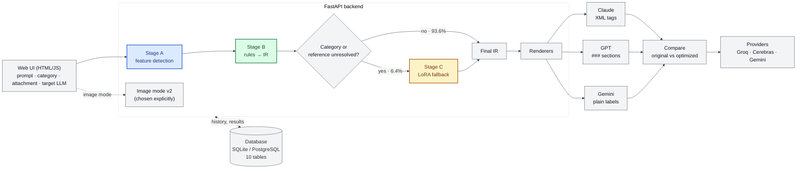
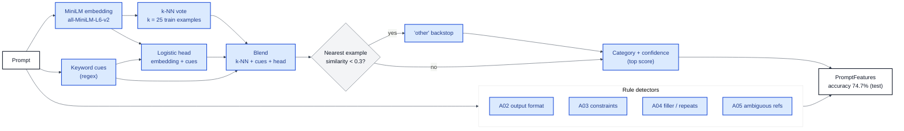
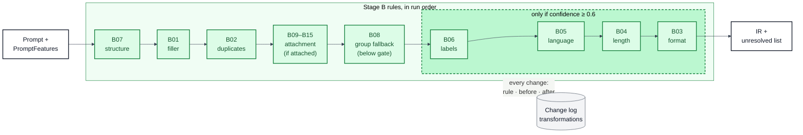
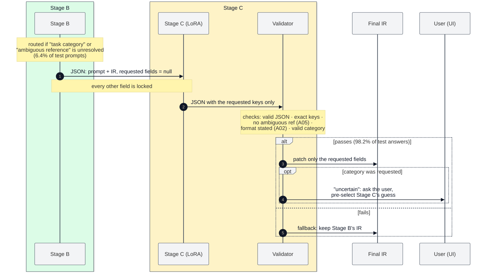
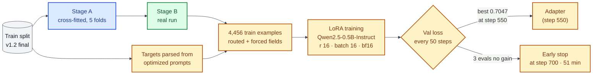
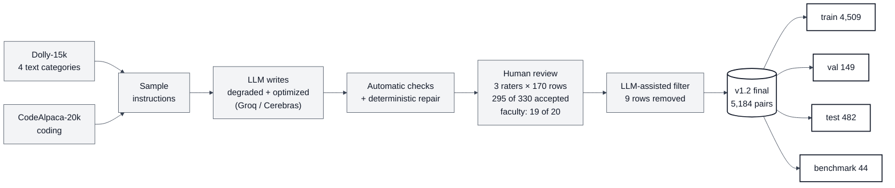
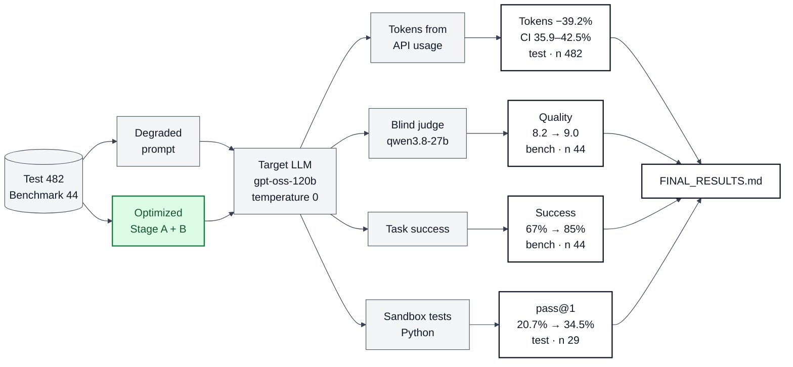
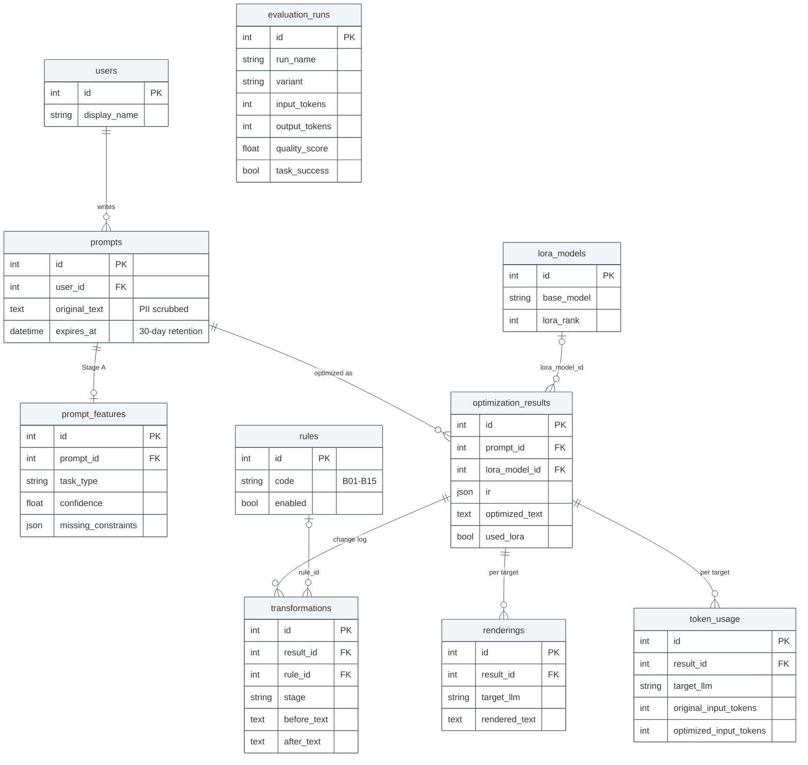

# PromptOpt

A lightweight, self-hosted system that rewrites vague prompts into clear, structured, token-efficient prompts for LLMs, and then **measures whether the rewrite actually helps**.

Final-year Mini Project-I (7CS345), Walchand College of Engineering, Sangli. Results: [`evaluation/FINAL_RESULTS.md`](evaluation/FINAL_RESULTS.md).

## What it does

You type a prompt, pick the target LLM (GPT, Gemini or Claude), a category (auto-detect or one of five) and, optionally, an attachment type. PromptOpt returns the prompt rewritten for that model, explains every change, and can run the original and the optimized prompt side by side on a real model (**Compare**).

| Stage | What it does | How |
|---|---|---|
| **A: feature detection** | Task category, missing output format, missing constraints (length/tone/audience/language), filler, ambiguous references | spaCy + regex + Sentence-Transformers → `PromptFeatures` |
| **B: rule-based optimization** | Deterministic, individually testable rules B01–B15 (B09–B15: attachments). Every change is logged | Category rules only at ≥ 0.6 confidence, with a group-level fallback (B08) |
| **C: LoRA fallback** | Fills only what Stage B could not resolve (an ambiguous reference, or format/constraints when the category is unclear); the category itself is only suggested to the user | Qwen2.5-0.5B-Instruct + LoRA, validated output, falls back to Stage B |
| **IR + rendering** | One intermediate representation, rendered per target, same content everywhere | Claude XML tags · GPT `###` sections · Gemini labelled sections; tests round-trip every rendering |
| **Image mode** | Separate, explicitly chosen "Image generation" category for DALL-E, Nano Banana (Gemini image) and Stable Diffusion | Keeps the user's words; missing attributes become clickable suggestions |
| **Compare** | Original vs optimized prompt on the same model: answers, tokens (incl. reasoning), latency, sandbox tests for coding, optional blind judge | Groq / Cerebras gpt-oss now; Gemini with a key; GPT/Claude once keys are added |

Categories: `closed_qa`, `information_extraction`, `classification`, `summarization` (from Dolly-15k), `coding` (from CodeAlpaca-20k), and `other`.

## Architecture

Stage A (blue) detects what is missing, Stage B (green) fixes it with rules, Stage C (amber) fills only what the rules leave unresolved. Plain-English walkthrough: [`docs/HOW_IT_WORKS.md`](docs/HOW_IT_WORKS.md); all diagrams (Mermaid source, SVG, PNG): [`docs/diagrams/`](docs/diagrams/).

<!-- DIAGRAM:01_system_architecture:start -->


*System architecture*: [PNG](docs/diagrams/01_system_architecture.png) · [SVG](docs/diagrams/01_system_architecture.svg) · source [`01_system_architecture.mmd`](docs/diagrams/01_system_architecture.mmd)
<!-- DIAGRAM:01_system_architecture:end -->

<details><summary>Stage A internals</summary>

<!-- DIAGRAM:02_stage_a:start -->


*Stage A internals*: [PNG](docs/diagrams/02_stage_a.png) · [SVG](docs/diagrams/02_stage_a.svg) · source [`02_stage_a.mmd`](docs/diagrams/02_stage_a.mmd)
<!-- DIAGRAM:02_stage_a:end -->

</details>

<details><summary>Stage B rule chain</summary>

<!-- DIAGRAM:03_stage_b_rules:start -->


*Stage B rule chain*: [PNG](docs/diagrams/03_stage_b_rules.png) · [SVG](docs/diagrams/03_stage_b_rules.svg) · source [`03_stage_b_rules.mmd`](docs/diagrams/03_stage_b_rules.mmd)
<!-- DIAGRAM:03_stage_b_rules:end -->

</details>

<details><summary>B → C contract</summary>

<!-- DIAGRAM:04_b_to_c_contract:start -->


*B → C contract*: [PNG](docs/diagrams/04_b_to_c_contract.png) · [SVG](docs/diagrams/04_b_to_c_contract.svg) · source [`04_b_to_c_contract.mmd`](docs/diagrams/04_b_to_c_contract.mmd)
<!-- DIAGRAM:04_b_to_c_contract:end -->

</details>

<details><summary>Stage C training</summary>

<!-- DIAGRAM:05_stage_c_training:start -->


*Stage C training*: [PNG](docs/diagrams/05_stage_c_training.png) · [SVG](docs/diagrams/05_stage_c_training.svg) · source [`05_stage_c_training.mmd`](docs/diagrams/05_stage_c_training.mmd)
<!-- DIAGRAM:05_stage_c_training:end -->

</details>

<details><summary>Dataset pipeline</summary>

<!-- DIAGRAM:06_dataset_pipeline:start -->


*Dataset pipeline*: [PNG](docs/diagrams/06_dataset_pipeline.png) · [SVG](docs/diagrams/06_dataset_pipeline.svg) · source [`06_dataset_pipeline.mmd`](docs/diagrams/06_dataset_pipeline.mmd)
<!-- DIAGRAM:06_dataset_pipeline:end -->

</details>

<details><summary>Evaluation flow</summary>

<!-- DIAGRAM:07_evaluation_flow:start -->


*Evaluation flow*: [PNG](docs/diagrams/07_evaluation_flow.png) · [SVG](docs/diagrams/07_evaluation_flow.svg) · source [`07_evaluation_flow.mmd`](docs/diagrams/07_evaluation_flow.mmd)
<!-- DIAGRAM:07_evaluation_flow:end -->

</details>

<details><summary>Database (10 tables)</summary>

<!-- DIAGRAM:08_database_er:start -->


*Database (10 tables)*: [PNG](docs/diagrams/08_database_er.png) · [SVG](docs/diagrams/08_database_er.svg) · source [`08_database_er.mmd`](docs/diagrams/08_database_er.mmd)
<!-- DIAGRAM:08_database_er:end -->

</details>


## How to run

Tested from a fresh clone on Linux (Fedora 44) with Python 3.14. All commands run inside `backend/`.

### 1. Setup (CPU, no GPU needed)

```bash
git clone https://github.com/piush365/PromptOpt.git && cd PromptOpt/backend
python3.14 -m venv .venv && source .venv/bin/activate
pip install -r requirements-lock.txt     # exact versions; CPU torch; includes spaCy's en_core_web_sm
```

`requirements-lock.txt` pins every package as used for the results. `requirements.txt` lists the direct dependencies
with lower bounds, if you prefer a looser install (then also `pip install torch --index-url
https://download.pytorch.org/whl/cpu` first and `python -m spacy download en_core_web_sm` after). The first run
downloads the sentence-transformers model `all-MiniLM-L6-v2` (about 90 MB) from Hugging Face.

### 2. Database

```bash
python -m app.init_db                  # SQLite at backend/promptopt.db: 10 tables, rules seeded (safe to re-run)
```

PostgreSQL instead: set `DATABASE_URL` in `backend/.env` (see `backend/README.md`).

### 3. Optional: Stage A's trained category classifier

Without it, Stage A uses its keyword classifier, so everything runs but categories are less accurate on hard
prompts. The results (Stage A 74.7%) use the trained index, which you can get either way:

```bash
# a) download the exact index used for the results (GitHub release v1.0)
mkdir -p artifacts && curl -L -o artifacts/category_index.npz \
  https://github.com/piush365/PromptOpt/releases/download/v1.0/category_index.npz
# b) or build it from the dataset's train split (needs the dataset, see "Dataset and Stage C adapter")
python -m app.stage_a.build_index
```

### 4. Web app

```bash
uvicorn app.api:app                    # open http://127.0.0.1:8000  (FastAPI docs: /docs)
```

This runs **without Stage C**: Stage A + B + rendering, fully offline. When a prompt needs Stage C (try
"hey can you just summarize this article for me"), the page says Stage C is not installed and shows Stage B's result.

**With Stage C (LoRA, GPU recommended):** a second venv with CUDA torch, transformers and peft, plus the adapter:

```bash
python3.14 -m venv .venv-gpu && source .venv-gpu/bin/activate
pip install -r requirements-gpu-lock.txt                 # CUDA 13.2 build of torch; needs an NVIDIA driver
curl -L -o /tmp/stage_c_adapter.zip \
  https://github.com/piush365/PromptOpt/releases/download/v1.0/stage_c_adapter.zip
unzip /tmp/stage_c_adapter.zip -d artifacts/             # -> artifacts/stage_c_adapter/
uvicorn app.api:app                                      # GET /api/options now shows "stage_c": {"available": true, ...}
```

On that prompt the "Stage C" panel now shows Stage C's fields. The base model `Qwen/Qwen2.5-0.5B-Instruct` (about 1 GB) is downloaded from Hugging Face on first use. Without a
GPU it also runs on CPU (`STAGE_C_DEVICE=cpu`, about 5 s per routed prompt instead of 0.7 s). `STAGE_C_ENABLED=0`
switches Stage C off.

**In the browser:** type a prompt, choose target (Claude, GPT, Gemini) and category (auto or one of five), optionally
an attachment type, then *Optimize*. The page shows Stage A's findings, the rules that fired with before/after,
whether Stage C was used, the prompt for each target with its input tokens, and the history (kept 30 days). With an
API key, choose a model under *Run on* and press *Compare*. For image prompts, pick *Image generation*.

**API:** `POST /api/optimize`, `POST /api/compare`, `GET /api/compare/models`, `GET /api/history`,
`GET /api/history/{id}`, `POST /api/coding-tests`, `GET /api/options`.

### 5. Demo in the terminal (offline)

```bash
python -m app.demo --examples                       # five prompts, one per category: Stage A, each Stage B rule, Stage C routing
python -m app.demo "summarize this for me" --target claude
```

### 6. Tests

```bash
python -m pytest -q                    # about 700 tests, offline, no API calls (more with the dataset or TEST_POSTGRES_URL)
python -m app.freeze_check             # Stage A/B byte-identical to the frozen tag (needs the dataset and the index)
```

### 7. API keys (Compare, evaluation)

```bash
cp .env.example .env                   # .env is git-ignored; never commit keys
```

Then uncomment and fill in what you have:

| key | used for | where to get it |
|---|---|---|
| `GROQ_API_KEY` | Compare on gpt-oss-120b (Groq), evaluation judge | https://console.groq.com/keys (free tier) |
| `CEREBRAS_API_KEY` | Compare on gpt-oss-120b (Cerebras), evaluation target, coding test generation | https://cloud.cerebras.ai (free tier) |
| `GEMINI_API_KEY` | Compare on Gemini 2.5 Flash | https://aistudio.google.com/apikey (free tier) |

Restart `uvicorn` after editing `.env`. Calls stay within 70% of each free daily limit; usage is logged in
`data/*_usage.json`. GPT and Claude are listed as "add API key" (no client yet; future work). Compare's sandbox tests
for coding prompts need `bubblewrap` (`sudo dnf install bubblewrap`); without it, generated code is never run.

## Dataset and Stage C adapter

Neither is in git (`data/` and `backend/artifacts/` are git-ignored).

| what | where | how to use |
|---|---|---|
| PromptOpt Dataset v1.2 final (5,184 rows, 7 MB CSV) | Google Drive: [`promptopt_dataset_v1_2_final`](https://drive.google.com/drive/folders/1gk-38Y3gZv7TzwsW14pgfcqEcZciODZG) (access on request from the team; derived from Dolly-15k, CC BY-SA 3.0, and CodeAlpaca-20k) | put the folder in `data/` at the repo root: `data/promptopt_dataset_v1_2_final/promptopt_dataset_v1_2_final.csv` (or set `DATASET_DIR`) |
| Dataset description | [`docs/DATASET_CARD.md`](docs/DATASET_CARD.md) | |
| Stage C training data manifest (file hashes, row counts) | [`docs/stage_c_data_manifest.json`](docs/stage_c_data_manifest.json); also attached to the release | rebuild the data with `python -m app.stage_c.data` (needs the dataset) |
| Stage C LoRA adapter (Qwen2.5-0.5B-Instruct, r 16, 45 MB) | [GitHub release v1.0](https://github.com/piush365/PromptOpt/releases/tag/v1.0): `stage_c_adapter.zip` | unzip into `backend/artifacts/` (see step 4) |
| Stage A category index | GitHub release v1.0: `category_index.npz` | `backend/artifacts/category_index.npz` (see step 3) |

Degraded -> optimized prompt pairs built from Dolly-15k and CodeAlpaca-20k, split into train/val/test/benchmark with
no instruction shared across splits; human-validated sample and LLM-assisted filter.

## Results and reports

[`evaluation/FINAL_RESULTS.md`](evaluation/FINAL_RESULTS.md) is the summary; the project report is
[`docs/PROJECT_REPORT.md`](docs/PROJECT_REPORT.md), the demo walkthrough [`docs/DEMO_SCRIPT.md`](docs/DEMO_SCRIPT.md)
and a 10-minute cheat sheet [`docs/EXPLAIN_IN_10_MIN.md`](docs/EXPLAIN_IN_10_MIN.md).
Every evaluation command is listed in FINAL_RESULTS section "Reproduce" and in each report's header.

## Repo layout

```
backend/app/         Stage A/B/C, IR + rendering, pipeline, API + web UI (static/), DB layer,
                     coding/ (sandbox, tests), image/ (image mode), compare/ (providers), evaluation/
backend/tests/       offline test suite
docs/                dataset card, Stage C plan, coding tests, category templates, milestone review
evaluation/          all reports; FINAL_RESULTS.md is the summary
notebooks/           Stage C training notebook (Colab); dataset_prep/: dataset EDA and annotation sheets
```

More detail on the backend and database: [`backend/README.md`](backend/README.md).
