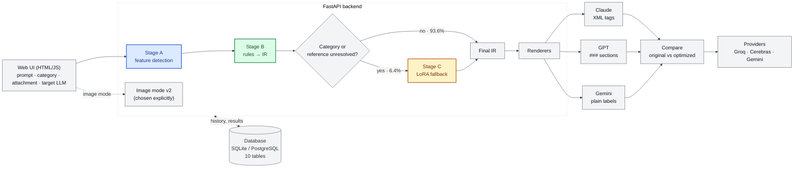
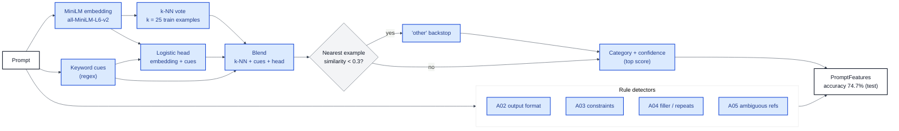
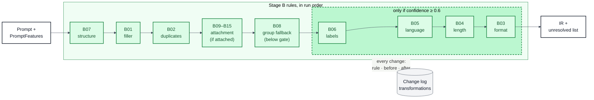
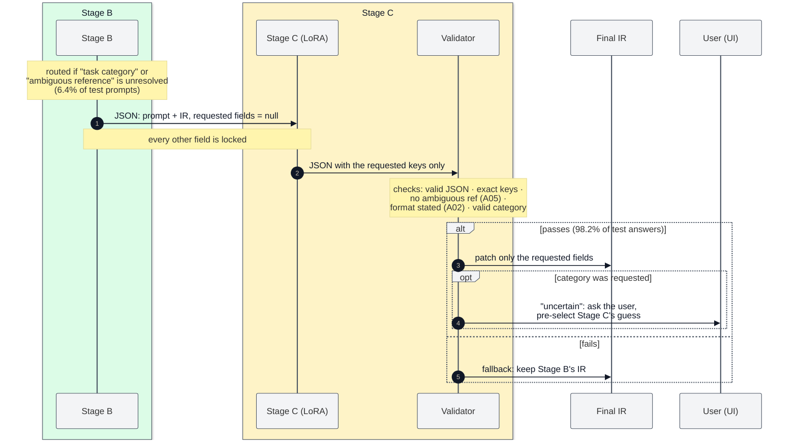
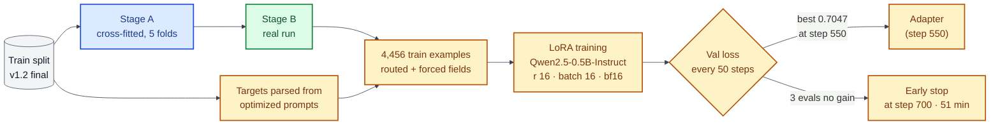
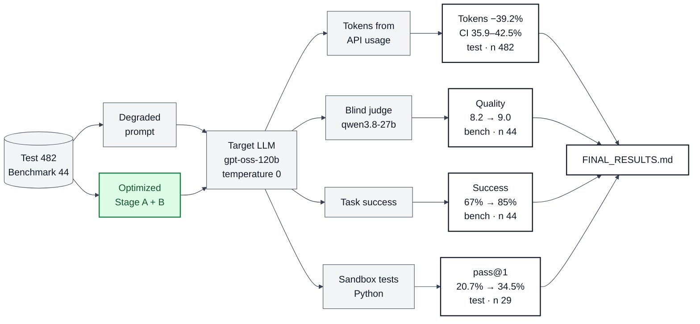
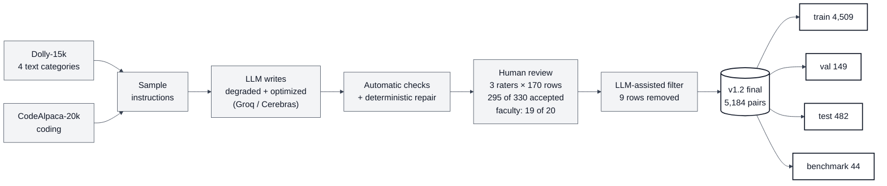
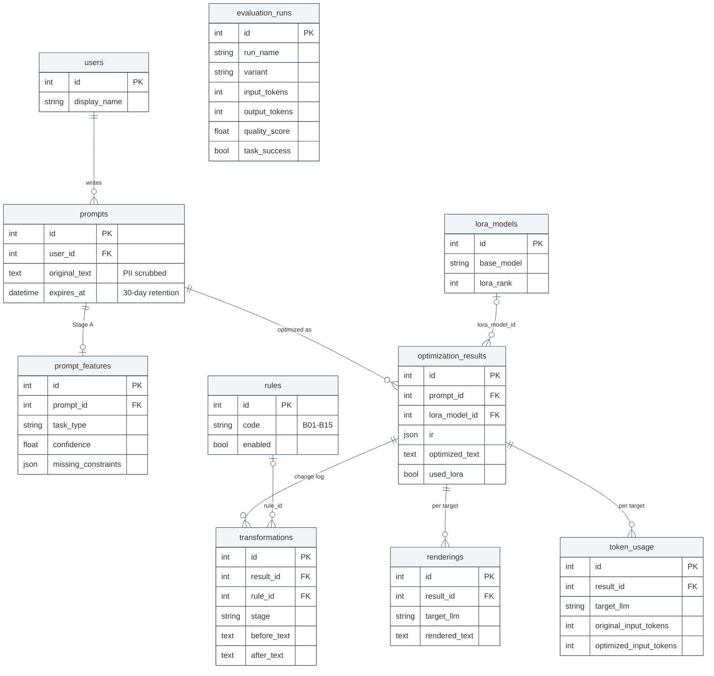

# How PromptOpt works: Stages A, B and C

This is a plain-English walk through the code, written the way I would explain it to a teacher.

**Where the numbers come from.**
* **Results** (accuracy, rates, token savings, latency) come only from `evaluation/FINAL_RESULTS.md`, cited as
  [FR §n] for section n.
* **Settings** (k = 25, the 0.6 gate, LoRA rank 16, ...) are values written in the code. I quote them with the file
  they are in.
* **Walkthrough values** (the confidence of one example prompt, the exact Stage C output) are live output from the
  frozen code, run on 2026-10-08. They show how the pipeline behaves. They are not evaluation results.

Where a metric was asked for but the project never measured it, this document says so plainly.

---

## 0. The big picture in one minute

A user types a vague prompt such as *"hey can you please summarize this for me"*.

1. **Stage A** looks at the prompt and writes down what is wrong with it. It never changes the prompt.
2. **Stage B** fixes what fixed rules can fix: it deletes filler, adds a format, adds a length limit, states the
   labels, and so on. It writes the result into a structured object called the **IR**.
3. If something is still unresolved that a model could fix, **Stage C** (a small fine-tuned model) fills only those
   missing fields.
4. The **renderer** turns the IR into a prompt laid out the way Claude, GPT or Gemini prefer.

<!-- DIAGRAM:01_system_architecture:start -->


*System architecture*: [PNG](diagrams/01_system_architecture.png) · [SVG](diagrams/01_system_architecture.svg) · source [`01_system_architecture.mmd`](diagrams/01_system_architecture.mmd)
<!-- DIAGRAM:01_system_architecture:end -->

---

## 1. Stage A: feature detection (`backend/app/stage_a/`)

### 1.1 What goes in, what comes out

**In:** the prompt text, plus optional context (a passage the user pasted).
**Out:** a `PromptFeatures` object (`backend/app/stage_a/schema.py`). This is the real output for
*"hey can you please summarize this for me"*:

```json
{
 "task_type": "summarization",
 "confidence": 0.9921,
 "category_scores": {"closed_qa": 0.004, "information_extraction": 0.0003, "classification": 0.0,
                     "summarization": 0.9921, "coding": 0.0001, "other": 0.0035},
 "classifier": "embedding",
 "has_format_spec": false,          "format_evidence": [],
 "has_context": false,
 "constraints_present": [],         "missing_constraints": ["length", "audience", "tone"],
 "redundant_phrases": ["hey", "can you please", "please", "for me"],
 "ambiguous_refs": ["summarize this"],
 "word_count": 8
}
```

Every detector returns **evidence**, meaning the exact words it matched, so the UI can show why something was
flagged.

### 1.2 How the category is decided (detector A01, `classifier.py`)

<!-- DIAGRAM:02_stage_a:start -->


*Stage A internals*: [PNG](diagrams/02_stage_a.png) · [SVG](diagrams/02_stage_a.svg) · source [`02_stage_a.mmd`](diagrams/02_stage_a.mmd)
<!-- DIAGRAM:02_stage_a:end -->

**Step 1: embed the prompt.** The prompt goes through the Sentence-Transformers model **all-MiniLM-L6-v2**
(`config.SENTENCE_MODEL`). This turns any text into a 384-number vector, and similar meanings give similar vectors.
The vectors are L2-normalised, so the dot product of two vectors is their cosine similarity.

**Step 2: k-nearest neighbours (k-NN).** The index (`build_index.py`) holds the embeddings of every **train-split**
degraded prompt and original instruction, each with its category, plus 250 Dolly "brainstorming" and 250 Dolly
"creative_writing" instructions labelled `other` (`OTHER_PER_CATEGORY = 250`). For a new prompt we:
* find the k = 25 most similar index entries (`classifier.py`, `k: int = 25`);
* give each one a weight `w = exp((sim − best_sim) / 0.05)`, with temperature 0.05, so the closest neighbours count
  much more than the 25th;
* add up the weights per category and divide by the total. This gives the k-NN score per category, summing to 1.

**Step 3: keyword cues.** Hand-written regexes give cue weights per category (`KEYWORD_CUES`). For example
"summarize" gives summarization a weight of 3.0, and "write a function" gives coding 2.0. If any cue fired, the
score becomes `0.7 × kNN + 0.3 × keywords` (`keyword_weight = 0.3`).

**Step 4: logistic regression head.** A multinomial logistic regression is trained on the same train embeddings
plus 6 keyword features: the normalised cue weight of each of the 5 categories, and whether the prompt ends in "?".
It uses scikit-learn, `C = 4.0` (`HEAD_C`), and `class_weight="balanced"` so every category counts equally. At run
time it is plain numpy softmax. The final score is `0.5 × (step 3 score) + 0.5 × head probability`
(`head_weight = 0.5`).

**Step 5: the "other" backstop.** If even the nearest neighbour has cosine similarity below 0.3
(`other_threshold`), nothing in our data looks like this prompt. Every score is then multiplied by
`keep = best_sim / 0.3 / 2`, and `other` gets `1 − keep` added. That puts at least half the mass on `other`, so
`other` always wins in this case.

**Step 6: the decision.** `task_type` is the category with the highest score, and **confidence is that highest
score**.

**Is the confidence calibrated?** No. No calibration step (Platt scaling, isotonic regression) is applied anywhere
in the code. The confidence is the blended score above. We did the next best thing: we chose the threshold that uses
it (0.6, see Stage B) on the **val** split, by checking how often Stage A was right above and below candidate
thresholds. The comment above `CATEGORY_MIN_CONFIDENCE` in `backend/app/stage_b/rules.py` records that check. If
asked: "it is a score, not a probability; we picked the threshold empirically on val."

**What "other" means.** `other` means "not one of our five tasks", for example brainstorming, creative writing or
chit-chat. It comes from two places: the labelled Dolly examples in the index, and the low-similarity backstop. On
held-out out-of-scope Dolly prompts, **68.5%** are classified as `other` [FR §3]. An `other` prompt gets no
category-specific rules and is routed to Stage C for its category.

### 1.3 The rule-based detectors (`rules.py`)

Each detector is a separate pure function. The examples below are real outputs.

| detector | what it looks for | examples (input → evidence) |
|---|---|---|
| **A02 format** `detect_format_spec` | about 25 regexes (`FORMAT_PATTERNS`): JSON/CSV/table, bullet/numbered list, "in N sentences/words", "output only", "yes or no", "code block", ... | "give the answer as JSON" → `["JSON"]`; "summarize it in 3 bullet points" → `["in 3 bullet points", "bullet points"]`; "tell me about rome" → `[]`, so the format is **missing** |
| **A03 constraints** `detect_constraints` | 4 kinds: **length** ("brief", "at most 3", "one sentence"), **tone** ("formal tone", "politely"), **audience** ("explain … to a 10 year old", "in simple terms"), **language** (Python, Rust, SQL, "in C", ...) | "explain recursion to a 10 year old in simple terms" → audience; "write it in rust" → language: `rust`; "write a short formal email" → length: `short` |
| **missing constraints** | `RELEVANT_CONSTRAINTS` lists, per category, which constraints are worth asking for: closed_qa → length; summarization → length, audience, tone; coding → language; extraction and classification → none | a summarization prompt with no length → `missing_constraints: ["length", ...]` |
| **A04 filler / repetition** `detect_filler`, `detect_repetition` | politeness and filler phrases (hey, please, could you, I was wondering if, just, for me, thanks, basically, ...), repeated sentences of 3+ words, doubled words ("the the") | "hi could you please just sort this list for me thanks" → `hi, could you please, please, just, for me, thanks`; "sort the the list. sort the the list." → the repeated sentence and `the the` |
| **A05 ambiguous reference** `detect_ambiguous_refs` | only when **no context** was supplied: "this/that/the + text/article/code/…", "summarize/fix/explain + it/this", "the above". With spaCy, also a pronoun that appears before any noun it could refer to ("what does it mean?") | "summarize the article" → `["the article"]`; "fix this" → `["fix this"]`; the same prompt **with** a passage → `[]` |
| **context** `detect_embedded_context` | the prompt itself carries data: a code fence, a long quote, 2+ commas, "task: <8+ words>", several lines, or 60+ words | "classify these as fruit or vegetable: apple, carrot, banana" → has context |

### 1.4 Accuracy of Stage A, and how it is calculated

* **Input:** the *degraded* prompts of the **test** split, n = 482, because degraded prompts are what real users
  type. **Reference:** the dataset's category label (`stage_a/evaluate.py`, `category_report`).
* **Accuracy** = correct predictions / n = **74.7%** (val: 75.8%) [FR §1, §3].
* **Per category:** precision = TP / (number predicted as that category), recall = TP / (number truly in that
  category), F1 = 2PR / (P + R).

  | category | n | precision | recall | F1 |
  |---|---|---|---|---|
  | closed_qa | 99 | 56.7% | 76.8% | 0.65 |
  | information_extraction | 93 | 73.2% | 55.9% | 0.63 |
  | classification | 98 | 93.1% | 95.9% | 0.94 |
  | summarization | 94 | 60.0% | 44.7% | 0.51 |
  | coding | 98 | 99.0% | 98.0% | 0.98 |
  [FR §3]
* **Macro-F1** = the plain average of the five F1 values, so every category counts equally = **0.746** [FR §1].
* **Confusion matrix:** rows = true category, columns = predicted category. The full matrix is printed in
  `evaluation/stage_a_test_final.md`; FINAL_RESULTS only gives its summary. In plain words, **precision** reads down
  a column: "of everything I called summarization, how much really was?" **Recall** reads along a row: "of all real
  summarization prompts, how many did I find?" The errors sit almost entirely between closed_qa,
  information_extraction and summarization, because a degraded prompt like "what is this about?" fits all three
  [FR §3]. Coding and classification are nearly perfect.
* **Cross-fitting:** the k-NN index is built from the train split, so Stage A has "seen" every train prompt. If we
  produced Stage C's train data with that index, Stage A would look unrealistically accurate on it. In
  `stage_c/data.py`, `crossfit_features`, each train prompt is therefore classified by an index and head built
  **without its own fold**: 5 folds, grouped by original instruction so paraphrases stay together. Val and test were
  never in the index, so they use it as is.

### 1.5 Limitations of Stage A, and what I would say

* "summarization at 0.51 F1 is weak." Yes. A degraded summarization prompt often reads like a question. That is why
  B08 exists: when Stage A is only sure about the *group*, Stage B acts at group level instead of guessing.
* "The confidence is not calibrated." True. It is a blended score; the 0.6 gate was set on val, not by theory.
* "The regex detectors miss things." They do. For example "a short **formal** email" is not detected as a tone
  constraint, because the tone pattern wants "formal tone/style". The detectors are deliberately simple and
  explainable.
* "The format agreement with the dataset is between two regexes", meaning A02 against the dataset notebook's regex.
  It measures consistency between them, not ground truth.

---

## 2. Stage B: rule-based optimization (`backend/app/stage_b/`)

### 2.1 What goes in, what comes out

**In:** the prompt, Stage A's features, and the user's choices (category, attachment type, target LLM).
**Out:** an `OptimizationOutput` (`optimizer.py`): the final **IR**, the plain optimized text, a list of steps
(the change log), a confidence, and `needs_stage_c`.

**The IR** (`ir.py`, `PromptIR`, a frozen Pydantic model) is the core data structure:

| field | meaning | rendered to the LLM? |
|---|---|---|
| `task` | what to do, in the user's words, cleaned | yes |
| `context` | data that was inside the prompt (a list, code), moved out by B07 | yes |
| `context_ref` | where the material is: none / inline / separate (pasted text) / attachment | indirectly |
| `requirements` | task-specific rules: allowed labels, how to use an attachment | yes (listed first) |
| `constraints` | length, programming language, grounding | yes |
| `output_format` | how to lay out the answer | yes |
| `attachment` | type (image, pdf, pptx, docx, spreadsheet, code, other) + optional name | yes (a note) |
| `category`, `category_source` (stage_a / user / stage_c), `category_group`, `target_llm`, `unresolved` | metadata for the pipeline and the UI | **no** |

### 2.2 How it runs

1. **Category choice** (`apply_category_choice`). "auto" keeps Stage A's category. If the user picks a category,
   it replaces Stage A's with confidence 1.0 and the missing constraints are re-derived for it.
2. **An attachment counts as context**, so `has_context` becomes true.
3. **Initial IR** (`initial_ir`). `task` is set to the prompt. Two problems are written into `unresolved`
   immediately: `"task category"` if the category is `other` or the confidence is below 0.6, and
   `"ambiguous reference: …"` if A05 found one.
4. **The rules run in a fixed order** (`RULES` in `rules.py`). Each rule is a pure function `(ir, features) → ir`
   that returns the IR unchanged when it does not apply:

   `B07 → B01 → B02 → B09 B10 B11 B12 B13 B14 B15 → B08 → B06 → B05 → B04 → B03`

   Why this order: structure first, so later rules never edit the user's data. Then clean-up, then attachments
   (their instructions go first among the requirements), then the additions. B03 (format) comes last because it
   needs to know whether B08 already handled the prompt at group level.
5. **The change log.** After each rule, the optimizer renders the IR to plain text before and after. If the text
   changed, it records `{"rule_code", "before", "after"}` (`optimizer.py`, `steps.append`). Stage C, when used,
   adds one more step with `"stage": "C"` (`pipeline.py`). The steps are stored in the `transformations` table
   through `repository.save_optimization`, and the UI shows them as the explanation.
6. **context_ref** is set, and the confidence is computed. The confidence is stored, **not used for routing**:
   Stage A's confidence minus 0.2 per unresolved item, or 0.3 for `other`.

<!-- DIAGRAM:03_stage_b_rules:start -->


*Stage B rule chain*: [PNG](diagrams/03_stage_b_rules.png) · [SVG](diagrams/03_stage_b_rules.svg) · source [`03_stage_b_rules.mmd`](diagrams/03_stage_b_rules.mmd)
<!-- DIAGRAM:03_stage_b_rules:end -->

### 2.3 The 0.6 category gate

`CATEGORY_MIN_CONFIDENCE = 0.6` (`rules.py`). Rules B03 to B06 add **category-specific** content: a format, a length,
a language, labels. A wrong format is worse than no format, so they act only when
`category_is_reliable`: the category is one of the five *and* the confidence is ≥ 0.6. Below 0.6:
* B08 may act at group level (see below);
* otherwise B03 records `"output format"` as unresolved and the prompt keeps only the clean-up.

### 2.4 Every rule, with a real before/after

All examples are real outputs of the frozen code.

| rule | detects (exact condition) | changes | before → after |
|---|---|---|---|
| **B07 standardize structure** | always runs; if there is no context yet: a ``` code fence, or (data categories classification/extraction/summarization/coding) a `head: tail` where head ≤ 25 words, the tail is not a question, and the tail has 8+ words or a comma or a newline | moves the fenced code / the tail into `context`; tidies the task (spacing, capital letter, "i" → "I", ends with `.` or `?`) | `classify these as fruit or vegetable: apple, carrot, banana` → task `Classify these as fruit or vegetable.` + Input: `apple, carrot, banana` |
| **B01 remove filler** | any A04 filler pattern in the task, unless it is inside quotes or within 4 words after a content verb like "print" (so "print please enter your name" is kept) | deletes it; "Can you …?" becomes an instruction ending in "."; if only filler would remain (fewer than 2 words), it does nothing | `hey can you please summarize this for me` → `Summarize this.` |
| **B02 remove duplicates** | doubled words (not allowed doubles like "that that", "very very") and sentences of 3+ words repeating an earlier one | drops them | `sort the the list in python. sort the the list in python.` → `Sort the list in python.` |
| **B09 image** | `attachment.type == "image"` | adds 2 requirements (use what is visible; say so if not readable) and removes the ambiguous-reference problem | `describe what is happening in the picture` → + `Use what is visible in the attached image; describe the parts you rely on. If something is not visible or not readable in the image, say so instead of guessing.` |
| **B10 pdf** | type pdf | 3 requirements: use the PDF, cite pages/sections, say if it is not there | `summarize this` + report.pdf → + `Use the attached PDF (report.pdf) as the source. Cite the page or section numbers for the information you use. If the PDF does not contain the answer, say so.` |
| **B11 pptx** | type pptx | use the deck, refer to slide numbers, say if absent | `summarize this` → + `Use the attached slide deck as the source. Refer to slides by their number. …` |
| **B12 docx** | type docx | use the document, cite section headings, say if absent | `summarize this` → + `Use the attached Word document as the source. Cite the section headings …` |
| **B13 other file** | type other | use the file; say so if it cannot be read | `summarize this` → + `Use the attached file as the source. If you cannot open or read the file, say so instead of guessing.` |
| **B14 spreadsheet** (added after the freeze) | type spreadsheet | use the sheet, refer to sheets/columns/rows by name, say if absent | `write a script that counts the rows` + sales.xlsx → + `Use the attached spreadsheet (sales.xlsx) as the source. Refer to sheets, columns and rows by their names. …` |
| **B15 code file** (added after the freeze) | type code | use the file, refer to functions/line numbers, say if unreadable | `explain this` + main.py → + `Use the attached code file (main.py) as the code to work on. Refer to functions and line numbers …` |
| **B08 group fallback** | the top category score < 0.6, **and** closed_qa + information_extraction + summarization together ≥ 0.6, **and** there is context | adds `Answer from the provided text in at most three sentences.` (only the missing half if grounding or length is already stated), sets `category_group = "text_based"`, removes `"task category"` from unresolved | val prompt `what are the big inventions and discoveries from berkeley in that text?` (scores closed_qa 0.45, summarization 0.36, extraction 0.17, with a passage) → + `Answer from the provided text in at most three sentences.` |
| **B06 labels** | classification, reliable category, no "labels:" already | extracts the labels ("as X, Y or Z", "which are X and which are Y", "is it X or Y") → `Use only these labels: "X", "Y".`; for "which of these … are X" with no labels → yes/no labels; nothing found → records `"label set"` as unresolved (**not** routed) | `which of these ski resorts are in utah: alta, vail, snowbird` → + `Use only these labels: "yes", "no".`; `classify the following animals` → unresolved `label set` |
| **B05 language** | coding, reliable, language missing | `Use Python.`; if code was supplied, `Keep the language of the given code.` (a regex cannot safely tell the language); a data attachment (spreadsheet, PDF, image …) still gets Python (post-freeze change, attachment only) | `could you please write a function that reverses a string thanks` → `Write a function that reverses a string.` + `Use Python.`; `fix the bug in this function` + code → + `Keep the language of the given code.` |
| **B04 length** | closed_qa or summarization, reliable, length missing | closed_qa: `Answer in at most two sentences.`; summarization: `Keep it under 100 words.` | `when did the war end` → `When did the war end?` + `Answer in at most two sentences.` |
| **B03 output format** | no format stated, no format set yet, no group fallback; if the category is not reliable, records `"output format"` as unresolved | closed_qa: `Start with the direct answer.`; extraction: `List each extracted item on its own line; if the text does not contain it, reply "Not found".`; classification: `For each item, output "item: label" on its own line.` (or `Output only the label.` for a single "Is X a Y or Z?" item); summarization: `Use bullet points.`; coding: `Return only the code, in a single code block.` | `Summarize this.` + length → + `Use bullet points.` |

### 2.5 Routing from B to C (the exact condition)

* **Code:** `STAGE_C_REASONS = ("task category", "ambiguous reference")` and
  `needs_stage_c = any(u.startswith(STAGE_C_REASONS) for u in ir.unresolved)` (`backend/app/stage_b/optimizer.py`).
* **"Unresolved"** means something Stage B could not fix deterministically, written into `ir.unresolved`. Four items
  can appear:
  * `task category`: confidence < 0.6 or `other`, and B08 did not resolve it at group level. **Routes.**
  * `ambiguous reference: '…'`: a dangling "this/the article", and no attachment rule resolved it. **Routes.**
  * `output format` (B03 could not pick one) and `label set` (B06 found no labels): **recorded only**. They are
    shown in the UI, but on their own they do not send the prompt to Stage C.
* **Threshold:** the single 0.6 confidence gate. B08's group sum ≥ 0.6 can cancel a `task category`.
* **What Stage C is asked for** (`natural_unresolved`, `contract.py`):
  * `task category` → `output_format`, `constraints`, `category`
  * `ambiguous reference` → `task`
  * `output format` → `output_format` (only asked when the prompt is routed anyway)
* **What is locked:** every other field. Stage C sees Stage B's values (including requirements such as the
  attachment rules) but may only return the requested keys, and `patch_ir` changes nothing else.

<!-- DIAGRAM:04_b_to_c_contract:start -->


*B → C contract*: [PNG](diagrams/04_b_to_c_contract.png) · [SVG](diagrams/04_b_to_c_contract.svg) · source [`04_b_to_c_contract.mmd`](diagrams/04_b_to_c_contract.mmd)
<!-- DIAGRAM:04_b_to_c_contract:end -->

### 2.6 How Stage B is measured (test, n = 482)

| metric | how it is calculated | result |
|---|---|---|
| **Output format stated** | share of prompts where A02 finds a format, before (degraded) vs after Stage B (`stage_b/evaluate.py`) | **3.1% → 95.0%** (the dataset's own LLM-written optimized prompts: 79.0%) [FR §1, §4] |
| per category | same | closed_qa 0.0→96.0%, extraction 4.3→94.6%, classification 0.0→90.8%, summarization 2.1→94.7%, coding 9.2→99.0% [FR §4] |
| **Prompt length** | mean words | 11.2 → 22.0 [FR §4] |
| **Wrong-category additions** | prompts where B03–B06 fired but Stage A's category ≠ the dataset label, **plus** prompts where B08 fired but the label is outside the text group, divided by n | **25 of 482 = 5.2%**, partly Dolly label noise [FR §1, §4] |
| **Routed to Stage C** | `needs_stage_c` true | **6.4% (31 of 482)**: 24 for the task category, 7 for an ambiguous reference [FR §1, §4] |
| **Resolved without Stage C** | 100% − routed | 93.6% (derived from [FR §1]) |
| **Missing constraints left** | prompts not routed that still lack a relevant length/language according to A03 | 27 test prompts still state no programming language [FR §10] |
| **Freeze check** | sha256 of all Stage A features, IR, text, steps, routing and confidence on the 482 test prompts, compared with `frozen-for-test` | identical (`35f7d4dc…`) [FR §2] |
| **Attachment rules** | 30 hand-made prompts: own rule fired, no other rule fired, requirements in all three renderings, ambiguous reference resolved | **30/30** [FR §6] |

**Per-rule accuracy, B01–B08** [FR §4.1] (`backend/app/stage_b/rule_accuracy.py`; measured on the frozen rules
after `final-for-test`, nothing tuned).
* **Expected:** the dataset's optimized prompt (the target) fixes the rule's defect while the degraded prompt has
  it, judged with the Stage A detectors. For B01 the degraded prompt has filler and the target has none; for B03 the
  target states a format and the degraded prompt does not; for B04 the target has a length; for B05 the target names
  a language; for B06 the target lists the labels explicitly; for B07 the target puts inline data in its own block;
  for B08 the target says to answer from the provided text.
* **Fired:** the rule's entry in the change log.
* **TP** = expected and fired, **FP** = fired but not expected, **FN** = expected but not fired.
  Precision = TP / (TP + FP), recall = TP / (TP + FN), F1 = 2PR / (P + R).

| rule | TP | FP | FN | precision | recall | F1 |
|---|---|---|---|---|---|---|
| B01 remove filler | 18 | 0 | 0 | 1.000 | 1.000 | 1.000 |
| B02 remove duplicates | 0 | 1 | 0 | 0.000 | - | - |
| B03 output format | 243 | 52 | 124 | 0.824 | 0.662 | 0.734 |
| B04 length | 67 | 14 | 146 | 0.827 | 0.315 | 0.456 |
| B05 language | 37 | 3 | 2 | 0.925 | 0.949 | 0.937 |
| B06 labels | 37 | 27 | 20 | 0.578 | 0.649 | 0.612 |
| B07 structure (change log) | 17 | 464 | 0 | 0.035 | 1.000 | 0.068 |
| B08 group fallback | 109 | 40 | 99 | 0.732 | 0.524 | 0.611 |
| **macro (B01–B08)** | | | | **0.615** | **0.728** | **0.631** |
| B07, data moved only (not in macro) | 14 | 33 | 3 | 0.298 | 0.824 | 0.438 |
| macro, with B07 = data moved | | | | 0.648 | 0.703 | 0.684 |

How to read it, and what I would say:
* **"Expected" comes from LLM-written targets**, not human labels. A rule that adds something the LLM left out
  counts as a false positive, even when the addition is reasonable.
* **B07's change-log entry includes tidying** (a capital letter, a final "."), so it fires on 481 of 482 prompts.
  The "data moved" row is the meaningful one for B07.
* **B01's perfect score is consistency, not independent accuracy**: its "expected" uses the same filler detector
  as the rule.
* **B02** had no expected prompt on test (one firing), so its recall and F1 are undefined.
* **Low recall for B04 (0.315) and B08 (0.524) is mostly by design.** Stage B adds a length only above the 0.6 gate
  and only for closed_qa/summarization, while the LLM targets add one almost everywhere. Rules also share defects
  (a length can come from B04 or B08), and a defect fixed by another rule counts as a miss.

Other checks of the rules:
* the format-stated rate above (a fix rate for the most common defect);
* the attachment test (30/30, an expected-vs-fired check for B09–B15 on developer-written prompts);
* the unit tests for every rule.

**With a real LLM** (benchmark split, 44 prompts; target `cerebras/gpt-oss-120b`, blind judge `qwen/qwen3.8-27b`):
quality 8.2 → **9.0**, task success 67% → **85%**, total tokens 894 → **386** per prompt (−57%), latency
1215 → 773 ms [FR §1, §4].

### 2.7 Limitations of Stage B, and what I would say

* **It makes prompts longer**: 11.2 → 22.0 words, and input tokens grow in every category [FR §4, §9a]. The saving
  comes from shorter answers. 87 of 482 test prompts (18.0%) individually cost more, because their answer was
  already short [FR §9a]. The future work is a lean mode.
* **Defaults can be wrong for the user**: "under 100 words" or "bullet points" may not be what they wanted. That is
  why defaults are applied only above the 0.6 gate, and the user can override the category.
* **Regex label extraction has edge cases.** Running the frozen code on *"Is a tomato a fruit or a vegetable?"*
  gives the labels `"tomato a fruit", "vegetable"`: the item is glued onto the first label. This is a real bug.
  Under the freeze it is reported here, not fixed.
* **B07 only moves data when it is clearly data.** In *"extract the names from the text below: Alice met Bob and
  Carol in Paris"* the tail has fewer than 8 words and no comma, so it stays in the task and "the text" is flagged as
  ambiguous.

---

## 3. Stage C: the LoRA fallback (`backend/app/stage_c/`)

### 3.1 What goes in, what comes out

**In:** a JSON object (`contract.model_input`): the prompt, Stage A's category with its source and confidence,
`has_context`, the attachment type, Stage B's IR with the fields to fill set to `null`, and the list `unresolved`.
**Out:** one JSON object with **exactly** the requested keys.

Real example (the named case, see section 4):

```json
// input (abridged)
{"prompt": "describe what is happening in the picture",
 "category": {"value": "coding", "source": "stage_a", "confidence": 0.37},
 "has_context": false, "attachment": "image",
 "ir": {"task": "Describe what is happening in the picture.", "output_format": null, "constraints": null,
        "requirements": ["Use what is visible in the attached image; ...", "If something is not visible ..."],
        "category": null},
 "unresolved": ["output_format", "constraints", "category"]}
// Stage C output
{"output_format": "Output as a single sentence describing each part.", "constraints": [], "category": "summarization"}
```

### 3.2 The model and the training

* **Base model:** `Qwen/Qwen2.5-0.5B-Instruct`, about 0.5 billion parameters (`stage_c/data.py`, `TRAIN_CONFIG`).
  It is small enough to train and run on a 4 GB laptop GPU.
* **LoRA settings** (`TRAIN_CONFIG`; the same values are in `backend/artifacts/stage_c_adapter/adapter_config.json`):
  rank **r = 16**, **alpha = 32**, dropout 0.05, applied to **all attention and MLP projections**: `q_proj, k_proj,
  v_proj, o_proj, gate_proj, up_proj, down_proj`. LoRA freezes the base model and learns two small matrices per layer;
  only those are trained.
* **Training settings:** 3 epochs maximum, learning rate **2e-4** with AdamW, 3% linear warm-up then linear decay,
  gradient clipping at 1.0, bf16, max length 512 tokens. **Effective batch 16**: configured as 4 × 4, run locally on
  the RTX 3050 as micro-batch 1 × 16 gradient accumulation (same effective batch) [FR §5]. Loss is computed **only on
  the assistant's JSON tokens**, not the prompt (`train.py`, `encode`: the prompt part gets label −100).
* **Data:** one example per train row, **4,456 train examples** [FR §5]. Stage A was cross-fitted (section 1.4),
  Stage B was run for real, and the **target** was parsed out of the dataset's optimized prompt by
  `stage_c/parse.py`. Prompts that Stage B really routes are `routed` examples. All other rows get a random non-empty
  subset of task / output_format / constraints (`forced`), so the model learns to fill any field it is asked for.
  One real pair (human-validated train row, routed for an ambiguous reference):

  ```json
  // input
  {"prompt": "classify these as streaming or cable: Netflix Hulu Disney+ QVC ABC Comedy Central",
   "category": {"value": "classification", "source": "stage_a", "confidence": 0.86},
   "has_context": false, "attachment": "none",
   "ir": {"task": null, "output_format": "For each item, output \"item: label\" on its own line.",
          "constraints": [], "requirements": ["Use only these labels: \"streaming\", \"cable\"."],
          "category": "classification"},
   "unresolved": ["task"]}
  // target
  {"task": "Classify each of the given names as either \"streaming service\" or \"cable channel\"."}
  ```

* **Early stopping:** the loss on val is computed every 50 steps (`eval_every`). Whenever it improves, the adapter is
  saved. After 3 evaluations in a row without improvement (`patience = 3`), training stops. Val loss reached its
  lowest value, **0.7047, at step 550**. Steps 600, 650 and 700 were all worse, so training stopped at **step 700**
  (51 min), and the saved adapter is the step-550 one [FR §5]. Val loss rising while train loss kept falling is the
  usual sign of overfitting, which is exactly what early stopping guards against.

<!-- DIAGRAM:05_stage_c_training:start -->


*Stage C training*: [PNG](diagrams/05_stage_c_training.png) · [SVG](diagrams/05_stage_c_training.svg) · source [`05_stage_c_training.mmd`](diagrams/05_stage_c_training.mmd)
<!-- DIAGRAM:05_stage_c_training:end -->

### 3.3 Validation, fallback, and the category policy (`contract.py`)

**Validation** (`validate`). Stage C's answer is used only if **all** of these hold:
1. it parses as **one JSON object** (a ```json fence is stripped first);
2. its keys are **exactly** the requested keys;
3. `task` (if asked) has at least 2 words and **no ambiguous reference** according to the same A05 detector;
4. `output_format` (if asked) is null or **states a format** according to A02 or the parser;
5. `constraints` (if asked) is a list of non-empty strings;
6. `category` (if asked) is one of the five categories.

**Fallback.** If any check fails, the prompt keeps **Stage B's IR unchanged**, and the errors are logged
(`StageCResult.fallback`). Stage C also does not run at all when the adapter or `peft`/`transformers` are missing;
then the app is A + B only (`runtime.available`). Real fallback example: for *"hey can you please summarize this for
me"* Stage C answered `{"task": "Summarize the provided text about the provided image."}`. That contains
ambiguous references and invents an image, so it was rejected and Stage B's text was kept.

**Category policy** (`category_decision`). When a prompt was routed for the task category, Stage C's category is
**never applied on its own**. It always returns `"uncertain"`: the category key is removed from the patch, so
`"task category"` **stays unresolved**. Stage C's guess is kept in `category_guess`, and the UI asks the user,
**pre-selecting that guess**. Stage C's *other* fields (format, constraints) are applied. Why: on val, neither
Stage A nor Stage C was reliable enough in the low-confidence range to decide alone (section 3.4).

### 3.4 How Stage C is measured

All on the Stage C examples of each split, greedy decoding, batch 1 (`stage_c/evaluate.py`).

**(a) Zero-shot base vs LoRA** [FR §5.1]

| metric | definition | test: base | test: LoRA |
|---|---|---|---|
| JSON valid | `parse_json` succeeds | 93.5% | **100%** |
| exact keys | keys = requested keys | 51.2% | **100%** |
| **passes validation** | the whole contract passes, so the pipeline would use it | **5.0%** | **98.2%** |
| task similarity | cosine (all-MiniLM-L6-v2) between predicted and target `task` | 0.668 | 0.801 |
| format present/absent agrees | (predicted format non-empty) == (target format non-empty) | 56.4% | 78.5% |
| constraints present/absent agrees | same for constraints | 53.8% | 75.0% |

n = 964 test examples (val: 298; LoRA passes validation 98.3%, base 3.4%). The format *content* similarity is
0.62 on test [FR §10].

**(b) Ablation: routed vs forced** [FR §5.2]
* **Task intent** (the main intent number) = cosine similarity between the **final IR's `task` field only** and the
  dataset's **original instruction**, averaged over prompts (`Similarity` class, same MiniLM encoder). Only the
  task is compared, so added format/constraint sentences do not count against it.
* **routed** = the prompts Stage B really sends (test n = 31). **forced** = every prompt with task, format and
  constraints all requested (test n = 482).

| test | system | task intent | format stated | fallback | median s |
|---|---|---|---|---|---|
| routed (31) | A+B | 0.869 | 22.6% | – | – |
| routed (31) | **A+B+C** | 0.843 | **90.3%** | 3.2% | 0.47 |
| routed (31) | C-only | 0.712 | 90.3% | 6.5% | 0.68 |
| forced (482) | **A+B** | **0.886** | **95.0%** | – | – |
| forced (482) | A+B+C | 0.769 | 90.2% | 2.1% | 0.68 |
| forced (482) | C-only | 0.765 | 88.6% | 1.9% | 0.67 |

The reading: **where Stage B routes, Stage C helps** (format 22.6% → 90.3% at a small intent cost). **Routing
everything through C hurts** (intent 0.886 → 0.769, below the dataset's own optimized prompts at 0.826). **C-only is
weakest**, so the rules are worth keeping in front [FR §5.2].

**(c) Category on routed prompts** [FR §5.3]: test, routed with a valid Stage C category, n = 24: Stage A right
9/24 (37.5%), Stage C's guess right 14/24 (58.3%). Over all 171 test prompts with Stage A confidence < 0.6: Stage A
45.0%, Stage C 41.5%. Neither is reliable enough to decide alone, so we ask the user.

**(d) Latency** (Stage C call only): median **0.74 s** on the RTX 3050 laptop GPU (p95 1.23 s), 4.55 s on CPU. The
requirement was < 3 s on GPU: met [FR §5.5].

### 3.5 Limitations of Stage C, and what I would say

* **The targets are LLM-written.** Only 111 train rows were individually human-validated [FR §10].
* **The parser separates constraints from the task in 75% of prompts** that state one [FR §10]. The rest stay inside
  the task text, so some targets are imperfect.
* **The routed set is small** (31 test prompts); the forced rows give the larger picture [FR §10].
* **Validation checks form, not facts.** In my run on *"i was wondering if you could tell me what this means"*,
  Stage C invented a phrase ("This is my favorite book"). The answer was rejected only because it also said "the
  provided text", which A05 flags. A hallucination without such a phrase would pass. That is one reason Stage C is
  routed-only and fills only a few fields.
* **The category is not trusted**: about 40-45% right in the routed range for both A and C [FR §10], hence the user
  is asked.

---

## 4. One vague prompt through the whole pipeline

The prompt is the named case in [FR §5.4]: *"describe what is happening in the picture"*, with an **image**
attached, category "auto". Everything below is real output from the frozen code.

**Step 1: Stage A.**
```
task_type: coding   confidence: 0.3682
scores: coding 0.368, summarization 0.267, other 0.258, extraction 0.086, closed_qa 0.013, classification 0.008
has_format_spec: false   missing_constraints: [language]   ambiguous_refs: ["the picture"]
```
Stage A is unsure (0.37 < 0.6) and its top guess is wrong. "Describe" pulls toward coding-style requests.

**Step 2: Stage B.** The attachment sets `has_context = true`. The initial IR gets
`unresolved = ["task category", "ambiguous reference: 'the picture'"]`. Then:
```
B07  'describe what is happening in the picture' -> 'Describe what is happening in the picture.'
B09  + 'Use what is visible in the attached image; describe the parts you rely on.
        If something is not visible or not readable in the image, say so instead of guessing.'
     (and removes the ambiguous-reference problem: the image is what "the picture" means)
B08  does not fire: the text group sums to 0.37 (< 0.6)
B03-B06 do not fire: confidence 0.37 < 0.6; B03 records "output format"
```
Stage B's IR: task = "Describe what is happening in the picture.", 2 requirements, no format,
`unresolved = ["task category", "output format"]`, so **routed to Stage C** (reason: task category).

**Step 3: Stage C.** Asked for `output_format, constraints, category`. Its answer, in 1.9 s on the GPU here:
```json
{"output_format": "Output as a single sentence describing each part.", "constraints": [], "category": "summarization"}
```
Validation passes: valid JSON, exact keys, the format is detected by A02/the parser, the category is valid. The
format and the (empty) constraints are applied. The category is **"uncertain"**: `task category` stays unresolved,
and the UI asks the user, **pre-selecting "summarization"**, which is the expected label [FR §5.4].

**Step 4: rendering.** Same content, three layouts (`backend/app/rendering.py`):

*Claude* (XML tags, context first):
```
<context>
<attachment>
The user attached an image.
</attachment>
</context>

<task>
Describe what is happening in the picture.
</task>

<constraints>
- Use what is visible in the attached image; describe the parts you rely on.
- If something is not visible or not readable in the image, say so instead of guessing.
</constraints>

<output_format>
Output as a single sentence describing each part.
</output_format>
```

*GPT* (`###` markdown sections):
```
### Task
Describe what is happening in the picture.

### Context
Attachment: The user attached an image.

### Constraints
- Use what is visible in the attached image; describe the parts you rely on.
- If something is not visible or not readable in the image, say so instead of guessing.

### Output format
Output as a single sentence describing each part.
```

*Gemini* (plain labels, instruction first, context last):
```
Task: Describe what is happening in the picture.

Constraints:
- Use what is visible in the attached image; describe the parts you rely on.
- If something is not visible or not readable in the image, say so instead of guessing.

Output format: Output as a single sentence describing each part.

Context:
Attachment: The user attached an image.
```

Input tokens: GPT 74 (exact, tiktoken o200k_base); Claude ~103 and Gemini ~86 (approximate, characters / 4,
labelled as approximate in the app).

**A second, contrasting case (Stage C rejected).** *"hey can you please summarize this for me"*, no attachment:
* Stage A: summarization at 0.99; ambiguous reference "summarize this".
* Stage B: B07 tidy, B01 → `Summarize this.`, B04 + `Keep it under 100 words.`, B03 + `Use bullet points.`
  Routed for the ambiguous reference: Stage C is asked for `task` only.
* Stage C answered "Summarize the provided text about the provided image." This fails validation (ambiguous
  reference), so the prompt keeps Stage B's version.

This shows the safety net: a bad model answer never reaches the user.

---

## 5. End-to-end measurements

<!-- DIAGRAM:07_evaluation_flow:start -->


*Evaluation flow*: [PNG](diagrams/07_evaluation_flow.png) · [SVG](diagrams/07_evaluation_flow.svg) · source [`07_evaluation_flow.mmd`](diagrams/07_evaluation_flow.mmd)
<!-- DIAGRAM:07_evaluation_flow:end -->

| measure | how | result |
|---|---|---|
| **Tokens** | from the provider's API usage fields: `prompt_tokens` → input, `completion_tokens` → output (this includes gpt-oss's hidden reasoning tokens) (`evaluation/llm.py`); total = input + output | – |
| **% reduction** | per prompt: `(degraded − optimized) / degraded × 100`, then the **mean over prompts** (`evaluation/tokens.py`, `reduction`) | **total −39.2%** on the full test split, n = 482 [FR §9a] |
| **95% CI** | 10,000 bootstrap resamples of the per-prompt reductions; 2.5th and 97.5th percentiles (`bootstrap_ci`) | **35.9–42.5%** [FR §9a] |
| **Significance** | Wilcoxon signed-rank test on the **paired** token counts (same prompt, two variants) | p < 0.001 [FR §9a] |
| summed tokens | reduction of the totals summed over all prompts | −55.4% [FR §9a] |
| input vs output | means per prompt | input 226 → 241 (grows); output 682 → 165 [FR §9a] |
| setup | `cerebras/gpt-oss-120b`, temperature 0, degraded vs Stage A + B, frozen pipeline | [FR §9a] |
| **Task success** (benchmark, n = 44) | closed_qa: the judge's yes/no against the reference; classification: every item gets the reference label; coding: a code block that parses (`evaluation/success.py`) | 67% → **85%** [FR §4] |
| **Judge score** (benchmark) | `qwen/qwen3.8-27b`, a different model from the target, **blind** to the variant; 0–10 on correctness, relevance, format, completeness (`evaluation/judge.py`) | 8.2 → **9.0** [FR §4] |
| **Latency** | from the API's reported time (Groq `usage.total_time`, otherwise the wall clock) | 1215 → 773 ms per prompt (benchmark) [FR §4] |
| **Coding pass@1** (Python, test, n = 29) | the generated code is run in a bubblewrap sandbox against asserts that were validated on the reference solution | strict 20.7% → **34.5%**; sign test p = 0.125 (n small) [FR §7] |

---

## 6. Summary of the whole pipeline

PromptOpt takes a vague prompt and makes it clear without guessing more than it must. Stage A measures what is
missing: the task category (MiniLM embeddings, k-NN, keyword cues and a logistic-regression head; 74.7% on the test
split), the output format, constraints, filler and dangling references. Stage B fixes what fixed rules can fix. It
runs 15 small, separately tested rules in a fixed order on a structured IR, logs every change, and adds
category-specific content only when Stage A is at least 0.6 confident. It raises "format stated" from 3.1% to 95.0%
and resolves 93.6% of prompts on its own. Only when the category or a reference is still unresolved (6.4% of test
prompts) does Stage C, a LoRA-tuned Qwen2.5-0.5B, fill exactly the missing fields. Its JSON is validated by the same
detectors and thrown away if it fails (98.2% pass). Its category guess is only a suggestion for the user. Finally,
the same IR is rendered for Claude, GPT or Gemini. On a real model, the optimized prompts cut total tokens by 39.2%
(95% CI 35.9–42.5%, n = 482), mainly by stopping long unrequested answers, and raised benchmark quality from 8.2 to
9.0 [FR §1, §9a].

```
  user prompt  +  category (auto / 5)  +  attachment type  +  target LLM
        |
        v
+------------------------------------------------------------------+
| STAGE A  feature detection                (never edits the text) |
|  MiniLM embedding -> k-NN (k=25) + keywords + logistic head      |
|    -> task_type, confidence, scores ("other" backstop)           |
|  regex/spaCy: format? constraints? filler? ambiguous refs?       |
+------------------------------------------------------------------+
        |  PromptFeatures
        v
+------------------------------------------------------------------+
| STAGE B  rules on the IR (each change logged before/after)       |
|  initial IR: unresolved += task category (conf<0.6 / other)      |
|                         += ambiguous reference                   |
|  B07 -> B01 -> B02 -> B09..B15 (attachment) -> B08 (group)       |
|       -> B06 labels -> B05 language -> B04 length -> B03 format  |
|  (B03-B06 only if confidence >= 0.6)                             |
+------------------------------------------------------------------+
        |  IR + steps
        v
   unresolved has "task category" or "ambiguous reference"?
        |  no (93.6%)                         | yes (6.4%)
        |                                     v
        |               +-----------------------------------------+
        |               | STAGE C  Qwen2.5-0.5B + LoRA (r 16)     |
        |               |  fills ONLY the requested fields (JSON) |
        |               |  validate (keys, A02/A05 checks)        |
        |               |   fail -> keep Stage B's IR             |
        |               |   category -> "uncertain": ask user,    |
        |               |               pre-select C's guess      |
        |               +-----------------------------------------+
        |                                     |
        v                                     v
+------------------------------------------------------------------+
| RENDERER  same content, per target                               |
|  Claude: <context><task><constraints><output_format>             |
|  GPT:    ### Task / Context / Constraints / Output format        |
|  Gemini: Task / Constraints / Output format / Context (last)     |
|  + input token counts (GPT exact, Claude/Gemini approx.)         |
+------------------------------------------------------------------+
```

---

## 7. Likely viva questions

1. **Why not just send every prompt to an LLM to rewrite it?**
   Rules are deterministic, explainable (every change is logged), free and fast. Our ablation also shows that
   rewriting everything with Stage C lowers task intent (0.886 → 0.769 on test) [FR §5.2]. We use a model only where
   rules cannot decide.

2. **How does Stage A pick the category?**
   It embeds the prompt with all-MiniLM-L6-v2 and takes a similarity-weighted vote of the 25 nearest train
   examples, blended 70/30 with keyword cues. That is averaged 50/50 with a logistic-regression head. The top score
   is the category, and that score is the confidence.

3. **Is your confidence calibrated?**
   No. It is a blended score, not a calibrated probability. We chose the 0.6 threshold on the val split by checking
   how often Stage A is right above and below it, so the threshold is empirical.

4. **Why is the gate 0.6?**
   Below it, Stage A was right too rarely on val to risk a category-specific format. A wrong format is worse than
   none. Below 0.6 we only clean up, use B08's group rule, or route to Stage C.

5. **What does B08 do and why?**
   Stage A often confuses closed_qa, extraction and summarization, but it is sure the prompt is one of them. If
   their combined score is ≥ 0.6 and text is attached, B08 adds "Answer from the provided text in at most three
   sentences." That fits all three, so the prompt is resolved without guessing which one.

6. **When exactly does a prompt go to Stage C?**
   When `ir.unresolved` still contains "task category" or "ambiguous reference" after all rules
   (`STAGE_C_REASONS`, `backend/app/stage_b/optimizer.py`). A missing label set or format alone does not route. On
   test, that is 31 of 482 prompts (6.4%) [FR §1].

7. **What stops Stage C from damaging a good prompt?**
   It may only return the requested keys, and every other field is locked. Its JSON must pass the same A02/A05
   detectors, otherwise Stage B's result is kept. Its category is never applied on its own.

8. **Why LoRA and why such a small model?**
   LoRA trains only small adapter matrices (rank 16), so a 0.5B model trains in 51 minutes on a 4 GB laptop GPU and
   answers in 0.74 s median [FR §5, §5.5]. The task is narrow (filling a few JSON fields), so a small model is
   enough: 98.2% of its answers pass validation vs 5.0% zero-shot [FR §5.1].

9. **How did you choose the checkpoint?**
   Val loss was computed every 50 steps and the adapter was saved on each improvement. The best was 0.7047 at step
   550. Three worse evaluations followed, so training stopped at step 700 [FR §5].

10. **What is cross-fitting and why did you need it?**
    Stage A's index contains the train prompts, so it would look too accurate on them. For Stage C's train data,
    each train prompt is classified by an index built without its own fold (5 folds), which mimics unseen prompts.

11. **Your optimized prompts are longer. How do you save tokens?**
    Input grows (226 → 241 per prompt), but a stated format and length make the answer much shorter (682 → 165), so
    the total falls by 39.2% per prompt (95% CI 35.9–42.5%, n = 482, Wilcoxon p < 0.001) [FR §9a].

12. **Are there prompts where it costs more?**
    Yes: 87 of 482 (18.0%), mostly information_extraction (35/93), where the answer was already short [FR §9a]. The
    planned fix is a lean mode that adds less for short-answer prompts.

13. **How do you know quality did not drop?**
    On the benchmark, a blind judge from a different model family scored 8.2 → 9.0, and checkable task success went
    67% → 85% [FR §4]. On Python coding items, strict pass@1 in a sandbox went 20.7% → 34.5% (n = 29) [FR §7].

14. **Did you tune on the test set?**
    No. Everything was tuned on val. The test split was run once, after the last decision was committed, and tagged
    `final-for-test`. A sha256 freeze check proves Stage A/B are byte-identical to `frozen-for-test` [FR intro, §2].

15. **What are the biggest weaknesses?**
    Stage A on the three text categories (summarization F1 0.51); Stage C's targets are mostly LLM-written (111
    human-validated train rows); the routed set is small (31); all LLM numbers use gpt-oss-120b as a stand-in,
    because GPT/Claude/Gemini need API keys [FR §3, §10].

---

## 8. Dataset and database

Where the data comes from (numbers: [FR §2a] and the dataset line of FINAL_RESULTS) and how one request is stored (`backend/app/db/models.py`; prompts expire after 30 days and delete with cascade).

<!-- DIAGRAM:06_dataset_pipeline:start -->


*Dataset pipeline*: [PNG](diagrams/06_dataset_pipeline.png) · [SVG](diagrams/06_dataset_pipeline.svg) · source [`06_dataset_pipeline.mmd`](diagrams/06_dataset_pipeline.mmd)
<!-- DIAGRAM:06_dataset_pipeline:end -->

<!-- DIAGRAM:08_database_er:start -->


*Database (10 tables)*: [PNG](diagrams/08_database_er.png) · [SVG](diagrams/08_database_er.svg) · source [`08_database_er.mmd`](diagrams/08_database_er.mmd)
<!-- DIAGRAM:08_database_er:end -->
