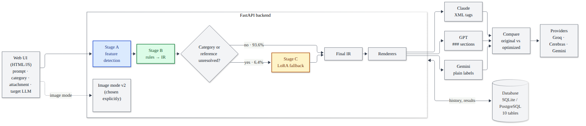

# 2. System architecture

[Back to the index](README.md)

This chapter describes the system from the outside in: the components, one request followed through every step and
sub-step, the module map of the code base, the technology stack with exact versions, and where the data and model
artifacts live.

---

## 2.1 Components

(Mermaid source: `docs/diagrams/01_system_architecture.mmd`; the other seven diagrams are in the same folder.)

| component | code | role |
|---|---|---|
| Web UI v2 | `frontend/` (React 19 + TypeScript + Vite + Tailwind), built into `backend/app/static/ui/` | prompt entry, results, Compare, history, image mode, test suite, results, status |
| Classic UI | `backend/app/static/index.html`, `app.js`, `style.css` | the first plain HTML/JS UI, still served at `/classic` |
| HTTP API | `backend/app/api.py`, `backend/app/ui_api.py` (FastAPI) | all endpoints (chapter 13.2) |
| Stage A | `backend/app/stage_a/` | feature detection: category + confidence, missing format/constraints, filler, ambiguous references |
| Stage B | `backend/app/stage_b/` | 15 deterministic rules on the IR, change log, routing decision |
| Stage C | `backend/app/stage_c/` | Qwen2.5-0.5B-Instruct + LoRA, fills only unresolved IR fields under a validated contract |
| Rendering | `backend/app/rendering.py` | IR → Claude / GPT / Gemini prompt, input token counts |
| Pipeline | `backend/app/pipeline.py` | one request end to end through the repository |
| Image mode | `backend/app/image/` | separate rule-based optimizer for image-generation prompts |
| Compare | `backend/app/compare/` | original vs optimized prompt on a real model |
| Coding tests | `backend/app/coding/` | sandboxed execution of generated code against validated asserts |
| Database | `backend/app/db/` (SQLAlchemy 2) | 10 tables on SQLite (development) or PostgreSQL (deployment) |
| Evaluation | `backend/app/evaluation/`, `backend/app/stage_*/evaluate.py`, `backend/app/correctness/` | every reported number |
| Dataset tools | `backend/app/dataset_repair.py`, `dataset_expand.py`, `validation.py`, `reference_check.py` | build, repair, expand and validate the dataset |

The design principle is **rules first, model last**: Stage A only observes, Stage B fixes what fixed rules can fix and
writes down what it could not, and Stage C (a small model) is called only for those written-down gaps, with its
answer checked by the same detectors as everything else.

## 2.2 One text request, step by step

The request is `POST /api/optimize` with JSON
`{"prompt": "hey can you please summarize this for me", "target": "claude", "category": "auto", "attachment_type": "none"}`.

**Step 1: HTTP layer** (`api.py`, `optimize_prompt`)

1. FastAPI validates the body against `OptimizeRequest` (Pydantic): `prompt` 1–20,000 characters, `target` one of
   claude/gpt/gemini (or an image target), `category` auto / one of five / `image_generation`, attachment type one of
   eight, optional `attachment_name` (≤ 255 characters) and `context` (pasted text, ≤ 50,000 characters).
   An invalid body gets HTTP 422 before any code runs.
2. The `enforce_retention` dependency deletes every prompt whose `expires_at` has passed, with everything derived from
   it (chapter 13.6). This runs on the same database session as the endpoint.
3. `category == "image_generation"` → the separate image mode (section 2.3). A text request with an image target →
   422.

**Step 2: store the prompt** (`pipeline.process_prompt` → `repository.create_prompt`)

1. Reject a prompt that is empty after stripping whitespace (`DataValidationError` → HTTP 422).
2. Strip surrounding whitespace, then remove emails and phone numbers (`db/pii.py`); count the redactions.
3. Insert a `prompts` row with `created_at = now (UTC)` and `expires_at = now + RETENTION_DAYS (30) days`; `flush`
   so the id exists. Nothing is committed yet.
4. Pasted context, if any, is scrubbed the same way (it ends up in stored renderings).

**Step 3: Stage A** (`stage_a/detector.py`, `FeatureDetector.detect`; chapter 4)

1. Category: embed the prompt (all-MiniLM-L6-v2, 384 numbers), vote over the 25 most similar training prompts, blend
   with keyword cues, average with a logistic-regression head, apply the "other" backstop → scores per category; the
   top score is the category and its value the confidence.
2. `has_context`: true if text was pasted, or the prompt itself carries data (code fence, long quote, list, ...).
3. spaCy parses the prompt (sentences, part-of-speech) when the model is installed.
4. Detectors A02 (format), A03 (constraints), A04 (filler, repetition), A05 (ambiguous references) return evidence.
5. The result is a `PromptFeatures` object, saved to `prompt_features`.

**Step 4: Stage B** (`stage_b/optimizer.py`, `optimize`; chapter 5)

1. Category choice: `auto` keeps Stage A's; a user category replaces it with confidence 1.0 and re-derives the
   missing constraints for it.
2. An attachment counts as context.
3. Initial IR: `task` = the prompt; `unresolved` gets `task category` (confidence < 0.6 or `other`) and
   `ambiguous reference: ...` (A05 evidence).
4. Rules run in fixed order B07 → B01 → B02 → B09…B15 → B08 → B06 → B05 → B04 → B03, then (app only) B16. After
   each rule the IR is rendered to plain text before and after; if the text changed, a change-log step is recorded.
5. `context_ref` is set (none / inline / separate / attachment), the stored confidence computed, and
   `needs_stage_c` is true if `unresolved` still contains a task-category or ambiguous-reference item.

**Step 5: Stage C** (only if routed and the model is installed; chapter 6)

1. Build the JSON input (prompt, Stage A category and confidence, `has_context`, attachment, the IR with the requested
   fields set to `null`, the list of requested fields).
2. Generate greedily (≤ 192 new tokens) with the merged LoRA model.
3. Validate (one JSON object, exactly the requested keys, task has no ambiguous reference, format is a format,
   constraints a list of strings, category valid). On failure keep Stage B's IR (fallback).
4. On success patch only the requested fields. A requested category is never applied: it is returned as a guess and
   the UI asks the user (category policy).
5. An accepted answer adds a change-log step with `stage = "C"`.

**Step 6: store the result and render** (`pipeline.py`)

1. `save_optimization`: one `optimization_results` row (IR as JSON, plain optimized text, confidence, whether LoRA
   was used, Stage C latency) and one `transformations` row per change-log step (rule id, before, after).
2. `render_all`: the final IR rendered for Claude, GPT and Gemini (chapter 7); saved to `renderings`.
3. Token counts per target: GPT exact (tiktoken `o200k_base`), Claude/Gemini approximate (characters ÷ 4); the
   original prompt (+ pasted text) is counted the same way; both saved to `token_usage`.
4. The endpoint commits **once**; if anything failed earlier, nothing is stored.

**Step 7: response** — JSON with spelling suggestions for the prompt as typed (`spelling`, chapter 13.7; nothing is
changed), Stage A's findings (`stage_a`), the category decision (`category`: used, source,
requested, Stage A's own, disagreement, uncertain, Stage C's guess), plain-language issues, the rules that fired with
before/after, Stage C's status (available, routed, reasons, used, accepted, fields, errors, seconds, raw output), the
final IR, the plain optimized text, the three renderings, the token counts, and (for coding prompts) validated or
generatable tests.

## 2.3 Other request types

**Image mode** (`POST /api/optimize` with `category = "image_generation"`): the prompt is stored like a text prompt
(PII scrubbed, retention), then optimized by image optimizer v2 (chapter 11), rendered for DALL-E, Nano Banana and
Stable Diffusion, and saved with the image IR and its rule log inside the result's IR JSON. Stage A/B/C are not
involved.

**Compare** (`POST /api/compare`; chapter 12): runs step 2–6 above (the optimized prompt is stored like any other),
then sends the scrubbed original prompt (+ scrubbed pasted text) and the optimized rendering for the chosen target to
the same real model, temperature 0, same maximum tokens; returns both answers with input/output/reasoning tokens,
latency, sandbox test results for dataset coding items, and an optional blind judge score. The token counts are
stored as an extra `token_usage` row tagged `compare:<model>`.

**History** (`GET /api/history`, `GET /api/history/{id}`, `GET /api/ui/history`, `DELETE /api/ui/history/{id}`):
read or delete stored prompts; expired prompts are deleted first.

## 2.4 Module map (backend)

| file | purpose |
|---|---|
| `app/config.py` | every setting, read from the environment / `backend/.env` |
| `app/api.py` | FastAPI app: UI pages, `/api/optimize`, `/api/compare`, history, coding tests, suite |
| `app/ui_api.py` | read-only endpoints for the React UI (status, examples, live token counter, results, suite grid, history search, compare history) |
| `app/retention.py` | the retention dependency (delete expired prompts before a request) |
| `app/spelling.py` | spelling suggestions for the typed prompt (chapter 13.7); never changes it |
| `app/pipeline.py` | `process_prompt`: store → Stage A → B → (C) → render → token counts |
| `app/rendering.py` | renderers per target, fencing, token counting |
| `app/stage_a/schema.py` | `PromptFeatures` (Stage A output) |
| `app/stage_a/rules.py` | detectors A02–A05 and context detection |
| `app/stage_a/classifier.py` | keyword classifier, embedding k-NN classifier, logistic head |
| `app/stage_a/build_index.py` | builds `artifacts/category_index.npz` from the train split (+ Dolly "other") |
| `app/stage_a/detector.py` | `FeatureDetector`: combines classifier and detectors |
| `app/stage_a/evaluate.py` | Stage A report on a split |
| `app/stage_b/ir.py` | `PromptIR`, `Attachment`, `render_plain` |
| `app/stage_b/rules.py` | rules B01–B15, `RULES` order, constants |
| `app/stage_b/extensions.py`, `extensions_eval.py` | B16 (app only, after the frozen rules) and its measurement (chapter 5.8) |
| `app/stage_b/optimizer.py` | `optimize`, category choice, initial IR, confidence, routing |
| `app/stage_b/evaluate.py` | Stage B report on a split |
| `app/stage_b/rule_accuracy.py` | per-rule precision/recall/F1 (B01–B08) |
| `app/stage_c/contract.py` | routing contract: requested fields, model input, validation, patching, category policy |
| `app/stage_c/parse.py` | optimized prompt → task / output_format / constraints (training targets) |
| `app/stage_c/data.py` | Stage C training/validation data, cross-fitting, packaging |
| `app/stage_c/train.py` | standalone LoRA training script (local and Colab) |
| `app/stage_c/runtime.py` | loads base + adapter, greedy generation |
| `app/stage_c/evaluate.py` | base vs LoRA, ablation, category policy, latency |
| `app/db/base.py`, `models.py`, `repository.py`, `pii.py`, `seed.py` | engine/session, 10 tables, the only read/write module, PII scrubbing, rule catalogue |
| `app/init_db.py` | create tables + seed rules; `--purge`; `--sql` prints PostgreSQL DDL |
| `app/evaluation/llm.py` | Groq client with pacing, retries, ledger; `Completion` |
| `app/cerebras.py` | Cerebras client (same interface) |
| `app/llm_router.py` | routes `cerebras/...` models to Cerebras, others to Groq |
| `app/groq_budget.py` | rolling 24-hour usage ledger and Groq limits |
| `app/evaluation/variants.py`, `judge.py`, `success.py`, `run.py`, `tokens.py` | evaluation harness (chapter 8) |
| `app/compare/providers.py`, `service.py` | Compare models and logic; Gemini client |
| `app/coding/sandbox.py`, `harness.py`, `testgen.py`, `evaluate.py`, `app_tests.py` | sandbox, test running, test generation, pass@1 |
| `app/image/attributes.py`, `optimizer.py`, `render.py`, `v2.py`, `evaluate.py`, `generate.py` | image mode |
| `app/correctness/cases.py`, `checks.py`, `prompts.py`, `run.py`, `review.py`, `view.py` | 50-case correctness suite |
| `app/dataset_io.py` | reads the dataset CSV |
| `app/dataset_repair.py` | v1 → v1.1 repair |
| `app/dataset_expand.py` | v1.1 → v1.2 expansion (sampling, generation, checks, splits) |
| `app/validation.py` | rater sheets, agreement statistics, merge |
| `app/reference_check.py` | static checks of CodeAlpaca reference answers |
| `app/attachment_eval.py` | attachment rule test (30 prompts) |
| `app/templates_doc.py` | writes `docs/CATEGORY_TEMPLATES.md` from the rule constants |
| `app/demo.py` | offline terminal demo |
| `app/freeze_check.py` | byte-level comparison with `frozen-for-test` |

## 2.5 Technology stack (pinned versions)

From `backend/requirements-lock.txt` (CPU venv `.venv`) and `backend/requirements-gpu-lock.txt` (GPU venv
`.venv-gpu`); Python 3.14 on Fedora 44.

| purpose | package | version (CPU / GPU venv) |
|---|---|---|
| web framework | fastapi, uvicorn | 0.142.2, 0.54.0 |
| data validation | pydantic | 2.13.5 |
| ORM | SQLAlchemy | 2.1.0 / 2.1.2 |
| PostgreSQL driver | psycopg | 3.3.6 |
| arrays | numpy | 2.5.3 |
| NLP parsing | spacy (+ `en_core_web_sm`) | 3.8.16 |
| sentence embeddings | sentence-transformers | 6.1.0 |
| logistic regression | scikit-learn | 1.9.1 |
| statistics | scipy | 1.18.1 |
| deep learning | torch | 2.14.0+cpu / 2.14.1+cu132 |
| transformers | transformers | 5.17.0 / 5.18.0 |
| LoRA | peft | 0.21.2 (GPU venv) |
| image generation | diffusers, accelerate | 0.40.0, 1.15.0 (GPU venv) |
| GPT tokenizer | tiktoken | 0.14.0 |
| LLM APIs | groq, httpx | 1.7.0, 0.28.1 |
| rater sheets | openpyxl | 3.1.5 |
| frontend | react, react-dom, react-router-dom, recharts, radix-ui, framer-motion, tailwindcss, vite, typescript | see `frontend/package.json` (React 19.1.1, Vite 6, Tailwind 4.1.12, TypeScript 5.8) |
| browser tests | @playwright/test | 1.55.0 |
| sandbox | bubblewrap (`bwrap`) | 0.12.0 (system package) |

Models: `sentence-transformers/all-MiniLM-L6-v2` (Stage A, about 90 MB), `Qwen/Qwen2.5-0.5B-Instruct` + LoRA adapter
(Stage C, about 1 GB + 34 MB), `stable-diffusion-v1-5/stable-diffusion-v1-5` and `openai/clip-vit-base-patch32`
(image evaluation only). LLMs via API: `openai/gpt-oss-120b` on Groq and Cerebras (target), `qwen/qwen3.8-27b` on Groq
(judge), `gemini-2.5-flash` (wired, not run).

## 2.6 Where things live

| what | location | in git? |
|---|---|---|
| code, tests, docs, reports | repository | yes |
| built React UI | `backend/app/static/ui/` | yes (so running the app needs no Node) |
| dataset (all versions) | `data/promptopt_dataset_*` and Google Drive | no (`data/` is git-ignored) |
| Stage A index | `backend/artifacts/category_index.npz` | no; GitHub release `v1.0` |
| Stage C adapter | `backend/artifacts/stage_c_adapter/` | no; GitHub release `v1.0` |
| Stage C data manifest | `docs/stage_c_data_manifest.json` | yes |
| LLM call caches, usage ledgers | `data/evaluation/`, `data/compare/`, `data/coding/`, `data/*_usage.json` | no |
| secrets | `backend/.env` | no (git-ignored; template `backend/.env.example`) |
| SQLite database | `backend/promptopt.db` | no |
