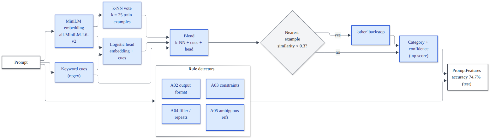

# 4. Stage A: feature detection

[Back to the index](README.md)

Stage A looks at a prompt and writes down what is wrong with it. **It never changes the prompt.** Its output, a
`PromptFeatures` object, drives every Stage B rule. Code: `backend/app/stage_a/`. Detector codes A01–A05 are the
entries of the rule catalogue (`backend/app/db/seed.py`).

---

## 4.1 Input and output

**Input:** the prompt text and, optionally, a context (text pasted next to the prompt).
**Output:** `PromptFeatures` (`stage_a/schema.py`, Pydantic):

| field | type | meaning |
|---|---|---|
| `task_type` | one of the 6 categories | the category with the highest score (A01) |
| `confidence` | float in [0, 1] | that highest score, rounded to 4 decimals |
| `category_scores` | {category: float}, sums to 1 | every category's score |
| `classifier` | `"embedding"` / `"keyword"` | which classifier produced it |
| `has_format_spec`, `format_evidence` | bool, [str] | A02: an output format is stated, and the matched words |
| `has_context` | bool | material to work on was pasted, or is embedded in the prompt |
| `constraints_present` | [length / tone / audience / language] | A03 constraints the prompt states |
| `missing_constraints` | same | constraints **relevant to the category** that the prompt does not state |
| `redundant_phrases` | [str] | A04 filler and repeated text |
| `ambiguous_refs` | [str] | A05 references to material that is not there |
| `word_count` | int | words in the prompt |

Every detector returns **evidence** (the exact words matched), so the UI can highlight why something was flagged.

Real output for *"hey can you please summarize this for me"* (no context):

```json
{"task_type": "summarization", "confidence": 0.9921,
 "category_scores": {"closed_qa": 0.004, "information_extraction": 0.0003, "classification": 0.0,
                     "summarization": 0.9921, "coding": 0.0001, "other": 0.0035},
 "classifier": "embedding", "has_format_spec": false, "format_evidence": [], "has_context": false,
 "constraints_present": [], "missing_constraints": ["length", "audience", "tone"],
 "redundant_phrases": ["hey", "can you please", "please", "for me"],
 "ambiguous_refs": ["summarize this"], "word_count": 8}
```

## 4.2 A01: task category



The category comes from a blend of three signals: a **k-nearest-neighbour vote** over labelled prompts in embedding
space, **keyword cues**, and a **logistic-regression head**; a **backstop** sends prompts unlike anything known to
`other`.

### 4.2.1 Sentence embedding

The prompt is encoded by `sentence-transformers/all-MiniLM-L6-v2` (`config.SENTENCE_MODEL`): a 6-layer MiniLM
transformer whose token vectors are mean-pooled into one **384-dimensional** vector. Vectors are **L2-normalized**
(`normalize_embeddings=True`), so for two prompts the dot product is their cosine similarity:

$$\text{sim}(a, b) = \mathbf{e}_a \cdot \mathbf{e}_b = \cos\angle(\mathbf{e}_a, \mathbf{e}_b) \in [-1, 1]$$

**Why this model:** it is the model the dataset's own quality checks used (so "similar" means the same thing
everywhere), it is small (about 90 MB) and fast on a CPU: the measured mean on the test split is **7.9 ms per prompt**
(batched, CPU; `evaluation/stage_a/stage_a_test_final.md`).

### 4.2.2 The labelled index (`build_index.py`)

Built once with `python -m app.stage_a.build_index` from the **train split only** (val and test never enter it):

* for every train row, its **degraded prompt** and its **original instruction**, labelled with the row's category:
  $4{,}509 \times 2 = 9{,}018$ texts (degraded prompts are what users type; original instructions add clean phrasings);
* **500 out-of-scope examples** labelled `other`: 250 Dolly `brainstorming` and 250 Dolly `creative_writing`
  instructions.

Total **9,518 × 384** float32 vectors in `artifacts/category_index.npz` (with the labels, the model name and the head).
Labels in the index: closed_qa 1,902, summarization 1,840, classification 1,812, information_extraction 1,734,
coding 1,730, other 500.

*Which Dolly rows become `other` examples:* each Dolly row number $i$ gets a bucket
$b_i = \text{int}(\text{SHA-256}(\texttt{"dolly-}i\texttt{"})[{:}8], 16) / (2^{32} - 1) \in [0, 1]$. Rows with
$b_i < 0.2$ (`OTHER_EVAL_FRACTION`) form a **held-out** evaluation set (467 prompts), never in the index; from the
rest, the 250 rows with the smallest $b$ per category go into the index (`OTHER_PER_CATEGORY`). A hash split is
deterministic and independent of file order.

*Why not Dolly `open_qa` / `general_qa` as `other`:* without their passage, degraded closed_qa prompts look exactly
like open questions; adding them cut closed_qa recall on val from 0.80 to 0.70 (comment in `build_index.py`).

### 4.2.3 k-NN vote

For the query embedding $\mathbf{q}$, compute $s_i = \mathbf{e}_i \cdot \mathbf{q}$ for every index vector, take the
$k = 25$ largest (`np.argpartition`), and weight each neighbour by

$$w_i = \exp\!\Big(\frac{s_i - s_{\max}}{\tau}\Big), \qquad \tau = 0.05$$

$$\text{knn}_c = \frac{\sum_{i \in \text{top-}k,\ y_i = c} w_i}{\sum_{i \in \text{top-}k} w_i}$$

This is a **softmax over the neighbours' similarities with temperature τ**. Subtracting $s_{\max}$ changes nothing in
the normalized result (it multiplies every weight by the same constant) but keeps the numbers in a safe range and
gives the nearest neighbour weight exactly 1. The temperature decides how fast a neighbour's influence falls with its
distance:

| similarity below the nearest neighbour, $s_{\max} - s_i$ | weight $w_i$ |
|---|---|
| 0.01 | 0.819 |
| 0.02 | 0.670 |
| 0.05 | 0.368 ($= e^{-1}$) |
| 0.10 | 0.135 |
| 0.20 | 0.018 |

So the vote is dominated by the few closest examples, while $k = 25$ gives a stable vote when many are about equally
close. The scores of the six labels sum to 1. The function also returns $s_{\max}$ (the **best similarity**) for the
backstop.

### 4.2.4 Keyword cues

Hand-written regular expressions with weights (`classifier.py`, `KEYWORD_CUES`); a pattern counts once if it matches
anywhere:

| category | cues (weight) |
|---|---|
| coding | programming terms such as function, script, algorithm, array, regex, SQL query (1.0); a language name such as Python, Java, Rust (1.5); "write/create/build … function/program/script/class/query/app" (2.0) |
| summarization | summary/summarize/TL;DR/sum up/recap/gist/condense/synopsis/overview (3.0); "main/key points/ideas/takeaways" (1.5) |
| classification | classify/categorize/label/sort … into/group these/sentiment (3.0); "which (of these) (one/ones) is/are" (1.5); "identify/tell me/say which" (2.0); "X or Y:" / "X or Y?" (1.0); "is a X a Y" (0.5) |
| information_extraction | extract… (3.0); "list/pull out/find/identify/give me … names/dates/places/people/…" (2.0); "mentioned/listed/named in" (1.5); "list all/the/out/of" (1.5); "from the/this text/passage/…" (1.0) |
| closed_qa | starts with a question word what/who/when/where/why/how/which/is/are/… (1.5); ends with "?" (1.0); "according to/based on the text/passage/…" (1.5) |

Raw score $r_c$ = sum of the matching weights; normalized $\text{kw}_c = r_c / \sum_{c'} r_{c'}$ (`other` gets 0).
If **any** cue fired, the k-NN scores are blended:

$$\text{blend}_c = (1 - 0.3)\,\text{knn}_c + 0.3\,\text{kw}_c$$

otherwise $\text{blend}_c = \text{knn}_c$ (`keyword_weight = 0.3`). **Why:** an explicit cue ("summarize", "write a
function") is more reliable than similarity alone, but cues also fire on incidental words, so they get less than a
third of the weight.

### 4.2.5 Logistic-regression head

A multinomial logistic regression over the embedding plus 6 keyword features:

$$\mathbf{x} = [\,\mathbf{e}\ (384) \;;\ \text{kw}_{\text{closed\_qa}}, \text{kw}_{\text{extraction}}, \text{kw}_{\text{classification}}, \text{kw}_{\text{summarization}}, \text{kw}_{\text{coding}}\ ;\ \mathbb{1}[\text{prompt ends with ?}]\,] \in \mathbb{R}^{390}$$

$$p(c \mid \mathbf{x}) = \operatorname{softmax}(W\mathbf{x} + \mathbf{b})_c = \frac{\exp(\mathbf{w}_c^\top \mathbf{x} + b_c)}{\sum_{c'} \exp(\mathbf{w}_{c'}^\top \mathbf{x} + b_{c'})}, \qquad W \in \mathbb{R}^{6 \times 390}$$

**Training** (scikit-learn `LogisticRegression(C=4.0, class_weight="balanced", max_iter=3000)`, L-BFGS) minimizes the
weighted cross-entropy plus an L2 penalty:

$$\min_{W, \mathbf{b}}\ \ C \sum_{i=1}^{N} \alpha_{y_i}\,\big(-\log p(y_i \mid \mathbf{x}_i)\big) + \tfrac{1}{2}\lVert W \rVert_2^2$$

* $C = 4.0$ (`HEAD_C`) is the inverse regularization strength, **chosen by 5-fold cross-validation on train**.
* `class_weight="balanced"` sets $\alpha_c = \frac{N}{K\,N_c}$, so every category contributes equally in total. With
  $N = 9{,}518$ and $K = 6$: $\alpha_{\text{other}} = 9518 / (6 \times 500) = 3.17$, while the five task categories get
  0.83–0.92. Without it, the 500 `other` examples would be under-weighted against ~1,800 per task category.

At run time the head is plain NumPy (`LinearHead.predict_proba`: $z = W\mathbf{x} + \mathbf{b}$, subtract
$\max z$, exponentiate, normalize), so scikit-learn is not needed to serve requests.

### 4.2.6 Final score and the "other" backstop

$$\text{score}_c = 0.5\,\text{blend}_c + 0.5\,p(c \mid \mathbf{x}) \qquad (\texttt{head\_weight} = 0.5)$$

**Backstop.** If even the nearest neighbour is not similar, $s_{\max} < 0.3$ (`other_threshold`), nothing in the data
looks like the prompt. Then

$$\text{keep} = \frac{\max(s_{\max}, 0)}{0.3 \times 2} \in [0, 0.5), \qquad \text{score}_c \leftarrow \text{keep}\cdot\text{score}_c, \qquad \text{score}_{\text{other}} \mathrel{+}= 1 - \text{keep}.$$

*Why `other` always wins in this case.* The scores summed to 1 before, so after scaling every non-`other` category
has at most $\text{keep} < 0.5$, while `other` has at least $1 - \text{keep} > 0.5$. The less similar the nearest
example, the more mass `other` gets: $s_{\max} = 0.24 \Rightarrow \text{keep} = 0.40$, `other` ≥ 0.60;
$s_{\max} = 0.1 \Rightarrow$ `other` ≥ 0.83.

**Decision:** `task_type` = the category with the highest score; **confidence = that score**.

### 4.2.7 Worked examples (real numbers from the final index)

| step | "hey can you please summarize this for me" | "describe what is happening in the picture" | "write a haiku about autumn rain" |
|---|---|---|---|
| nearest neighbours (sim, label) | 0.590 sum, 0.531 sum, 0.488 sum, 0.488 sum, 0.396 sum | 0.430 coding, 0.420 coding, 0.417 coding, 0.407 sum, 0.393 coding | 0.701 sum, 0.701 sum, 0.664 other, 0.660 other, 0.635 other |
| k-NN | summarization 0.988, closed_qa 0.009 | coding 0.503, summarization 0.388, extraction 0.066 | summarization 0.615, other 0.372 |
| keyword cues | "summarize" → summarization 3.0 → kw = 1.0 | none | none |
| blend | 0.7 × 0.988 + 0.3 × 1.0 = **0.992** | = k-NN (no cue) | = k-NN |
| head | summarization 0.993 | other 0.497, coding 0.234, summarization 0.146 | other 0.881 |
| final = 0.5 blend + 0.5 head | **summarization 0.9921** | **coding 0.368**, summarization 0.267, other 0.258 | **other 0.627**, summarization 0.315 |
| backstop | no ($s_{\max}$ = 0.59) | no (0.43) | no (0.70) |

The second prompt is the named case of chapter 6: the category is wrong and the confidence is low (0.37 < 0.6), so
Stage B adds nothing category-specific and routes it. The third shows `other` coming from the labelled Dolly
creative-writing examples and the head, not from the backstop.

### 4.2.8 How the settings were chosen, and what "confidence" means

| setting | value | how it was chosen |
|---|---|---|
| model | all-MiniLM-L6-v2 | same encoder as the dataset checks; speed on CPU |
| $k$ | 25 | tuned on val (comment "Defaults tuned on the val split"; the tuning log is not in the repository) |
| $\tau$ | 0.05 | tuned on val |
| keyword weight | 0.3 | tuned on val |
| head weight | 0.5 | tuned on val |
| `other` threshold | 0.3 | tuned on val |
| head $C$ | 4.0 | 5-fold cross-validation on train |
| `other` examples | 250 + 250 | `OTHER_PER_CATEGORY`; open_qa excluded (val recall drop, above) |

Evidence for blending (5-fold cross-validation on train, `classifier.py` docstring): accuracy of the average
**72.9%**, vs **69.3%** for k-NN alone and **70.4%** for the head alone; at 90% precision the blend keeps 63% of
prompts above the confidence gate vs 53% for k-NN.

**The confidence is not calibrated.** No Platt scaling or isotonic regression is applied; it is a blended score, not a
probability. The threshold that uses it (0.6, chapter 5.3) was therefore chosen empirically on val: above 0.6 Stage A
was right 77–96% of the time, between 0.4 and 0.6 only 47–59% (comment above `CATEGORY_MIN_CONFIDENCE`).

### 4.2.9 Fallback classifier

Without an index file (fresh clone without the release download), `default_classifier()` falls back to the
**keyword classifier**: normalized cue weights, or `other` = 1.0 if no cue fires. Everything still runs, but categories
are less accurate on hard prompts. The tests use it so they need no model download.

## 4.3 The rule-based detectors (`stage_a/rules.py`)

Each detector is a separate, pure function returning evidence; all patterns are case-insensitive.
`_find_all` returns matched substrings in order of appearance without duplicates.

### 4.3.1 A02 output format (`detect_format_spec`, 26 patterns)

Flags an explicit output format: JSON / YAML / CSV / XML / markdown / HTML table; "a table"; bulleted / numbered /
comma-separated lists; "separated by commas / new lines"; "as a list"; "one item per line"; "start with the direct
answer"; "in (at most / exactly) N words / sentences / lines / bullet points"; "a one-sentence summary"; "answer/
output/return only"; "only the label / name / number"; "yes or no", "true or false"; "output format / as / only";
"formatted as"; "in the following format"; "format:"; "code block"; "with headings / sections"; "key-value pairs";
"labels only"; "(max 50 words)"; "under 100 words". An empty list means **format missing**.

### 4.3.2 A03 constraints (`detect_constraints`)

| kind | what counts (examples) |
|---|---|
| length (5 patterns) | "3 sentences", "brief", "concise", "short", "in detail", "at most 50", "one-liner", "only the label" |
| tone (3) | "formal tone/style/manner/voice", "politely", "objectively", the word "tone" |
| audience (4) | "explain … to a beginner / 10-year-old / non-technical audience / investors …", "audience", "explain like I'm 5", "in simple terms" |
| language (3) | a programming language name (Python, Java, JavaScript, C++, C#, Go, Rust, SQL, Bash, …), "in Go/R/C", "C code" |

**Which constraints are worth asking for** depends on the category (`RELEVANT_CONSTRAINTS`):

| category | relevant | why |
|---|---|---|
| closed_qa | length | answers grow without a limit; tone/audience rarely matter for a fact |
| information_extraction | — | the output is a list of facts; a length would conflict with "extract all" |
| classification | — | the output is labels |
| summarization | length, audience, tone | a summary's length and register are its main free choices |
| coding | language | the single most important missing fact for code |
| other | length, audience, tone | general prose |

`missing_constraints` = relevant constraints not present. Stage B fills only some of them (length for closed_qa and
summarization, language for coding); audience and tone are reported but never invented.

### 4.3.3 A04 redundancy (`detect_filler`, 17 patterns; `detect_repetition`)

Filler: a greeting at the start (hey/hi/hello/dear), please, kindly, "could/can/would/will you (please/kindly) (be
able to / mind / help me to)", "I was/am just wondering if (you could)", "I'd like/love you to", "I want/need you to",
"if possible / if you can / if you don't mind", "if it's not too much trouble", thanks / thank you (so much / in
advance), basically/literally/actually/honestly, "just" (not "just in time/now/like/as/because"), "sort of / kind of"
(not "what kind of …"), "you know", "quick question", "for me", "as an AI (language model)".

Repetition: a sentence of **3 or more words** (after removing punctuation and lower-casing) that repeats an earlier
sentence, and doubled words ("the the"), except allowed doubles (that, had, is, no, bye, very, so) and numbers.
Sentences come from spaCy when available, otherwise a regex split on `.!?` and new lines.

### 4.3.4 A05 ambiguous references (`detect_ambiguous_refs`)

Only when **no context** was supplied (pasted or embedded). Four patterns over 48 reference nouns (text, passage,
article, document, code, function, data, table, file, image, picture, pdf, slide, spreadsheet, …):

1. a demonstrative or position word + noun: "this/that/these/those/above/below/following/given/provided/attached/
   previous/said text";
2. "the + noun" only where the noun phrase **ends** ("summarize the article.", "the text and …"), not "returns the
   page content";
3. "the above", "aforementioned", "mentioned above", "discussed earlier";
4. an action verb + pronoun: "summarize/explain/fix/translate/rewrite/check/debug/classify/describe/… it/this/that/
   these/those/them" (not followed by an -ing word).

With spaCy, a pronoun (it/this/that/these/those/they/them) that appears **before any noun or number** it could refer
to is also flagged ("what does it mean?"), except expletive "it" ("it is raining"), subordinating "that", and pronouns
inside a relative clause.

### 4.3.5 Embedded context (`detect_embedded_context`)

The prompt itself carries material when any of these holds: a code fence or code-like line (4-space indent, a line
ending in `{`, `}` or `;`, `def f(`, `function f(`, an HTML tag); a quoted passage of 40+ characters; **2 or more
commas**; a `head: tail` split where the head has ≤ 25 words and the tail ≥ 8 words or a comma; 2+ lines with ≥ 8
words after the first line; or **60+ words** in total. `has_context` = pasted context present, or embedded material.

## 4.4 How Stage A is measured (`stage_a/evaluate.py`)

**Input:** the *degraded* prompts of a split (what users type) with their context; **reference:** the dataset's
category label.

| metric | formula |
|---|---|
| accuracy | $\frac{\#\{\text{pred} = \text{gold}\}}{n}$ |
| precision of $c$ | $P_c = \frac{TP_c}{\#\{\text{pred} = c\}}$ (read down a confusion-matrix column) |
| recall of $c$ | $R_c = \frac{TP_c}{\#\{\text{gold} = c\}}$ (read along a row) |
| F1 of $c$ | $F1_c = \frac{2 P_c R_c}{P_c + R_c}$ (harmonic mean) |
| macro-F1 | $\frac{1}{5}\sum_{c} F1_c$ over the five task categories (each counts equally) |

**Test split (n = 482), confusion matrix** (rows = true, columns = predicted):

| true \ pred | closed_qa | extraction | classification | summarization | coding | other | total |
|---|---|---|---|---|---|---|---|
| closed_qa | **76** | 5 | 2 | 13 | 0 | 3 | 99 |
| information_extraction | 23 | **52** | 2 | 15 | 1 | 0 | 93 |
| classification | 2 | 0 | **94** | 0 | 0 | 2 | 98 |
| summarization | 33 | 14 | 2 | **42** | 0 | 3 | 94 |
| coding | 0 | 0 | 1 | 0 | **96** | 1 | 98 |
| predicted total | 134 | 71 | 101 | 70 | 97 | 9 | 482 |

**Worked computation:**

* accuracy $= (76 + 52 + 94 + 42 + 96)/482 = 360/482 = \mathbf{74.7\%}$
* summarization: $P = 42/70 = 0.600$, $R = 42/94 = 0.447$, $F1 = \frac{2 \cdot 0.600 \cdot 0.447}{0.600 + 0.447} = 0.512$

| category | TP | predicted | true | precision | recall | F1 |
|---|---|---|---|---|---|---|
| closed_qa | 76 | 134 | 99 | 56.7% | 76.8% | 0.652 |
| information_extraction | 52 | 71 | 93 | 73.2% | 55.9% | 0.634 |
| classification | 94 | 101 | 98 | 93.1% | 95.9% | 0.945 |
| summarization | 42 | 70 | 94 | 60.0% | 44.7% | 0.512 |
| coding | 96 | 97 | 98 | 99.0% | 98.0% | 0.985 |

* macro-F1 $= (0.652 + 0.634 + 0.945 + 0.512 + 0.985)/5 = \mathbf{0.746}$; val accuracy 75.8%.

**Reading.** Coding and classification are nearly perfect. Almost all errors are inside the text group (closed_qa,
information_extraction, summarization): a degraded prompt such as "what is this about?" fits all three, and Dolly's
labels in this group are noisy (chapter 3.12). That is exactly why Stage B has the group-level rule B08 (chapter 5).

**Out-of-scope prompts:** of the 467 held-out Dolly brainstorming/creative-writing prompts (never in the index),
**68.5%** are classified `other`.

**A02 agreement with the dataset's format labels** (the dataset's `has_format_spec` columns come from the notebook's
own regex, so this measures consistency between two regex detectors, not ground truth):

| prompt | flagged as having a format | agreement with the dataset label |
|---|---|---|
| original instruction | 6.8% | 95.2% |
| degraded prompt | 3.1% | (no label) |
| optimized prompt | 79.0% | 67.0% |

**A03:** missing relevant constraints in degraded test prompts: length 209, audience 79, tone 79, language 41.
**A04:** degraded prompts with filler/repetition 3.9%, optimized 0.4%.
**A05:** degraded prompts whose source had **no** context (141): 5.0% flagged (mostly false alarms); degraded prompts
whose source **had** a context, run without it (341): 20.5% flagged (a reference to a missing passage is what A05
should catch).

## 4.5 Cross-fitting (used to build Stage C's training data)

The index contains every train prompt, so Stage A on train would find each prompt as its own nearest neighbour and
look unrealistically accurate; Stage C's training data (which depends on Stage A's routing) would then not match test
conditions. `stage_c/data.py`, `crossfit_features`:

1. fold of a train row $= \text{int}(\text{SHA-256}(\text{lower}(\text{original instruction}))[{:}8], 16) \bmod 5$,
   so paraphrases of the same instruction stay in the same fold;
2. for each fold $k$, rebuild the k-NN index and retrain the head **without** fold $k$ (reusing the stored embeddings;
   nothing is re-encoded), and classify the rows of fold $k$ with it.

Cross-fitted accuracy on train: **73.9%**, close to 74.7% on test, so the routing labels in Stage C's data are
realistic. Val and test were never in the index and use it as is.

## 4.6 Limitations and known issues

* **Weak in the text group** (summarization F1 0.51): addressed by B08 and by letting the user pick the category.
* **The confidence is a score, not a probability**; the 0.6 gate is empirical (chapter 5.3).
* **Regex detectors miss phrasings:** "a short **formal** email" is not a tone constraint (the tone pattern wants
  "formal tone/style/…"; "short" counts as length).
* **Frozen, reported, not fixed:** in `detect_embedded_context`, the quoted-passage pattern
  `[\"“'']([^\"”'']{40,})[\"”'']` lists the straight apostrophe twice where curly single quotes (‘ ’) were evidently
  intended, so a 40+ character passage in curly single quotes is not recognized as context by this pattern (other
  context signals usually still fire). Fixing it would change Stage A output and break the freeze check (chapter 15.5).
