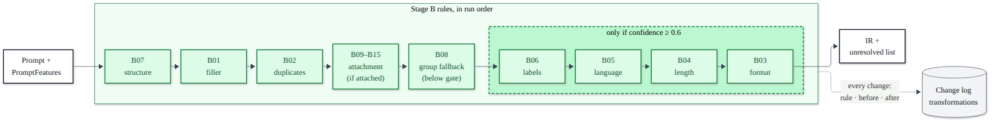

# 5. Stage B: the rule-based optimizer

[Back to the index](README.md)

Stage B fixes what fixed rules can fix. It turns the prompt into a structured **intermediate representation (IR)**,
runs 15 small, separately tested rules over it in a fixed order, logs every change with the text before and after,
and writes down what it could **not** fix (`ir.unresolved`). Only some of those unresolved items send the prompt to
Stage C. Code: `backend/app/stage_b/`.

---

## 5.1 The IR (`stage_b/ir.py`, `PromptIR`)

A frozen (immutable) Pydantic model. Rules never edit a string in place; each returns a new IR (`model_copy`), so
every change is small, testable and loggable.

| field | type | meaning | sent to the target LLM? |
|---|---|---|---|
| `task` | str | what to do, in the user's words, cleaned | yes |
| `context` | str or null | data that was inside the prompt (a list, code), moved out by B07 | yes ("Input") |
| `context_ref` | none / inline / separate / attachment | where the material is | indirectly |
| `constraints` | tuple of str | length, programming language, grounding | yes |
| `requirements` | tuple of str | task-specific rules: allowed labels, how to use an attachment | yes (listed first) |
| `output_format` | str or null | how to lay out the answer | yes |
| `attachment` | {type, name} | none/image/pdf/pptx/docx/spreadsheet/code/other + optional file name | yes (a note) |
| `category` | category | the category Stage B used | no |
| `category_source` | stage_a / user / stage_c | where it came from | no |
| `category_group` | str or null | `text_based` when B08 resolved the category at group level | no |
| `target_llm` | gpt / gemini / claude / null | the user's target | no |
| `unresolved` | tuple of str | what Stage B could not fix | no |

`context_ref_for`: an attachment beats separate (pasted) text beats inline material.

`render_plain(ir)` is the generic optimized text used for the change log and storage:
`task`, then `"Input:\n" + context` if any, then one paragraph with requirements, constraints and output format.

## 5.2 How `optimize` runs (`stage_b/optimizer.py`)

1. **Category choice** (`apply_category_choice`). `"auto"` keeps Stage A's features. A user category (one of five)
   replaces Stage A's: `task_type` = the choice, `confidence = 1.0`, `category_scores = {choice: 1.0}`, and
   `missing_constraints` re-derived for that category from the constraints already present. Source recorded as
   `user`. Anything else raises an error (→ 422 at the API).
2. **Attachment = context.** If an attachment type is given, `has_context` becomes true.
3. **Initial IR** (`initial_ir`): `task` = the stripped prompt, plus two unresolved items that no rule can fix by
   itself:
   * `"task category"` if the category is `other` or its confidence is below 0.6;
   * `"ambiguous reference: 'x', 'y'"` if A05 found references.
4. **Rules** run in the fixed order of `RULES`:

   `B07 → B01 → B02 → B09 B10 B11 B12 B13 B14 B15 → B08 → B06 → B05 → B04 → B03`

   For each rule (skipping codes in `disabled`, used by the ablation): `new = rule(ir, features)`; if
   `render_plain(new) != render_plain(ir)`, append `{"rule_code", "before", "after"}` to `steps`. A rule that does
   not apply returns the IR unchanged.
5. **`context_ref`** is set.
6. **Confidence** (stored, **not** used for routing):

   $$\text{confidence} = \operatorname{clip}_{[0,1]}\big(\text{base} - 0.2 \times |\text{unresolved}|\big), \qquad \text{base} = \begin{cases} 0.3 & \text{category} = \text{other} \\ \text{Stage A confidence} & \text{otherwise} \end{cases}$$

   rounded to 4 decimals (`UNRESOLVED_PENALTY = 0.2`, `OTHER_CONFIDENCE = 0.3`). *Basis:* a simple, monotone summary
   for the UI and the database ("the more is unresolved, the less sure"); it is a heuristic, not a probability.
   *History:* in the first version a confidence below 0.7 routed the prompt to Stage C; that was replaced by the
   explicit rule in step 7 (commit `5b2111c`) because a score threshold sent prompts to the model that had nothing
   left to fix.
7. **Routing:**

   ```python
   STAGE_C_REASONS = ("task category", "ambiguous reference")
   needs_stage_c = any(u.startswith(STAGE_C_REASONS) for u in ir.unresolved)
   ```

   Four unresolved items can exist; only two route:

   | unresolved item | set by | routes to Stage C? |
   |---|---|---|
   | `task category` | initial IR (confidence < 0.6 or `other`), not cleared by B08 | **yes** |
   | `ambiguous reference: …` | initial IR (A05), not cleared by an attachment rule | **yes** |
   | `output format` | B03, when the category is not reliable | no (shown in the UI) |
   | `label set` | B06, when no labels could be found | no (shown in the UI) |

## 5.3 The 0.6 category gate

```python
CATEGORY_MIN_CONFIDENCE = 0.6
def category_is_reliable(ir, f): return ir.category in KNOWN_CATEGORIES and f.confidence >= 0.6
```

Rules B03–B06 add **category-specific** content (a format, a length, a language, labels). A wrong format is worse than
none (a classification layout on a summarization request misleads the model), so they act only when the category is
reliable.

**How 0.6 was chosen:** on the **val** split, Stage A's category was right 77–96% of the time when its confidence was
at least 0.6, and only 47–59% of the time between 0.4 and 0.6 (comment in `rules.py`; commit `3035ebb`). 0.6 is the
lowest value at which category-specific additions are usually right. It is an empirical threshold on an uncalibrated
score (chapter 4.2.8), set on val, never on test.

On test, 171 of 482 prompts (35.5%) have Stage A confidence below 0.6 (chapter 6.8); B08 then resolves most of them
at group level, so only 24 are routed for the category.

## 5.4 Shared clean-up: `tidy`

Used by B07, B01 and B02 on the task text:

1. collapse whitespace; remove spaces before `, . ; : ? !`; collapse repeated separators (`", ,"` left by deletions);
2. strip leading punctuation/dashes and trailing separators; remove a comma right before the final `.?!`;
3. **capital "I":** `i'm/i'd/i've/i'll` → `I'm…`; a lone `i` becomes `I` when the word before it is an auxiliary or
   conjunction (do, can, if, when, and, but, that, …) or the word after it is a verb (am, need, want, think, write,
   sort, …), or it opens the sentence before a word other than "in" — so `for i in range` is left alone;
4. capitalize the first letter;
5. end with `?` if the text starts with a question word (what, who, which, how, is, are, do, can, …) and contains no
   `?`, otherwise with `.`; a question-shaped text that ended in `.` gets `?`.

## 5.5 The rules, in run order



### B07 standardize structure (always runs first)

*Purpose:* separate the user's data from the instruction **before** any other rule touches the text, so later rules
never edit the data.

*Condition and action* (only if there is no context yet):
1. any fenced code block (```` ``` … ``` ````) is moved into `context` (several blocks joined by a blank line);
2. otherwise, for the data categories (classification, information_extraction, summarization, coding): at the first
   colon followed by whitespace, split into `head: tail` and move the tail to `context` if the head has no new line
   and ≤ 25 words, the tail does not end with `?`, and the tail has ≥ 8 words **or** a comma **or** a new line;
3. the task is tidied.

*Example:* `classify these as fruit or vegetable: apple, carrot, banana` → task `Classify these as fruit or
vegetable.`, context `apple, carrot, banana`.

*Why closed_qa is excluded from step 2:* in a question the part after a colon is usually the question itself.

### B01 remove filler

*Condition:* any A04 filler pattern in the task (the same list as the detector).
*Action:* delete each match, **unless** it is inside quotes (an odd number of quote marks before it) or within the
4 words after a content verb (print, say, display, output, echo, show, write out, …) — so `print please enter your
name` keeps its text. If fewer than 2 words would remain, do nothing (an all-filler prompt is left for Stage C). A
prompt that started with "(hey) can/could/would/will you …" and ended in `?` becomes an instruction ending in `.`
unless what remains still starts with a question word. Then tidy.

*Example:* `hey can you please summarize this for me` → `Summarize this.`

### B02 remove duplicates

*Action:* doubled words collapse to one (`the the` → `the`, except allowed doubles and numbers); a sentence of 3+
words that repeats an earlier one (after normalizing) is dropped. Then tidy.
*Example:* `sort the the list in python. sort the the list in python.` → `Sort the list in python.`

### B09–B15 attachment modifier (one rule per type)

*Condition:* `attachment.type` equals the rule's type. *Action:* put the type's requirement sentences **first** among
the requirements (`{name}` becomes ` (file.pdf)` when a file name was given), and remove the ambiguous-reference
problem from `unresolved` — the attachment is what "this"/"the file" refers to.

| rule | type | requirements added |
|---|---|---|
| B09 | image | Use what is visible in the attached image{name}; describe the parts you rely on. · If something is not visible or not readable in the image, say so instead of guessing. |
| B10 | pdf | Use the attached PDF{name} as the source. · Cite the page or section numbers for the information you use. · If the PDF does not contain the answer, say so. |
| B11 | pptx | Use the attached slide deck{name} as the source. · Refer to slides by their number. · If the slides do not contain the answer, say so. |
| B12 | docx | Use the attached Word document{name} as the source. · Cite the section headings for the information you use. · If the document does not contain the answer, say so. |
| B13 | other | Use the attached file{name} as the source. · If you cannot open or read the file, say so instead of guessing. |
| B14 | spreadsheet | Use the attached spreadsheet{name} as the source. · Refer to sheets, columns and rows by their names. · If the spreadsheet does not contain the data, say so. |
| B15 | code | Use the attached code file{name} as the code to work on. · Refer to functions and line numbers when you point to code. · If you cannot open or read the file, say so instead of guessing. |

*Why one rule per type:* the ablation can switch each off. *Why "say so instead of guessing":* the most common failure
with attachments is a model answering from prior knowledge when the file does not contain the answer. B14 and B15 were
added after the freeze and fire only with their attachment type (freeze check: byte-identical).

### B08 group fallback (text-based group)

*Condition* (`group_applies`), with $s_c$ = Stage A's scores:

$$\max_c s_c < 0.6 \quad\wedge\quad \text{has\_context} \quad\wedge\quad s_{\text{closed\_qa}} + s_{\text{information\_extraction}} + s_{\text{summarization}} \ge 0.6$$

*Reasoning:* Stage A often cannot tell these three apart (a degraded summarization or extraction prompt reads like a
question), but it is much surer that the prompt is **one of them**; all three work on attached text and want a short,
grounded answer. So the group, not a single category, is acted on.

*Action:* add what is missing of "answer from the text" and "at most three sentences":

| prompt already grounded? (`from the provided text`, `only … the text`, `based on/according to the …`) | A03 length present? | added constraint |
|---|---|---|
| no | no | `Answer from the provided text in at most three sentences.` |
| no | yes | `Answer from the provided text.` |
| yes | no | `Answer in at most three sentences.` |
| yes | yes | nothing |

then set `category_group = "text_based"` and remove `task category` from `unresolved`. No category-specific format is
added (B03 skips prompts with a group).

*Effect when it was introduced* (val, commit `5b2111c`): prompts routed to Stage C **52.0% → 11.3%**, with no new
wrong-category additions (B08 fired on 43 val prompts, none outside the group). On test it fires on 149 of 482 (30.9%).

*Example (val):* `what are the big inventions and discoveries from berkeley in that text?` with a passage, scores
closed_qa 0.45, summarization 0.36, extraction 0.17 (sum 0.98, max 0.45) → `+ Answer from the provided text in at most
three sentences.`

### B06 labels (classification)

*Condition:* category classification, reliable, and no `labels:`/`categories:`/`classes:` already in the text.
*Action:* extract the allowed labels (`extract_labels`) with three patterns, tried in order:
1. "(classify these) **as/into** (either) X, Y or Z" / "… X and Y";
2. "**which** (…) **is/are** X (,) **and which** (…) **is/are** Y";
3. "**is/are** (it/this/each/they/these) (a/the) X **or** Y".

Labels are split on commas/or/and, articles removed, quotes stripped; 2–8 **distinct** labels are required. When the
labels run to the end of the prompt with no punctuation ("is string or percussion agung bell"), the item is glued
onto the last label, so the last label is cut to the word length of the longest other label.
→ requirement `Use only these labels: "X", "Y".`
* No labels but a "which of these/the following … is/are …" question without "or" → `Use only these labels: "yes", "no".`
  (a yes/no decision per item).
* Otherwise → `label set` added to `unresolved` (recorded, not routed).

*Examples:* `which of these ski resorts are in utah: alta, vail, snowbird` → `"yes", "no"`;
`classify the following animals` → unresolved `label set`.

### B05 programming language (coding)

*Condition:* category coding, reliable, and `language` missing (A03).
*Action:* add `Use Python.`, or `Keep the language of the given code.` when code was supplied (pasted, embedded or a
code attachment). A data attachment (spreadsheet, PDF, image, docx, pptx, other) with no embedded code still gets
`Use Python.` (post-freeze refinement; attachment only).
*Why Python as the default:* it is by far the most common language in the CodeAlpaca coding items (47 of 98 test
items; the next is SQL with 14; chapter 10), and the coding test harness runs Python. *Why not detect the language of given code:* a regex cannot do it safely,
and a wrong language is worse than "keep the language".

### B04 length

*Condition:* category closed_qa or summarization, reliable, `length` missing.
*Action:* closed_qa → `Answer in at most two sentences.`; summarization → `Keep it under 100 words.`

*Basis:* design defaults written on 2026-09-25 (commit `3035ebb`) and kept after the val runs: a closed question is
answered in one or two sentences; 100 words is a common short-summary length. They are not numerically tuned;
their effect is measured (chapter 9: output tokens closed_qa 835 → 127, summarization 831 → 204 on test). Length is
never added to extraction or classification, whose output size is fixed by the data.

### B03 output format (runs last)

*Condition:* no format stated (A02), none set yet, and no group fallback.
If the category is not reliable → `output format` added to `unresolved` (recorded, not routed). Otherwise:

| category | format added |
|---|---|
| closed_qa | `Start with the direct answer.` |
| information_extraction | `List each extracted item on its own line; if the text does not contain it, reply "Not found".` |
| classification | `For each item, output "item: label" on its own line.` — or `Output only the label.` for a single item |
| summarization | `Use bullet points.` |
| coding | `Return only the code, in a single code block.` |

*Single item* (classification): no context, the task starts with is/was/does/do, and nothing hints at several items
(no comma/semicolon, no "and", these, following, each, every, all, list, items, them, which). *Why so strict:* on val
an earlier rule picked the single-label format for 8 prompts, all of which had 2+ items glued onto the question.

*Why B03 runs last:* it must know whether B08 already handled the prompt at group level.

All defaults per category, with renderings: `docs/CATEGORY_TEMPLATES.md` (generated from these constants by
`python -m app.templates_doc`).

## 5.6 One prompt through Stage B (real output)

`hey can you please summarize this for me` (Stage A: summarization 0.99; ambiguous reference "summarize this"):

| rule | before → after |
|---|---|
| B07 | tidy: `Hey can you please summarize this for me.` |
| B01 | → `Summarize this.` |
| B04 | + `Keep it under 100 words.` |
| B03 | + `Use bullet points.` |

`unresolved = ["ambiguous reference: 'summarize this'"]` → routed to Stage C for the `task` field. Stored
confidence: $0.9921 - 0.2 \times 1 = 0.7921$.

## 5.7 How Stage B is measured

### 5.7.1 Offline report (`stage_b/evaluate.py`, test, n = 482)

| metric | definition | result |
|---|---|---|
| output format stated | share of prompts where A02 finds a format, degraded vs after Stage B | **3.1% → 95.0%** (dataset's LLM-written optimized prompts: 79.0%) |
| mean words | words per prompt | 11.2 → 22.0 (dataset optimized: 26.3) |
| routed to Stage C | `needs_stage_c` | **31 (6.4%)**: 24 task category, 7 ambiguous reference |
| recorded, not routed | | label set 27, output format 24 |
| wrong-category additions | prompts where B03–B06 fired but Stage A's category ≠ the dataset label, **plus** prompts where B08 fired but the label is outside the text group | $\frac{24 + 1}{482} = $ **5.2%** (partly Dolly label noise) |
| missing constraints left | prompts not routed that still lack a relevant constraint per A03 | language 27 |

Rules fired on test: B07 481 (99.8%), B03 295 (61.2%), B08 149 (30.9%), B04 81 (16.8%), B06 64 (13.3%),
B05 40 (8.3%), B01 18 (3.7%), B02 1 (0.2%), B09–B15 0 (no attachments in the dataset).

Per category:

| category | n | format: degraded → Stage B | words: degraded → Stage B | to Stage C |
|---|---|---|---|---|
| closed_qa | 99 | 0.0% → 96.0% | 9.1 → 18.8 | 4.0% |
| information_extraction | 93 | 4.3% → 94.6% | 9.1 → 20.9 | 5.4% |
| classification | 98 | 0.0% → 90.8% | 18.7 → 32.5 | 15.3% |
| summarization | 94 | 2.1% → 94.7% | 8.0 → 16.6 | 5.3% |
| coding | 98 | 9.2% → 99.0% | 10.6 → 20.8 | 2.0% |

### 5.7.2 Per-rule accuracy (`stage_b/rule_accuracy.py`, test)

*Expected* = the dataset's optimized prompt (the LLM-written target) fixes the rule's defect while the degraded prompt
has it, judged with the Stage A detectors; *fired* = the rule's change-log entry.

| rule | defect "expected" when … |
|---|---|
| B01 | degraded has filler (A04), target has none |
| B02 | degraded has a repeated sentence or doubled word, target has none |
| B03 | target states a format (A02), degraded does not |
| B04 | target states a length (A03), degraded does not |
| B05 | target names a programming language, degraded does not |
| B06 | target lists the labels explicitly (`"X" or "Y"`, `{a, b}`, `labels:`), degraded does not |
| B07 | degraded carries its data inline on one line, target puts it in its own block |
| B08 | target says to answer from the provided text, degraded does not |

$TP$ = expected and fired, $FP$ = fired not expected, $FN$ = expected not fired;
$P = TP/(TP+FP)$, $R = TP/(TP+FN)$, $F1 = 2PR/(P+R)$; macro = unweighted mean over the rules where defined.

| rule | TP | FP | FN | precision | recall | F1 |
|---|---|---|---|---|---|---|
| B01 | 18 | 0 | 0 | 1.000 | 1.000 | 1.000 |
| B02 | 0 | 1 | 0 | 0.000 | – | – |
| B03 | 243 | 52 | 124 | 0.824 | 0.662 | 0.734 |
| B04 | 67 | 14 | 146 | 0.827 | 0.315 | 0.456 |
| B05 | 37 | 3 | 2 | 0.925 | 0.949 | 0.937 |
| B06 | 37 | 27 | 20 | 0.578 | 0.649 | 0.612 |
| B07 (change log) | 17 | 464 | 0 | 0.035 | 1.000 | 0.068 |
| B08 | 109 | 40 | 99 | 0.732 | 0.524 | 0.611 |
| **macro** | | | | **0.615** | **0.728** | **0.631** |
| B07, data moved only | 14 | 33 | 3 | 0.298 | 0.824 | 0.438 |

*Example check:* B03 $P = 243/(243+52) = 0.824$, $R = 243/(243+124) = 0.662$.

*How to read it:* "expected" is the LLM's choice, not a human gold label, so a reasonable addition the LLM left out
counts as a false positive. B07's log entry includes pure tidying (it fires on 481 of 482), so the "data moved" row is
the meaningful one. B01's perfect score is consistency (its "expected" uses the same filler detector). Low recall for
B04 and B08 is largely by design: lengths are added only above the gate and only where they matter, while the LLM
targets add one almost everywhere, and a defect fixed by a different rule (a length from B08 instead of B04) counts as
a miss.

### 5.7.3 With a real LLM (benchmark, 44 prompts; chapter 8 for the method)

Target `cerebras/gpt-oss-120b`, blind judge `qwen/qwen3.8-27b`: quality **8.2 → 9.0**, task success **67% → 85%** (27
checkable items), total tokens **894 → 386** per prompt (−57%), latency 1,215 → 773 ms. On the full test split the
total-token reduction is **39.2%** per prompt (chapter 9.3).

### 5.7.4 Attachment rules (30 hand-made prompts)

`python -m app.attachment_eval`: 5 prompts per type (image, pdf, pptx, docx, spreadsheet, code). Correct = the
type's rule fired, no other attachment rule fired, its requirements and the attachment note are in all three
renderings, and no ambiguous reference is left. **30/30 correct**; 2 prompts still go to Stage C, only for the task
category. These prompts were written by the developers; a blind set by outsiders is future work.

## 5.8 Limitations and known issues

* **Prompts get longer** (11.2 → 22.0 words; input tokens grow in every category). The saving comes from shorter
  answers; 87 of 482 test prompts individually cost more (chapter 9.3). Future work: a lean mode.
* **Defaults can be wrong for a user** ("under 100 words", "bullet points"); that is why they apply only above the
  gate and the user can override the category.
* **Frozen, reported, not fixed — B06 label glue:** for *"Is a tomato a fruit or a vegetable?"* the third label
  pattern captures `"tomato a fruit", "vegetable"` (the item is glued onto the first label). Fixing it would change
  Stage B output on the frozen pipeline (chapter 15.5).
* **B07 moves data only when it is clearly data:** in *"extract the names from the text below: Alice met Bob and
  Carol in Paris"* the tail has fewer than 8 words and no comma, so it stays in the task and "the text" is flagged as
  ambiguous.
