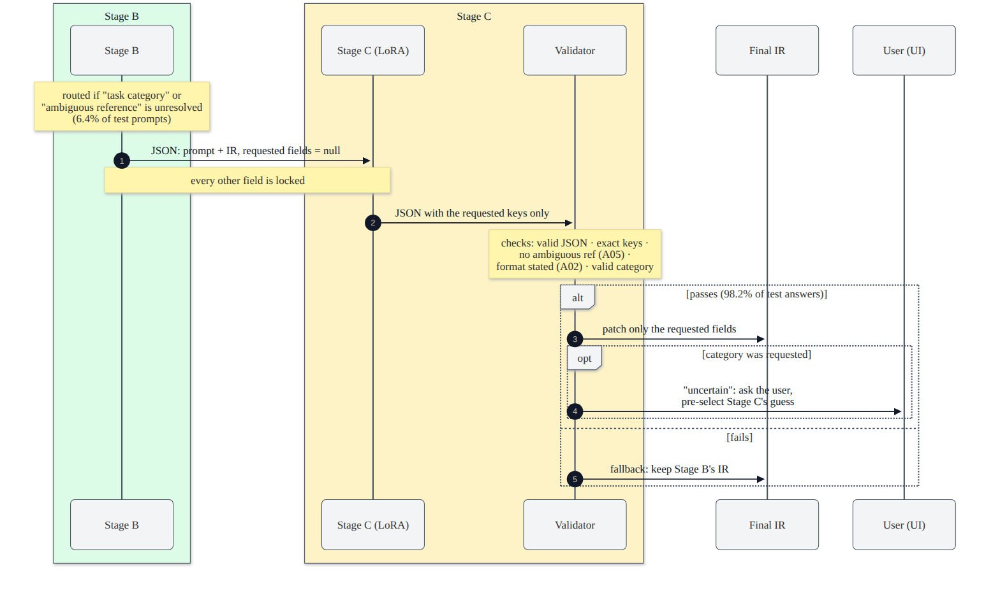

# 6. Stage C: the LoRA fallback

[Back to the index](README.md)

Stage C is a small fine-tuned language model (Qwen2.5-0.5B-Instruct + a LoRA adapter) that fills **only** the IR
fields Stage B left unresolved, under a contract that is checked by the same detectors as the rest of the pipeline.
If its answer fails the checks, the prompt keeps Stage B's result. Code: `backend/app/stage_c/`; plan written before
training: `docs/STAGE_C_PLAN.md`.

---

## 6.1 When Stage C runs and what it may change

A prompt is **routed** only if, after all Stage B rules, `ir.unresolved` contains `task category` or
`ambiguous reference` (chapter 5.2). On test: 31 of 482 prompts (6.4%). Stage C is then asked for specific fields
(`contract.natural_unresolved`):

| unresolved item | fields Stage C must fill | why these |
|---|---|---|
| `task category` | `output_format`, `constraints`, `category` | Stage B added nothing category-specific (the category was unreliable), so format and constraints are missing too |
| `ambiguous reference: …` | `task` | the task must be rewritten to be self-contained |
| `output format` (only when routed anyway) | `output_format` | |

**Every other field is locked:** Stage C sees Stage B's values (including requirements such as the attachment rules),
but `patch_ir` changes only the requested ones, whatever the model returns.



## 6.2 What the model sees (`contract.model_input`, `to_messages`)

A chat with three parts: the system prompt, the user message (the input as JSON), and (in training only) the
assistant message (the target as JSON).

**System prompt** (`SYSTEM_PROMPT`):

> You are Stage C of PromptOpt. You get a user's prompt and the structured version a rule-based optimizer made of it.
> Fields set to null and listed in "unresolved" could not be filled by the rules. Return a JSON object with exactly
> the unresolved keys and nothing else. "task": the instruction, clear and self-contained. "output_format": how the
> answer should be laid out, or null if no format is needed. "constraints": a list of short rules (length, language,
> tone, audience, use only the provided text), possibly empty. "category": one of closed_qa, information_extraction,
> classification, summarization, coding. Keep the user's intent; add no facts.

**Input JSON:**

```json
{"prompt": "describe what is happening in the picture",
 "category": {"value": "coding", "source": "stage_a", "confidence": 0.37},
 "has_context": true, "attachment": "image",
 "ir": {"task": "Describe what is happening in the picture.", "output_format": null, "constraints": null,
        "requirements": ["Use what is visible in the attached image; ...", "If something is not visible ..."],
        "category": null},
 "unresolved": ["output_format", "constraints", "category"]}
```

The passage itself is **not** included, only `has_context`: Stage C writes the *instruction*, not the answer, and
this keeps sequences short. The same two functions build the training data and the live input, so training and
inference see exactly the same format.

**Output:** one JSON object with exactly the requested keys, e.g.
`{"output_format": "Output as a single sentence describing each part.", "constraints": [], "category": "summarization"}`.

## 6.3 Training data (`stage_c/data.py`, `python -m app.stage_c.data`)

One example per dataset row; Stage A on train is **cross-fitted** (chapter 4.5), Stage B is run for real, and the
**target** is parsed out of the dataset's optimized prompt (section 6.4); `category` targets are the dataset label.

Which fields an example asks for:

| kind | rule | train | val | test |
|---|---|---|---|---|
| `routed` | Stage B really routes the row: its natural fields | 377 | 10 | 31 |
| `forced` | every other row: a seeded random non-empty subset of {task, output_format, constraints} | 4,132 | 139 | 451 |
| `forced_all` | val/test only: every row once more with all three fields | – | 149 | 482 |
| **examples** | | **4,509** | **298** | **964** |

(A `recorded` kind, for rows whose only unresolved item is `output format`, exists in the code but never occurs:
B03 records `output format` only for an unreliable category, which also leaves `task category` unresolved unless B08
resolved it — and then B03 does not run.)

Routed train examples by requested fields: category reason 335, ambiguous reference 36, both 6.

**Why forced subsets:** only 8.4% of train rows route naturally — too few to learn from. Forced examples teach the
model to fill *any* requested field while respecting the locked ones.

**The forced-subset distribution, derived.** Each of the 3 fields is kept independently with probability 0.5
(`rng.random() < 0.5`, `random.Random(13)`); an empty draw (probability $0.5^3 = 1/8$) is replaced by one field
chosen uniformly. So

$$P(|S| = 1) = \tbinom{3}{1}0.5^3 + \tfrac{1}{8} = \tfrac{1}{2}, \quad P(|S| = 2) = \tbinom{3}{2}0.5^3 = \tfrac{3}{8}, \quad P(|S| = 3) = \tfrac{1}{8},$$

expected $1.625$ fields per example. Observed on train: 2,033 / 1,578 / 521 of 4,132 = 49.2% / 38.2% / 12.6%.

**Clean flag:** 53 train examples whose requested format is still inside the parsed task (the target would miss it)
are marked `clean: false` and **left out of training** → **4,456** training examples. Only **111** train rows were
individually human-validated (the rest passed the human-rejection pass and the LLM filter).

**Packaging and integrity:** `train.jsonl`, `val.jsonl`, `config.json` (training settings + system prompt), the
training script and `manifest.json` (SHA-256, bytes, row counts per file) are zipped into `data/stage_c_data_v1.zip`;
the manifest is committed as `docs/stage_c_data_manifest.json`, and `train.py` refuses to train if any file's SHA-256
differs from it. The test examples (`--test`) were built only for the final evaluation, with seed 14.

## 6.4 Training targets: the parser (`stage_c/parse.py`)

The dataset's optimized prompt is free text; the parser splits it into the IR fields, reusing Stage A's detectors
(no Stage A/B code changed). **Every sentence goes to exactly one field**, so nothing is lost:

1. first paragraph = instruction; later paragraphs (`Items: …`, `Input: …`, code) = context;
2. the first sentence is the task, after cutting out a few fixed clause shapes when at least 3 task words remain: a
   restrictive grounding clause ("Answer only from the provided text: …" → constraint), a length phrase ("… in two
   sentences", "limiting the response to 15 words" → constraint), a trailing format clause ("…, and output them as a
   JSON array" → format), a format phrase ("in 3 bullet points" → `Use 3 bullet points.`);
3. each later sentence → `output_format` if it states a structure (A02 patterns minus the 4 length-only ones, plus 3
   layouts A02 misses: "on a separate line", "one X per line", "Output/List each …"); a follow-up sentence describing
   the elements ("Each element has …") stays with the format; → `constraints` if it states a length, tone, audience,
   language or grounding; otherwise it stays in the task.

Coverage on train ("separated" = a stated format/constraint ends up in its own field, not inside the task):

| category | n | task | output_format separated | constraints separated |
|---|---|---|---|---|
| closed_qa | 951 | 100% | 112/152 (73.7%) | 620/812 (76.4%) |
| information_extraction | 867 | 100% | 710/714 (99.4%) | 38/91 (41.8%) |
| classification | 906 | 100% | 760/795 (95.6%) | 22/37 (59.5%) |
| summarization | 920 | 100% | 366/396 (92.4%) | 451/566 (79.7%) |
| coding | 865 | 100% | 745/808 (92.2%) | 57/77 (74.0%) |
| **all** | 4,509 | **100%** | **2,693/2,865 (94.0%)** | **1,188/1,583 (75.0%)** |

A hand check of 20 random parses: 17 fully correct. Constraints coverage (75%) is below the 85% bar set in the plan;
accepted on 2026-10-02 because most misses are lengths embedded in the task wording ("in **one short** sentence")
that cannot be cut out without rewriting. This affects 133 of 1,516 train targets that ask for constraints while the
task is locked (8.8%).

## 6.5 The base model

`Qwen/Qwen2.5-0.5B-Instruct` (`config.STAGE_C_BASE_MODEL`), from its `config.json`:

| property | value |
|---|---|
| parameters | about 494 million (0.49 B) |
| transformer layers | 24 |
| hidden size $d$ | 896 |
| attention | 14 query heads × 64 dims; **2 key/value heads** (grouped-query attention) → K and V projections are 896 → 128 |
| MLP | SwiGLU: gate and up 896 → 4,864, down 4,864 → 896 |
| vocabulary | 151,936 tokens; input and output embeddings tied |
| context | 32,768 positions (we use ≤ 512) |
| weights | bfloat16 |

**Why this model:** the smallest current instruction-tuned Qwen model; it fits the 4 GB laptop GPU for training (with
the measures in 6.7) and a free Colab T4; the task (filling a few JSON fields) is narrow, so a small model suffices
(98.2% of its answers pass validation after training vs 5.0% zero-shot; section 6.10).

## 6.6 LoRA: the method and the parameter count

LoRA (low-rank adaptation; Hu et al. 2021) freezes every base weight $W_0 \in \mathbb{R}^{d_{out} \times d_{in}}$ and
learns a low-rank update:

$$h = W_0 x + \frac{\alpha}{r} B A x, \qquad A \in \mathbb{R}^{r \times d_{in}},\ B \in \mathbb{R}^{d_{out} \times r}$$

* $A$ is initialized randomly (Kaiming-uniform) and $B = 0$, so at the start the update is zero and the model equals
  the base model exactly;
* settings (`TRAIN_CONFIG["lora"]`, identical in `artifacts/stage_c_adapter/adapter_config.json`): rank $r = 16$,
  $\alpha = 32$ (scale $\alpha/r = 2$), dropout 0.05 on the LoRA input, bias not trained;
* target modules: all attention and MLP projections — `q_proj, k_proj, v_proj, o_proj, gate_proj, up_proj, down_proj`.

**Trainable parameters, derived.** A LoRA pair on a $d_{in} \to d_{out}$ projection has $r(d_{in} + d_{out})$
parameters. Per layer, with $d = 896$, $d_{kv} = 128$, $d_{ff} = 4{,}864$, $r = 16$:

| projection | shape | $r(d_{in} + d_{out})$ |
|---|---|---|
| q_proj | 896 → 896 | 16 × 1,792 = 28,672 |
| k_proj | 896 → 128 | 16 × 1,024 = 16,384 |
| v_proj | 896 → 128 | 16 × 1,024 = 16,384 |
| o_proj | 896 → 896 | 28,672 |
| gate_proj | 896 → 4,864 | 16 × 5,760 = 92,160 |
| up_proj | 896 → 4,864 | 92,160 |
| down_proj | 4,864 → 896 | 92,160 |
| **per layer** | | **366,592** |

$\times 24$ layers $= \mathbf{8{,}798{,}208}$ trainable parameters, **1.78%** of 494 M. Counting the tensors in
`adapter_model.safetensors` gives exactly 8,798,208. Stored in float32 (adapters are kept in fp32 for stable
mixed-precision training): $8{,}798{,}208 \times 4$ bytes $= 35.2$ MB $\approx 33.6$ MiB, the 34 MB file.

**At inference** the adapter is merged (`merge_and_unload`): $W = W_0 + \frac{\alpha}{r}BA$, so Stage C costs the
same as the base model.

## 6.7 Training (`stage_c/train.py`)

Standalone script (no `app` imports), so the same file runs locally and in Colab. It was run locally in
`backend/.venv-gpu` on the RTX 3050 laptop GPU (4 GB) with `--batch-size 1`.

### 6.7.1 Tokenization and loss

For each example, the chat template is applied twice: to the system + user turns with the generation prompt (the
*prompt part*) and to the full conversation. Labels are $-100$ for every prompt-part token (ignored by the loss) and
equal to the token ids for the assistant's JSON. Examples longer than `max_length = 512` tokens would be dropped;
**none is** (chat-templated train examples: median 291, p99 371, max 446 tokens). The loss is the mean token
cross-entropy over the assistant tokens:

$$\mathcal{L}(\theta) = -\frac{1}{|T|}\sum_{t \in T} \log p_\theta(x_t \mid x_{<t}), \qquad T = \text{assistant (target) tokens}$$

*Why only the answer:* the model should learn to produce the JSON, not to reproduce the prompt it is given.

### 6.7.2 Batch, optimizer, schedule

| setting | value | basis |
|---|---|---|
| effective batch | 16 examples per optimizer step | `batch_size 4 × grad_accum 4` in the config; run as **1 × 16** on the 4 GB GPU (same effective batch) |
| optimizer | AdamW, lr $2 \times 10^{-4}$, weight decay 0, PyTorch default $\beta_1 = 0.9$, $\beta_2 = 0.999$, $\epsilon = 10^{-8}$ | 2e-4 is the usual LoRA learning rate (higher than full fine-tuning because only small matrices move) |
| epochs | at most 3 | early stopping decides |
| steps | $\lceil 4{,}456 / 16 \rceil = 279$ per epoch planned, $T = 837$ in total | |
| warm-up | $W = \max(1, \lfloor 0.03\,T \rfloor) = 25$ steps | 3% linear warm-up avoids large early updates from the Adam moments' cold start |
| clipping | global gradient L2 norm ≤ 1.0 | stability |
| precision | bf16 autocast on the RTX 3050 (Ampere supports bf16, more stable than fp16); fp16 + GradScaler on a T4; LoRA weights in fp32 | memory and speed |
| memory | gradient checkpointing (activations recomputed in the backward pass), KV cache off | fits 4 GB |
| seed | 13 (Python, NumPy, torch; shuffling) | reproducibility |

**AdamW update** for each trainable parameter $\theta$ with gradient $g_t$ (after accumulation and clipping):

$$m_t = \beta_1 m_{t-1} + (1-\beta_1) g_t, \quad v_t = \beta_2 v_{t-1} + (1-\beta_2) g_t^2, \quad
\theta_t = \theta_{t-1} - \eta_t \Big(\frac{\hat m_t}{\sqrt{\hat v_t} + \epsilon} + \lambda\,\theta_{t-1}\Big)$$

with bias corrections $\hat m_t = m_t/(1-\beta_1^t)$, $\hat v_t = v_t/(1-\beta_2^t)$ and $\lambda = 0$.

**Learning-rate schedule** (linear warm-up, then linear decay to 0), for optimizer step $s$:

$$\eta(s) = 2\times10^{-4} \cdot \begin{cases} \dfrac{s + 1}{W} & s < W \\[2mm] \max\!\Big(0, \dfrac{T - s}{T - W}\Big) & s \ge W \end{cases}$$

| step $s$ | 0 | 12 | 24 | 25 | 100 | 278 | 550 | 700 |
|---|---|---|---|---|---|---|---|---|
| $\eta$ | 8.0e-6 | 1.04e-4 | 2.0e-4 | 2.0e-4 | 1.82e-4 | 1.38e-4 | 7.07e-5 | 3.37e-5 |

**Gradient clipping:** if $\lVert g \rVert_2 > 1$, $g \leftarrow g / \lVert g \rVert_2$.

### 6.7.3 Early stopping

Every 50 optimizer steps (`eval_every`) the **validation loss** is computed on all val examples: the summed token
cross-entropy over all target tokens divided by the number of target tokens (a token-weighted mean). If it improved by
more than $10^{-4}$, the adapter is saved; otherwise a counter increases, and after 3 evaluations without improvement
(`patience`) training stops. The saved adapter is therefore the best one on val.

Full history (`artifacts/stage_c_adapter/training_summary.json`):

| step | epoch | val loss | minutes | | step | epoch | val loss | minutes |
|---|---|---|---|---|---|---|---|---|
| 50 | 0 | 0.8518 | 3.4 | | 400 | 1 | 0.7157 | 28.8 |
| 100 | 0 | 0.7887 | 6.8 | | 450 | 1 | 0.7142 | 33.0 |
| 150 | 0 | 0.7656 | 10.2 | | 500 | 1 | 0.7060 | 36.7 |
| 200 | 0 | 0.7454 | 13.8 | | **550** | 1 | **0.7047** (best, saved) | 40.0 |
| 250 | 0 | 0.7352 | 17.3 | | 600 | 2 | 0.7439 | 44.0 |
| 300 | 1 | 0.7264 | 21.5 | | 650 | 2 | 0.7462 | 47.4 |
| 350 | 1 | 0.7233 | 24.9 | | 700 | 2 | 0.7613 → stop | 50.7 |

* Best val loss **0.7047 at step 550**, i.e. a validation perplexity of $e^{0.7047} = 2.02$ per target token.
* Val loss rose for three evaluations after the start of the third epoch (step 556) while training continued:
  the usual sign of over-fitting, which early stopping guards against. Training stopped at step **700** after
  **51 minutes**.
* The logged "train loss" is one micro-batch's loss (values from 0.0002 to 0.71), so only the val curve is meaningful.
* Before training, `train.py --estimate` times 20 optimizer steps and prints the projected run time and peak GPU
  memory; the plan was to train locally only if the estimate fit in 4 GB and about 2 hours, otherwise in Colab
  (`notebooks/train_stage_c.ipynb`, which verifies the manifest, runs a zero-shot baseline, trains and saves the
  adapter to Drive). Locally it fit, so Colab was not needed.

## 6.8 Inference (`stage_c/runtime.py`)

1. `available()`: `peft` and `torch` importable **and** `artifacts/stage_c_adapter/adapter_config.json` exists;
   otherwise the app runs A + B only (and `STAGE_C_ENABLED=0` switches Stage C off).
2. Load the tokenizer and base model in bf16 on a CUDA GPU with bf16 support (fp16 otherwise), fp32 on CPU; load and
   merge the adapter; `STAGE_C_DEVICE=auto` chooses CUDA if available.
3. Apply the chat template with the generation prompt; **greedy decoding** (`do_sample=False`), at most **192 new
   tokens** (the longest training target is 123 tokens, median 24), decode only the new tokens.

## 6.9 Validation, fallback and the category policy (`stage_c/contract.py`)

`validate(raw, fields, has_context)` accepts the answer only if **all** hold:

1. it parses as **one JSON object** (a ```` ```json ```` fence is stripped first);
2. its keys are **exactly** the requested keys;
3. `task` (if asked) has at least 2 words and **A05 finds no ambiguous reference** in it (with the prompt's own
   `has_context`);
4. `output_format` (if asked) is null or **states a format** by A02 or the parser's layouts;
5. `constraints` (if asked) is a list of non-empty strings;
6. `category` (if asked) is one of the five categories.

**Fallback:** any failure → Stage B's IR is kept unchanged and the reasons are returned (`errors`). Real example:
for *"hey can you please summarize this for me"* Stage C answered `{"task": "Summarize the provided text about the
provided image."}`; "the provided text" is an ambiguous reference (and the image is invented), so it was rejected.

**Patch** (`patch_ir`): fill only the requested fields; resolve the matching unresolved items (`task` resolves the
ambiguous reference; a non-empty `output_format` resolves `output format`; `category` would resolve `task category`).

**Category policy** (`category_decision`; decided on val on 2026-10-02, before the test run): when a prompt was routed
for the category, Stage C's category is **never applied on its own**. It is marked `"uncertain"`, removed from the
patch (so `task category` stays unresolved), kept as `category_guess`, and the UI asks the user, **pre-selecting the
guess**. Stage C's other fields (format, constraints) are applied.

*Why:* on val, in the confidence range where prompts are routed (Stage A < 0.6, n = 50), Stage A's category was right
40.0% of the time and Stage C's guess only 30.0%. A first policy (accept Stage C's category if it is in Stage A's
top-2, or if Stage A's confidence < 0.3) picked out no better guesses (accepted 33: Stage C 30.3% right; uncertain 17:
29.4%) and, on the 10 naturally routed val prompts, accepted 3 guesses that were all wrong. Asking the user was the
only part worth keeping.

## 6.10 How Stage C is measured (`stage_c/evaluate.py`; val during development, test once)

All runs: greedy decoding, batch 1, the same examples for the base model and the adapter.

| metric | definition |
|---|---|
| JSON valid | `parse_json` succeeds |
| exact keys | keys = requested keys |
| passes validation | the whole contract passes (the pipeline would use the answer) |
| category accuracy | predicted category = dataset label |
| task similarity | cosine (all-MiniLM-L6-v2) between predicted and target `task` |
| field present/absent agrees | (prediction non-empty) = (target non-empty), for format and constraints |
| task intent (main ablation number) | cosine between the **final IR's task field** and the dataset's **original instruction** (added format/constraint sentences do not count against it) |
| full-prompt similarity | cosine between the whole final prompt and the original instruction (reference only: it falls as format/constraints are added) |
| format stated | A02 or the parser finds a format in the final prompt |
| fallback | share of Stage C calls rejected by validation |
| latency | seconds per Stage C call; median and p95, where p95 = the value at index $\min(n-1, \lfloor 0.95n \rfloor)$ of the sorted times |

### 6.10.1 Zero-shot base vs LoRA (test, 964 examples)

| model | JSON valid | exact keys | **passes validation** | task sim. | format present/absent agrees | constraints present/absent agrees |
|---|---|---|---|---|---|---|
| zero-shot base | 93.5% | 51.2% | **5.0%** | 0.668 | 56.4% | 53.8% |
| LoRA | 100% | 100% | **98.2%** | 0.801 | 78.5% | 75.0% |

(Val, 298 examples: passes validation 3.4% → 98.3%.) Format *content* similarity on test: 0.62.

### 6.10.2 Ablation: routed vs forced (test)

* **A+B** = Stage A + B (the pipeline without Stage C); **A+B+C** = Stage C fills the requested fields, others
  locked, rejected answers fall back; **C-only** = Stage C fills task, format and constraints with **no** Stage B
  rules (rejected → the raw prompt).
* **routed** = the 31 prompts Stage B really sends; **forced** = all 482 prompts with all three fields requested.

| set | system | n | task intent | format stated | fallback | median s |
|---|---|---|---|---|---|---|
| routed | A+B | 31 | 0.869 | 22.6% | – | – |
| routed | **A+B+C** | 31 | 0.843 | **90.3%** | 3.2% | 0.47 |
| routed | C-only | 31 | 0.712 | 90.3% | 6.5% | 0.68 |
| forced | **A+B** | 482 | **0.886** | **95.0%** | – | – |
| forced | A+B+C | 482 | 0.769 | 90.2% | 2.1% | 0.68 |
| forced | C-only | 482 | 0.765 | 88.6% | 1.9% | 0.67 |
| reference | degraded / dataset optimized | 482 | 0.903 / 0.826 | 3.1% / 79.0% | | |

**Findings (the same on val):** where Stage B routes, Stage C helps (format stated 22.6% → 90.3% at a small intent
cost, −0.026); routing *everything* through Stage C hurts (task intent 0.886 → 0.769, below the dataset's own
optimized prompts at 0.826); C-only is the weakest, so the rules are worth keeping in front of the model. Hence Stage C
stays **routed-only**.

### 6.10.3 Category on routed prompts (test)

| prompts | n | Stage A right | Stage C guess right |
|---|---|---|---|
| routed for the category, valid Stage C category | 24 | 9/24 (37.5%) | 14/24 (58.3%) |
| every prompt with Stage A confidence < 0.6 (category requested) | 171 | 77/171 (45.0%) | 71/171 (41.5%) |
| every prompt | 476 | 354/476 (74.4%) | 293/476 (61.6%) |

On the small routed set Stage C's guess beat Stage A's (the opposite of val); over the whole low-confidence range
Stage A stays slightly ahead. Neither is reliable enough to decide alone, which supports asking the user; the policy
was not changed after seeing these numbers.

### 6.10.4 Latency (Stage C call only, batch 1, greedy)

| split | device | median s | p95 s |
|---|---|---|---|
| val | RTX 3050 laptop GPU | 0.71 | 1.15 |
| val | CPU | 4.63 | 7.61 |
| **test** | **RTX 3050 laptop GPU** | **0.74** | 1.23 |
| test | CPU | 4.55 | 7.22 |
| test | zero-shot base, GPU | 1.47 | 3.30 |

Requirement (plan): under 3 s per prompt on the laptop GPU (median) — **met**. The zero-shot base is slower because it
writes longer, unfocused answers.

### 6.10.5 Named case (illustrative, not evidence)

*"describe what is happening in the picture"* + an image, category auto: Stage A says coding (0.37) → B09 adds the
image requirements and resolves "the picture" → still routed for the category → Stage C returns
`{"output_format": "Output as a single sentence describing each part.", "constraints": [], "category": "summarization"}`
→ validation passes, format and constraints applied, category **uncertain**: the UI asks, pre-selecting
summarization (the expected label, set after a smoke run, hence illustrative only).

## 6.11 Limitations and known issues

* Targets are LLM-written (only 111 train rows individually human-validated); the parser separates constraints in 75%
  of prompts that state one.
* The routed set is small (31 test prompts); the forced rows give the larger picture.
* **Validation checks form, not facts:** a hallucinated phrase without an ambiguous reference would pass (one reason
  Stage C fills only a few fields and only on routed prompts).
* **Training-script detail (reported; the adapter is unaffected in practice):** in `train.py` the gradient
  accumulation counter restarts every epoch but the gradients are not cleared, so the $4{,}456 \bmod 16 = 8$ leftover
  micro-batches at the end of an epoch are added to the first optimizer step of the next epoch (that step sums 24
  micro-batch gradients scaled by 1/16, i.e. 1.5× a normal step, before clipping to norm 1.0). It also means an epoch
  has 278 optimizer steps, not the 279 used to plan the schedule. The fix is one line (`opt.zero_grad()` at the start
  of each epoch, or stepping on the remainder), but the training script's SHA-256 is part of the committed data
  manifest, so it is reported rather than silently changed (chapter 15.5).
