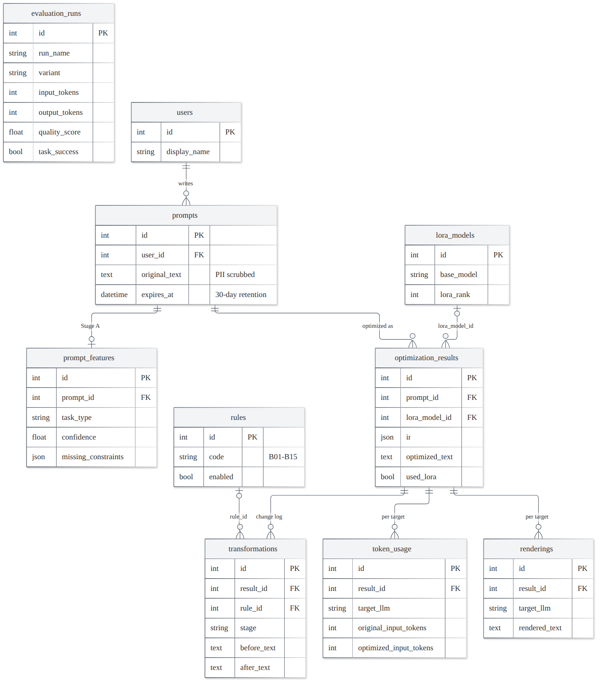

# 13. Backend: API, database, privacy, configuration, LLM clients

[Back to the index](README.md)

---

## 13.1 The FastAPI application (`backend/app/api.py`, `backend/app/ui_api.py`)

`FastAPI(title="PromptOpt", version="0.2.0")`, GZip compression for responses ≥ 1,000 bytes, `/static` mounted from
`app/static`. Start with `uvicorn app.api:app` inside `backend/` (http://127.0.0.1:8000; interactive API docs at
`/docs`). Endpoints are synchronous functions; FastAPI runs them in its thread pool. At start-up the app inserts
rule codes added after a database was created (B16) into `rules` (`lifespan`; a database without tables is left for
`python -m app.init_db`).

**UI routes:** `/` and `/compare`, `/suite`, `/results`, `/how`, `/history`, `/image`, `/status` serve the React app
(`static/ui/index.html`; client-side routing); `/classic` serves the first UI; `/favicon.ico`; any other single path
segment → 404.

## 13.2 Endpoint reference

| method + path | purpose | body / query | response (main fields) | errors |
|---|---|---|---|---|
| `GET /api/options` | what the UI can offer | – | targets, image_targets, categories, attachment_types, stage_c {available, model, device}, retention_days, compare_enabled, spelling_available | – |
| `POST /api/optimize` | optimize a prompt (text or image mode) | `OptimizeRequest` | text: prompt_id, stage_a, category, issues, rules, unresolved_after_b, stage_c, unresolved, **spelling**, ir, optimized_plain, renderings, tokens, target, coding_tests · image: mode, version, **spelling**, stated, avoid_user, auto_added, accepted, suggestions, aspect_ratio, rules, ir, renderings | 422 invalid input / blank prompt / wrong target for the mode / unknown suggestion |
| `POST /api/coding-tests` | unvalidated tests for a coding prompt | `{optimized_prompt}` | source, validated=false, function, signature, tests, note | 503 without `CEREBRAS_API_KEY` |
| `GET /api/history?limit=` | recent prompts (1–100, default 20) | – | prompt_id, text (first 200 chars), created_at, expires_at | – |
| `GET /api/history/{id}` | everything done to one prompt | – | original_text, pii_redactions, expires_at, features, results [steps, renderings, token_usage] | 404 (also after expiry) |
| `GET /api/compare/models` | models for Compare | – | default, models [id, label, provider, family, available, reason] | – |
| `POST /api/compare` | original vs optimized on a real model | `OptimizeRequest` + `model`, `judge` | rendered_for, answered_by, stand_in, label, settings, original, optimized, change_pct, latency_change_pct, tests, judge, prompt_id, category | 422 image mode / unknown model; 503 unavailable; 429 daily budget |
| `GET /api/suite` | correctness suite overview | – | cases, categories, models with summaries | – |
| `GET /api/suite/{id}?model=` | one case with stored results | – | case, gold, prompts, pipeline, result | 404, 422 |
| `POST /api/suite/{id}/run` | run one case live (cached) | `{model}` | as above, live | 404, 422, 429, 503 |
| `GET /api/ui/status` | providers with 24-hour usage vs limit, Stage C, sandbox kind, retention | – | providers [usage_24h], stage_c, coding_tests {can_generate, sandbox}, retention_days | – |
| `GET /api/ui/examples` | the example gallery | – | examples [id, title, kind, category, target, prompt, context?, attachment_type?, why] | – |
| `POST /api/ui/tokens` | live token counter (nothing stored) | `{text}` (≤ 70,000 chars) | {claude, gpt, gemini: {tokens, method, exact}} | – |
| `GET /api/ui/results` | `FINAL_RESULTS.md` parsed into sections and tables, token headline, suite summary | – | sections [id, title, intro, bullets, tables], tokens, suite | 404 if the file is missing |
| `GET /api/ui/suite-grid` | every case's verdict per model | – | categories, models, cases, verdicts | – |
| `GET /api/ui/history?q=&limit=&offset=` | history with search (prompt or optimized text, case-insensitive) and paging (1–200) | – | total, items [mode, category, target, attachment, changes, used_stage_c, optimized, compares] | – |
| `DELETE /api/ui/history/{id}` | delete one prompt (cascade) | – | deleted | 404 |
| `GET /api/ui/compare-history?limit=` | past Compare runs | – | prompt_id, text, model, target, original/optimized {input, output, total}, change_pct | – |

All endpoints that **store, read or list** prompts (`/api/optimize`, `/api/compare`, `/api/history`,
`/api/history/{id}`, `/api/ui/history`, `/api/ui/compare-history`) first delete expired prompts (section 13.6).

**`OptimizeRequest`** fields and limits: `prompt` 1–20,000 characters (and not blank after stripping), `target` ∈
{claude, gpt, gemini, dalle, nano_banana, stable_diffusion} (default gpt), `category` ∈ {auto, the five,
image_generation} (default auto), `attachment_type` ∈ {none, image, pdf, pptx, docx, spreadsheet, code, other},
`attachment_name` ≤ 255 characters, `context` ≤ 50,000 characters, `accepted_suggestions` ≤ 20 items
(`"attribute:value"`, image mode).

**Error mapping:** Pydantic validation and `DataValidationError` (e.g. a whitespace-only prompt; fixed in this review,
previously HTTP 500) → **422**; `DailyLimitReached` → **429**; `ModelUnavailable` or a missing key → **503**; unknown
ids → **404**. The React client turns these into actionable messages (e.g. "Groq's daily quota is used up. Switch the
model to gpt-oss-120b on Cerebras").

## 13.3 Database (`backend/app/db/`)

SQLAlchemy 2.0 ORM; **SQLite** for development (default `backend/promptopt.db`) and **PostgreSQL** for deployment
(`DATABASE_URL=postgresql+psycopg://…`). JSON columns are `JSON` on SQLite and `JSONB` on PostgreSQL. SQLite ignores
foreign keys unless enabled per connection, so a connect hook runs `PRAGMA foreign_keys=ON` (the retention cascade
relies on it). `python -m app.init_db` creates the tables and seeds the rule catalogue (safe to re-run);
`--sql` prints the PostgreSQL DDL (committed as `backend/schema_postgres.sql`).

### 13.3.1 The 10 tables

| table | columns (type) | constraints and notes |
|---|---|---|
| `users` | id, display_name (≤ 80), created_at | no email or real name stored; optional |
| `prompts` | id, user_id → users (SET NULL), **original_text** (after PII scrubbing), pii_redactions, created_at, **expires_at** | CHECK `expires_at > created_at`; index on `expires_at` (the purge filters on it) |
| `prompt_features` | id, prompt_id → prompts (CASCADE, unique), task_type, has_format_spec, has_context, missing_constraints (JSON), redundant_phrases (JSON), ambiguous_refs (JSON), confidence, created_at | CHECK task_type ∈ the 6 categories; CHECK 0 ≤ confidence ≤ 1 |
| `rules` | id, code (unique, e.g. `B03_ADD_OUTPUT_FORMAT`), name, stage (A/B), description, enabled | seeded with A01–A05 and B01–B16; `enabled` for ablations |
| `lora_models` | id, name (unique), base_model, lora_rank, adapter_path, dataset_version, created_at | metadata of Stage C adapters |
| `optimization_results` | id, prompt_id → prompts (CASCADE, indexed), **ir** (JSON), optimized_text, confidence, used_lora, lora_model_id → lora_models (SET NULL), pipeline_version, latency_ms, created_at | CHECK 0 ≤ confidence ≤ 1 |
| `transformations` | id, result_id → optimization_results (CASCADE), step_no, stage (B/C), rule_id → rules (SET NULL), before_text, after_text, note | UNIQUE (result_id, step_no); CHECK stage ∈ {B, C}; CHECK a Stage B step has a rule_id |
| `renderings` | id, result_id (CASCADE), target_llm, rendered_text, created_at | UNIQUE (result_id, target_llm) |
| `token_usage` | id, result_id (CASCADE), target_llm, tokenizer, original_input_tokens, optimized_input_tokens, original_output_tokens, optimized_output_tokens, est_cost_original_usd, est_cost_optimized_usd (NUMERIC 12,6), created_at | CHECK input tokens ≥ 0; property `net_token_change` |
| `evaluation_runs` | id, run_name (indexed), dataset_version, dataset_item_id (source_id), category, variant, target_llm, input_tokens, output_tokens, latency_ms, quality_score, task_success, created_at | UNIQUE (run_name, dataset_item_id, variant, target_llm); CHECK category; CHECK 0 ≤ quality ≤ 10; **not linked to prompts**, so the retention purge never deletes benchmark results |

`net_token_change` $= (\text{opt}_{in} + \text{opt}_{out}) - (\text{orig}_{in} + \text{orig}_{out})$ (negative = saved),
`None` until output tokens are known.

### 13.3.2 The repository (`db/repository.py`): the only module that reads or writes

| function | does |
|---|---|
| `create_prompt` | reject blank text and retention < 1 day; strip; scrub PII; set `expires_at`; flush |
| `save_features` | Stage A output (category and confidence validated) |
| `save_optimization` | the result + one transformation per step; unknown rule codes and Stage B steps without a rule are rejected |
| `save_renderings`, `save_token_usage`, `register_lora_model` | as named |
| `record_evaluation`, `delete_evaluation`, `evaluation_summary` | evaluation harness storage and per (category, variant) averages (task success over checkable items only) |
| `get_prompt_history` | everything for one prompt (eager-loaded) |
| `purge_expired` | delete prompts with `expires_at ≤ now`; cascade removes the rest; commits |

**Transaction rule:** functions `flush` (so ids exist) but never `commit`; the caller commits **once per request**,
so a failure half-way leaves nothing behind.

## 13.4 Privacy (`db/pii.py`) and retention

**PII scrubbing** runs **before** a prompt (or pasted text) is stored or sent to Compare:

| pattern | regex idea | replaced by |
|---|---|---|
| email | `local-part @ domain . tld(2+ letters)` | `[EMAIL]` |
| phone (NANP style) | optional country code, `(555) 123-4567` / `555-123-4567` / `555.123.4567` | `[PHONE]` |
| phone (Indian mobile) | optional `+91`, a first digit 6–9, `98765 43210` / `9876543210` | `[PHONE]` |

Emails are replaced first, then phones; the number of replacements is stored (`pii_redactions`). The same patterns
were applied to Dolly when the dataset was built, so training data and live data are treated alike. *Scope (stated in
the SRS):* emails and phone numbers only — names, addresses and ID numbers are not detected.

**Retention:** every prompt gets `expires_at = created_at + RETENTION_DAYS` (default 30). Expired prompts are deleted
with everything derived from them (features, results, transformations, renderings, token usage: `ON DELETE CASCADE`):

* **automatically by the web app** before every request that stores, reads or lists prompts
  (`app/retention.enforce_retention`, a FastAPI dependency that shares the endpoint's session) — *added in this
  review*: before it, nothing purged automatically and the UI kept showing prompts past their expiry date;
* **from the command line** with `python -m app.init_db --purge` (e.g. a daily cron job while the app is not running).

## 13.5 Configuration (`app/config.py`, `backend/.env`)

Settings come from environment variables; `backend/.env` (git-ignored; template `.env.example`) is loaded without
overriding variables already set in the shell.

| variable | default | used for |
|---|---|---|
| `DATABASE_URL` | SQLite `backend/promptopt.db` (absolute path) | database |
| `RETENTION_DAYS` | 30 | prompt expiry |
| `SQL_ECHO` | 0 | log SQL |
| `SENTENCE_MODEL` | `sentence-transformers/all-MiniLM-L6-v2` | Stage A encoder |
| `CATEGORY_INDEX_PATH` | `backend/artifacts/category_index.npz` | Stage A index |
| `DATASET_DIR`, `DATASET_CSV` | `data/promptopt_dataset_v1_2_final/` and `<folder>/<folder>.csv` | dataset |
| `EVAL_DIR` | `data/evaluation` | evaluation caches |
| `GROQ_API_KEY`, `CEREBRAS_API_KEY`, `GEMINI_API_KEY` | unset | LLM providers |
| `GEMINI_MODEL` | `gemini-2.5-flash` | Compare on Gemini |
| `OPENAI_API_KEY`, `ANTHROPIC_API_KEY` | unset | listed only (no client yet) |
| `STAGE_C_ENABLED` | 1 | 0 = Stage A + B only |
| `STAGE_C_BASE_MODEL` | `Qwen/Qwen2.5-0.5B-Instruct` | Stage C |
| `STAGE_C_ADAPTER` | `backend/artifacts/stage_c_adapter` | Stage C |
| `STAGE_C_DEVICE` | auto (CUDA if available) | Stage C |
| `SANDBOX_REQUIRE_BWRAP` | 1 | refuse to run code without bubblewrap |
| `PROMPTOPT_PASSWORD` | unset | if set, visitors from other machines must give it (HTTP Basic auth); this machine never needs it |
| `TEST_POSTGRES_URL` | unset | also run the tests on PostgreSQL (**drops all tables**: must point at a test database) |

Secrets are never committed and never hard-coded.

## 13.6 LLM clients, rate limits and budgets

### 13.6.1 Clients

| client | pacing | 429 handling | other errors |
|---|---|---|---|
| `GroqChat` (`evaluation/llm.py`) | ≥ 2.2 s between calls → $60 / 2.2 = 27.3$ requests per minute, under the free tier's per-minute limit | per-minute: wait `retry-after` or $\min(60, 5 \cdot 2^{a})$ s and retry; per-day (`(RPD)`, `(TPD)`, "per day"): stop with `DailyLimitReached` | back off $\min(30, 3 \cdot 2^{a})$ s, at most 5 attempts; model not found/decommissioned → `ModelUnavailable`; JSON mode `json_validate_failed` → `JSONGenerationFailed` at once (recorded in the ledger as an estimate: characters ÷ 4 + max tokens) |
| `CerebrasChat` (`cerebras.py`) | ≥ 24.5 s between calls → $3600 / 24.5 = 146.9$ per hour, under the 150/hour limit that binds first | wait `retry-after` or $\min(120, 15 \cdot 2^{a})$; stop when the header-reported daily remaining requests/tokens reach 0 | as Groq; 400 mentioning JSON → `JSONGenerationFailed` |
| `GeminiChat` (`compare/providers.py`) | – | per-day quota → stop; per-minute → wait $\min(60, 10 \cdot 2^{a})$, 3 attempts | 400/401/403/404 → `ModelUnavailable` |

($a$ = 0-based attempt number.) A model that rejects `reasoning_effort` is retried without it and remembered.
`llm_router.Router` sends `cerebras/<model>` to Cerebras and everything else to Groq.

**Free-tier limits** used in the code (checked 2026-09-26):

| provider / model | per day | other |
|---|---|---|
| Groq gpt-oss-120b, gpt-oss-20b, qwen3.8-27b | 1,000 requests, 200,000 tokens each | 8,000 tokens per minute |
| Cerebras gpt-oss-120b | 2,400 requests, 1,000,000 tokens | 5 requests/min, 150/hour, 30,000 tokens/min, 8K context (read from response headers) |

### 13.6.2 The rolling 24-hour usage ledger (`groq_budget.py`)

Groq limits each model per **rolling** 24 hours, and its headers report only the per-minute budget, so every call
(by every tool) is recorded as `[unix_time, model, tag, tokens, cached_tokens]` in `data/groq_usage.json` (Cerebras:
`data/cerebras_usage.json`). `used(model, tag=None)` sums requests and tokens of the last 24 hours. Cached input
tokens are **counted** (`COUNT_CACHED = True`): Groq's docs say they do not count toward limits, but a test on
2026-09-26 was confounded, so the conservative choice stays until measured. Several processes share the file, and
`data/` is on an NTFS mount where an atomic rename is not reliable: updates take an exclusive `fcntl` lock, write a
per-process temporary file, fall back to writing in place, and reads retry a file caught mid-write.

### 13.6.3 Budgets per tool

| tool | rule |
|---|---|
| evaluation harness / token evaluation | stop when the 24-hour usage + this call's reserve (prompt characters ÷ 4 + 2,048) would pass **70%** of the daily limit |
| Compare | same 70% rule per model; the judge is skipped above 70% of its model's limit |
| coding test generation | stop above 70% of Cerebras' daily tokens |
| dataset generation | Groq ≤ 50% of each limit (own tag), all tools together ≤ 95%; Cerebras ≤ 95% (chapter 3.6.4) |

*Why 70%:* the free tiers are shared by every tool on the same day; stopping at 70% leaves room for the app's Compare
and for interactive work, and keeps a margin under the provider's hard stop.

**Planning example — the full-test token evaluation.** 482 prompts × 2 variants = 964 target calls (+ 31 Stage C
variants). The reserve checked before each call is a worst case (≈ 226 + 2,048 tokens), while the measured average
was $(909 + 406)/2 \approx 658$ tokens per call, i.e. $482 \times (909 + 406) = 633{,}830$ tokens for the two main
variants. That is below one day's 70% of Cerebras' 1,000,000 (700,000) only if nothing else uses Cerebras that day,
which is why the script is resumable and "a run can span two days".

## 13.7 Spelling suggestions (`app/spelling.py`)

Added on 2026-10-10. The optimizer keeps the user's words as typed: an automatic correction would damage exactly what
matters — the items to classify, names, identifiers, abbreviations. Instead every `/api/optimize` response lists
**likely typos with suggestions** (`spelling`: word, start/end offsets into the prompt as sent, up to 3 suggestions);
the UI shows them and changes a word only when the user clicks a suggestion (then it optimizes again). Stage A/B/C
never see this module, so nothing in the evaluated pipeline changes.

**Dictionary and candidates.** `pyspellchecker` 0.9 (pure Python, offline, an English word-frequency list): a word
not in the list gets every known word within **edit distance 2** as a candidate (Norvig's method).

**Ranking.** Plain frequency would correct "sanke" to "sake". Candidates are sorted by
(1) **same letters** (a swapped pair: "sanke" → "snake", "teh" → "the") first, (2) the **Damerau–Levenshtein
distance** (insert, delete, replace, swap adjacent letters; optimal string alignment):

$$d(i,j) = \min\{d(i-1,j)+1,\ d(i,j-1)+1,\ d(i-1,j-1)+[a_i \ne b_j],\ d(i-2,j-2)+1 \text{ if } a_i = b_{j-1} \wedge a_{i-1} = b_j\}$$

then (3) higher word frequency. A capitalized word gets capitalized suggestions.

**Never flagged:** words in code fences, backticks or double quotes; URLs and emails; words of fewer than 3 letters or
with an apostrophe; technical words (a list of about 120: json, numpy, regex, sql, api, url, gpt, pdf, pptx, …);
ALL-CAPS words (acronyms); words with inner capitals (identifiers); capitalized words in mid-sentence (names); words
touching digits, `_ . / \ @ # $ < > = -` (paths, identifiers, numbers); British spellings whose American form is
known ("summarise", "colour", "analyse", "centre"); and any word that also occurs in the pasted text (a name from the
passage is not a typo).

Example: *"frm the list tell me prog lang or animal panda pythom java sanke bunny"* → frm → from / form / arm;
pythom → python; sanke → snake / sake / sane ("prog", "lang", "bunny" are words). Without `pyspellchecker` installed
the list is empty (`spelling_available: false` in `/api/options`). Tests: `backend/tests/test_spelling.py`.
