# Image-generation mode

A separate mode the user selects explicitly (no auto-detection; the text pipeline Stage A/B/C is unchanged and frozen at `final-for-test`). Rule-based: `backend/app/image/` (detectors `attributes.py`, rules I01-I11 `optimizer.py`, renderers `render.py`).

## 1. Attribute coverage on 40 hand-written vague prompts

Prompts: `evaluation/image/image_prompts.json` (varied subjects; some already state a style, ratio or something to avoid). Before = detectors on the user's request; after = on each rendering.

| attribute | before (stated by user) | after: DALL-E | after: Nano Banana | after: Stable Diffusion | filled by a default |
|---|---|---|---|---|---|
| subject_detail | 2/40 (5%) | 40/40 (100%) | 40/40 (100%) | 40/40 (100%) | 38 |
| style | 7/40 (18%) | 40/40 (100%) | 40/40 (100%) | 40/40 (100%) | 33 |
| composition | 2/40 (5%) | 40/40 (100%) | 40/40 (100%) | 40/40 (100%) | 38 |
| lighting | 4/40 (10%) | 40/40 (100%) | 40/40 (100%) | 40/40 (100%) | 36 |
| palette | 1/40 (2%) | 40/40 (100%) | 40/40 (100%) | 40/40 (100%) | 39 |
| mood | 3/40 (8%) | 40/40 (100%) | 40/40 (100%) | 40/40 (100%) | 37 |
| aspect_ratio | 3/40 (8%) | 40/40 (100%) | 40/40 (100%) | 40/40 (100%) | 37 |
| background | 5/40 (12%) | 40/40 (100%) | 40/40 (100%) | 40/40 (100%) | 35 |
| avoid | 3/40 (8%) | 40/40 (100%) | 40/40 (100%) | 40/40 (100%) | 37 |
| **mean attributes per prompt (of 9)** | **0.8** | **9.0** | **9.0** | **9.0** | |

Rules fired: I01_CLEAN_REQUEST 4, I02_MOVE_AVOID 3, I03_ASPECT_RATIO 40, I04_DEFAULT_SUBJECT_DETAIL 38, I05_DEFAULT_STYLE 33, I06_DEFAULT_COMPOSITION 38, I07_DEFAULT_LIGHTING 36, I08_DEFAULT_PALETTE 39, I09_DEFAULT_MOOD 37, I10_DEFAULT_BACKGROUND 35, I11_AVOID_DEFAULTS 40.

The defaults are worded to defer to the subject ("lighting that suits the scene", "let the mood follow from the subject"), but section 3 shows that in Stable Diffusion keyword form they are not neutral in effect for stylised requests. The user's description is never rewritten (tests check every user word survives in every rendering). Detector limits: a name can look like an attribute ("a bakery called Sunrise" counts as lighting), and a subject that implies a setting or mood ("an underwater coral reef") is not recognised as stating it.

## 2. Before / after examples

**img-01: `a dog`**  
Rules: I03_ASPECT_RATIO, I04_DEFAULT_SUBJECT_DETAIL, I05_DEFAULT_STYLE, I06_DEFAULT_COMPOSITION, I07_DEFAULT_LIGHTING, I08_DEFAULT_PALETTE, I09_DEFAULT_MOOD, I10_DEFAULT_BACKGROUND, I11_AVOID_DEFAULTS; defaults (marked in the UI): aspect_ratio, subject_detail, style, composition, lighting, palette, mood, background, avoid; avoid from the user: none

| target | optimized prompt |
|---|---|
| DALL-E (size 1024x1024) | A dog. Show the subject clearly and in detail. Use a realistic, detailed style. Keep the subject centered and fully in frame. Use clear, natural lighting that suits the scene. Use a natural, balanced color palette that suits the subject. Let the mood follow from the subject; do not add a different one. Keep the background uncluttered and consistent with the scene. Do not include text, watermarks, logos, distorted anatomy, extra limbs or blurry details. Aspect ratio 1:1. |
| Nano Banana | Generate an image: A dog. Show the subject clearly and in detail. Use a realistic, detailed style. Keep the subject centered and fully in frame. Use clear, natural lighting that suits the scene. Use a natural, balanced color palette that suits the subject. Let the mood follow from the subject; do not add a different one. Keep the background uncluttered and consistent with the scene. Do not include text, watermarks, logos, distorted anatomy, extra limbs or blurry details. Aspect ratio 1:1. |
| Stable Diffusion (512x512) | A dog, detailed subject, realistic, detailed, centered composition, subject fully in frame, natural lighting, natural balanced color palette, mood matching the subject, uncluttered background, high quality **negative:** text, watermarks, logos, distorted anatomy, extra limbs, blurry details |

**img-06: `can you make me a picture of a cat on a windowsill, no text`**  
Rules: I01_CLEAN_REQUEST, I02_MOVE_AVOID, I03_ASPECT_RATIO, I04_DEFAULT_SUBJECT_DETAIL, I05_DEFAULT_STYLE, I06_DEFAULT_COMPOSITION, I07_DEFAULT_LIGHTING, I08_DEFAULT_PALETTE, I09_DEFAULT_MOOD, I10_DEFAULT_BACKGROUND, I11_AVOID_DEFAULTS; defaults (marked in the UI): aspect_ratio, subject_detail, style, composition, lighting, palette, mood, background; avoid from the user: text

| target | optimized prompt |
|---|---|
| DALL-E (size 1024x1024) | A cat on a windowsill, no text. Show the subject clearly and in detail. Use a realistic, detailed style. Keep the subject centered and fully in frame. Use clear, natural lighting that suits the scene. Use a natural, balanced color palette that suits the subject. Let the mood follow from the subject; do not add a different one. Keep the background uncluttered and consistent with the scene. Do not include text, watermarks, logos, distorted anatomy, extra limbs or blurry details. Aspect ratio 1:1. |
| Nano Banana | Generate an image: A cat on a windowsill, no text. Show the subject clearly and in detail. Use a realistic, detailed style. Keep the subject centered and fully in frame. Use clear, natural lighting that suits the scene. Use a natural, balanced color palette that suits the subject. Let the mood follow from the subject; do not add a different one. Keep the background uncluttered and consistent with the scene. Do not include text, watermarks, logos, distorted anatomy, extra limbs or blurry details. Aspect ratio 1:1. |
| Stable Diffusion (512x512) | A cat on a windowsill, detailed subject, realistic, detailed, centered composition, subject fully in frame, natural lighting, natural balanced color palette, mood matching the subject, uncluttered background, high quality **negative:** text, watermarks, logos, distorted anatomy, extra limbs, blurry details |

**img-13: `a futuristic city without cars and people for my phone wallpaper`**  
Rules: I02_MOVE_AVOID, I03_ASPECT_RATIO, I04_DEFAULT_SUBJECT_DETAIL, I05_DEFAULT_STYLE, I06_DEFAULT_COMPOSITION, I07_DEFAULT_LIGHTING, I08_DEFAULT_PALETTE, I10_DEFAULT_BACKGROUND, I11_AVOID_DEFAULTS; defaults (marked in the UI): subject_detail, style, composition, lighting, palette, background; avoid from the user: cars, people

| target | optimized prompt |
|---|---|
| DALL-E (size 1024x1792) | A futuristic city without cars and people for my phone wallpaper. Show the subject clearly and in detail. Use a realistic, detailed style. Keep the subject centered and fully in frame. Use clear, natural lighting that suits the scene. Use a natural, balanced color palette that suits the subject. Keep the background uncluttered and consistent with the scene. Do not include cars, people, text, watermarks, logos, distorted anatomy, extra limbs or blurry details. Aspect ratio 9:16. |
| Nano Banana | Generate an image: A futuristic city without cars and people for my phone wallpaper. Show the subject clearly and in detail. Use a realistic, detailed style. Keep the subject centered and fully in frame. Use clear, natural lighting that suits the scene. Use a natural, balanced color palette that suits the subject. Keep the background uncluttered and consistent with the scene. Do not include cars, people, text, watermarks, logos, distorted anatomy, extra limbs or blurry details. Aspect ratio 9:16. |
| Stable Diffusion (384x680) | A futuristic city for my phone wallpaper, detailed subject, realistic, detailed, centered composition, subject fully in frame, natural lighting, natural balanced color palette, uncluttered background, high quality **negative:** cars, people, text, watermarks, logos, distorted anatomy, extra limbs, blurry details |

## 3. Local image generation (optional step)

Model `stable-diffusion-v1-5/stable-diffusion-v1-5` (Stable Diffusion 1.5, fp16; licence **CreativeML OpenRAIL-M**: use-based restrictions, research use allowed) on the NVIDIA GeForce RTX 3050 Laptop GPU (4 GB): DPM-Solver++ 25 steps, guidance 7.5, attention slicing, peak 3.18 GiB, safety checker on. SD 1.5 rather than SD-Turbo because SD-Turbo runs without guidance and ignores negative prompts. Same seed for both images of a prompt. Original = the prompt as typed (512x512, no negative prompt); optimized = the Stable Diffusion rendering (keywords, negative prompt, width/height).

Scored with CLIP `openai/clip-vit-base-patch32` against the user's **original** prompt: 100 x cosine(image, original prompt). The optimized prompt's extra words are not in the scoring text, so a longer prompt does not win automatically.

| | original prompt | optimized prompt |
|---|---|---|
| CLIP score vs original prompt (mean) | 29.95 | **28.44** |
| time per image, median (mean) | 7.46 s (7.91 s) | 7.49 s (8.00 s) |

Paired over 40 prompts: optimized higher in 9, lower in 25, tie (|difference| < 0.5) in 6; mean difference -1.51; two-sided sign test p = 0.009. Optimized prompts over CLIP's 77-token limit (Stable Diffusion cuts them off; the user's words come first, so only defaults are lost): 0. Images blacked out by the safety checker: 0.

CLIP measures agreement with the request text, not aesthetic quality, and ViT-B/32 is a weak judge of fine detail; treat this as a check that the defaults do not pull images away from what the user asked for, not as a quality score.

| prompt | original (CLIP) | optimized (CLIP) |
|---|---|---|
| img-01: `a dog` | 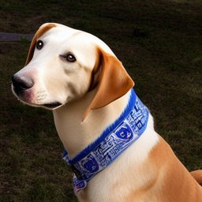 23.9 | 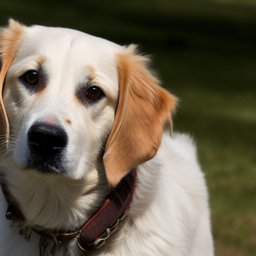 25.2 |
| img-06: `can you make me a picture of a cat on a windowsill, no text` | 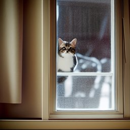 30.4 | 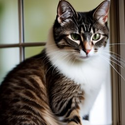 27.1 |
| img-13: `a futuristic city without cars and people for my phone wallpaper` | 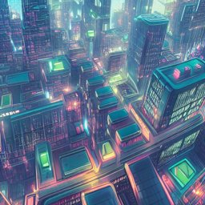 31.2 | 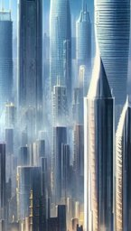 30.3 |

### Finding: the Stable Diffusion defaults are not neutral for stylised requests

The three largest drops (below) are all prompts that state a style. Their words survive (tested), but the default keywords "natural lighting", "natural balanced color palette" and "detailed subject" act as photographic cues for SD 1.5 and pull the image away from the requested style or subject. The defaults were **not** tuned on this set afterwards (that would fit the evaluation prompts); a fix needs a fresh held-out prompt set.

| prompt | Stable Diffusion prompt | original (CLIP) | optimized (CLIP) |
|---|---|---|---|
| img-14: `watercolor painting of a fox in a forest` | Watercolor painting of a fox in a forest, detailed subject, centered composition, subject fully in frame, natural lighting, natural balanced color palette, mood matching the subject, high quality | 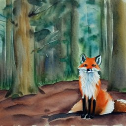 38.6 | 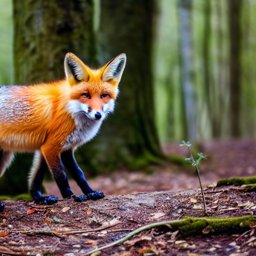 26.7 |
| img-36: `a minimalist poster of a whale` | A minimalist poster of a whale, detailed subject, centered composition, subject fully in frame, natural lighting, natural balanced color palette, mood matching the subject, uncluttered background, high quality | 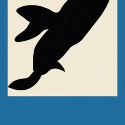 36.2 | 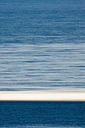 25.8 |
| img-37: `a snowy village at night` | A snowy village at night, detailed subject, realistic, detailed, centered composition, subject fully in frame, natural balanced color palette, mood matching the subject, uncluttered background, high quality | 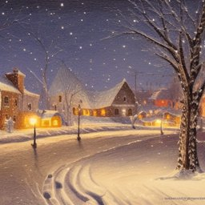 32.2 | 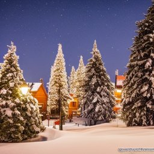 27.4 |

Per prompt (CLIP vs original prompt): img-01 23.9 -> 25.2; img-02 27.1 -> 26.6; img-03 26.3 -> 26.0; img-04 27.2 -> 27.6; img-05 28.7 -> 26.8; img-06 30.4 -> 27.1; img-07 29.6 -> 27.8; img-08 27.4 -> 25.5; img-09 28.4 -> 26.4; img-10 29.4 -> 29.2; img-11 28.1 -> 29.5; img-12 29.6 -> 31.5; img-13 31.2 -> 30.3; img-14 38.6 -> 26.7; img-15 29.5 -> 28.8; img-16 30.1 -> 29.8; img-17 29.0 -> 29.7; img-18 29.8 -> 29.2; img-19 29.3 -> 27.7; img-20 32.8 -> 34.7; img-21 32.4 -> 31.5; img-22 29.9 -> 27.8; img-23 38.0 -> 35.6; img-24 26.8 -> 27.9; img-25 32.7 -> 28.6; img-26 30.1 -> 28.9; img-27 29.9 -> 25.7; img-28 28.2 -> 29.3; img-29 30.4 -> 27.7; img-30 30.7 -> 28.9; img-31 29.7 -> 27.2; img-32 32.2 -> 28.0; img-33 23.2 -> 23.9; img-34 28.9 -> 28.9; img-35 33.5 -> 32.6; img-36 36.2 -> 25.8; img-37 32.2 -> 27.4; img-38 30.3 -> 28.5; img-39 29.2 -> 29.5; img-40 27.0 -> 27.9.

## 4. All prompts

| id | prompt | stated by user | defaults added | avoid (user) |
|---|---|---|---|---|
| img-01 | a dog | - | 9 | - |
| img-02 | cat | - | 9 | - |
| img-03 | a sunset | lighting | 8 | - |
| img-04 | mountains | - | 9 | - |
| img-05 | a red car | - | 9 | - |
| img-06 | can you make me a picture of a cat on a windowsill, no text | avoid | 8 | text |
| img-07 | pls draw a dragon | style | 8 | - |
| img-08 | a cozy coffee shop | mood | 8 | - |
| img-09 | give me an image of a robot | - | 9 | - |
| img-10 | a bowl of ramen | - | 9 | - |
| img-11 | an old lighthouse | - | 9 | - |
| img-12 | a girl reading a book | - | 9 | - |
| img-13 | a futuristic city without cars and people for my phone wallpaper | mood, aspect_ratio, avoid | 6 | cars, people |
| img-14 | watercolor painting of a fox in a forest | style, background | 7 | - |
| img-15 | a birthday cake | - | 9 | - |
| img-16 | an astronaut on the moon | background | 8 | - |
| img-17 | a logo for a bakery called Sunrise | style, lighting | 7 | - |
| img-18 | a medieval castle | - | 9 | - |
| img-19 | a pair of running shoes for an ad | subject_detail | 8 | - |
| img-20 | two kids playing in the rain | background | 8 | - |
| img-21 | an underwater coral reef | - | 9 | - |
| img-22 | a tree in autumn | - | 9 | - |
| img-23 | a portrait of an old fisherman | composition | 8 | - |
| img-24 | a spaceship | - | 9 | - |
| img-25 | a wedding invitation background | background | 8 | - |
| img-26 | hey could you please create an image of a lion | - | 9 | - |
| img-27 | a pixel art knight | style | 8 | - |
| img-28 | a cup of tea on a table | background | 8 | - |
| img-29 | a mountain lake at sunrise, 16:9 | lighting, aspect_ratio | 7 | - |
| img-30 | a black and white photo of a jazz club | style, palette | 7 | - |
| img-31 | a dinosaur | - | 9 | - |
| img-32 | an icon of a cloud for an app | style | 8 | - |
| img-33 | a beach with no people and a blue sky | avoid | 8 | people |
| img-34 | a magical library | - | 9 | - |
| img-35 | a busy street market in Morocco | subject_detail | 8 | - |
| img-36 | a minimalist poster of a whale | style, aspect_ratio | 7 | - |
| img-37 | a snowy village at night | lighting | 8 | - |
| img-38 | a bicycle | - | 9 | - |
| img-39 | a close-up of a honeybee on a flower | composition | 8 | - |
| img-40 | a happy family having dinner | mood | 8 | - |
