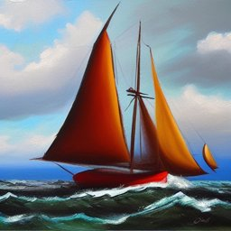
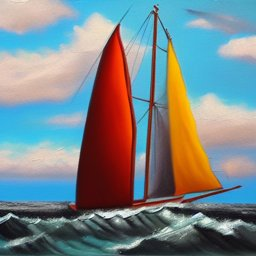
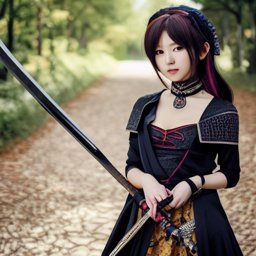
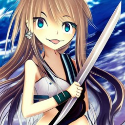
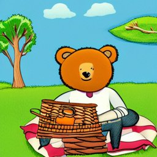
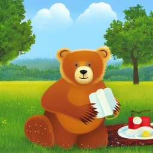

# Image-generation mode

A separate mode the user selects explicitly (no auto-detection; the text pipeline Stage A/B/C is unchanged and frozen at `final-for-test`). Rule-based: `backend/app/image/` (detectors `attributes.py`; v1: rules I01-I11 `optimizer.py`, renderers `render.py`; v2, the app's default: `v2.py`). Contents: v1 on the dev set (as first reported), the problem it showed, v2, and v1 vs v2 on a held-out set run once.

## 1. Attribute coverage on 40 hand-written vague prompts (dev set)

Prompts: `evaluation/image/image_prompts.json` (varied subjects; some already state a style, ratio or something to avoid). Before = detectors on the user's request; after = on each rendering.

| attribute | before (stated by user) | after: DALL-E | after: Nano Banana | after: Stable Diffusion | filled by a default |
|---|---|---|---|---|---|
| subject_detail | 2/40 (5%) | 40/40 (100%) | 40/40 (100%) | 40/40 (100%) | 38 |
| style | 7/40 (18%) | 40/40 (100%) | 40/40 (100%) | 40/40 (100%) | 33 |
| composition | 2/40 (5%) | 40/40 (100%) | 40/40 (100%) | 40/40 (100%) | 38 |
| lighting | 4/40 (10%) | 40/40 (100%) | 40/40 (100%) | 40/40 (100%) | 36 |
| palette | 1/40 (2%) | 40/40 (100%) | 40/40 (100%) | 40/40 (100%) | 39 |
| mood | 3/40 (8%) | 40/40 (100%) | 40/40 (100%) | 40/40 (100%) | 37 |
| aspect_ratio | 3/40 (8%) | 40/40 (100%) | 40/40 (100%) | 40/40 (100%) | 37 |
| background | 5/40 (12%) | 40/40 (100%) | 40/40 (100%) | 40/40 (100%) | 35 |
| avoid | 3/40 (8%) | 40/40 (100%) | 40/40 (100%) | 40/40 (100%) | 37 |
| **mean attributes per prompt (of 9)** | **0.8** | **9.0** | **9.0** | **9.0** | |

Rules fired: I01_CLEAN_REQUEST 4, I02_MOVE_AVOID 3, I03_ASPECT_RATIO 40, I04_DEFAULT_SUBJECT_DETAIL 38, I05_DEFAULT_STYLE 33, I06_DEFAULT_COMPOSITION 38, I07_DEFAULT_LIGHTING 36, I08_DEFAULT_PALETTE 39, I09_DEFAULT_MOOD 37, I10_DEFAULT_BACKGROUND 35, I11_AVOID_DEFAULTS 40.

The defaults are worded to defer to the subject ("lighting that suits the scene", "let the mood follow from the subject"), but section 3 shows that in Stable Diffusion keyword form they are not neutral in effect for stylised requests. The user's description is never rewritten (tests check every user word survives in every rendering). Detector limits: a name can look like an attribute ("a bakery called Sunrise" counts as lighting), and a subject that implies a setting or mood ("an underwater coral reef") is not recognised as stating it.

## 2. Before / after examples (v1, then v2)

**img-01: `a dog`**  
Rules: I03_ASPECT_RATIO, I04_DEFAULT_SUBJECT_DETAIL, I05_DEFAULT_STYLE, I06_DEFAULT_COMPOSITION, I07_DEFAULT_LIGHTING, I08_DEFAULT_PALETTE, I09_DEFAULT_MOOD, I10_DEFAULT_BACKGROUND, I11_AVOID_DEFAULTS; defaults (marked in the UI): aspect_ratio, subject_detail, style, composition, lighting, palette, mood, background, avoid; avoid from the user: none

| target | optimized prompt |
|---|---|
| DALL-E (size 1024x1024) | A dog. Show the subject clearly and in detail. Use a realistic, detailed style. Keep the subject centered and fully in frame. Use clear, natural lighting that suits the scene. Use a natural, balanced color palette that suits the subject. Let the mood follow from the subject; do not add a different one. Keep the background uncluttered and consistent with the scene. Do not include text, watermarks, logos, distorted anatomy, extra limbs or blurry details. Aspect ratio 1:1. |
| Nano Banana | Generate an image: A dog. Show the subject clearly and in detail. Use a realistic, detailed style. Keep the subject centered and fully in frame. Use clear, natural lighting that suits the scene. Use a natural, balanced color palette that suits the subject. Let the mood follow from the subject; do not add a different one. Keep the background uncluttered and consistent with the scene. Do not include text, watermarks, logos, distorted anatomy, extra limbs or blurry details. Aspect ratio 1:1. |
| Stable Diffusion (512x512) | A dog, detailed subject, realistic, detailed, centered composition, subject fully in frame, natural lighting, natural balanced color palette, mood matching the subject, uncluttered background, high quality **negative:** text, watermarks, logos, distorted anatomy, extra limbs, blurry details |

**img-06: `can you make me a picture of a cat on a windowsill, no text`**  
Rules: I01_CLEAN_REQUEST, I02_MOVE_AVOID, I03_ASPECT_RATIO, I04_DEFAULT_SUBJECT_DETAIL, I05_DEFAULT_STYLE, I06_DEFAULT_COMPOSITION, I07_DEFAULT_LIGHTING, I08_DEFAULT_PALETTE, I09_DEFAULT_MOOD, I10_DEFAULT_BACKGROUND, I11_AVOID_DEFAULTS; defaults (marked in the UI): aspect_ratio, subject_detail, style, composition, lighting, palette, mood, background; avoid from the user: text

| target | optimized prompt |
|---|---|
| DALL-E (size 1024x1024) | A cat on a windowsill, no text. Show the subject clearly and in detail. Use a realistic, detailed style. Keep the subject centered and fully in frame. Use clear, natural lighting that suits the scene. Use a natural, balanced color palette that suits the subject. Let the mood follow from the subject; do not add a different one. Keep the background uncluttered and consistent with the scene. Do not include text, watermarks, logos, distorted anatomy, extra limbs or blurry details. Aspect ratio 1:1. |
| Nano Banana | Generate an image: A cat on a windowsill, no text. Show the subject clearly and in detail. Use a realistic, detailed style. Keep the subject centered and fully in frame. Use clear, natural lighting that suits the scene. Use a natural, balanced color palette that suits the subject. Let the mood follow from the subject; do not add a different one. Keep the background uncluttered and consistent with the scene. Do not include text, watermarks, logos, distorted anatomy, extra limbs or blurry details. Aspect ratio 1:1. |
| Stable Diffusion (512x512) | A cat on a windowsill, detailed subject, realistic, detailed, centered composition, subject fully in frame, natural lighting, natural balanced color palette, mood matching the subject, uncluttered background, high quality **negative:** text, watermarks, logos, distorted anatomy, extra limbs, blurry details |

**img-13: `a futuristic city without cars and people for my phone wallpaper`**  
Rules: I02_MOVE_AVOID, I03_ASPECT_RATIO, I04_DEFAULT_SUBJECT_DETAIL, I05_DEFAULT_STYLE, I06_DEFAULT_COMPOSITION, I07_DEFAULT_LIGHTING, I08_DEFAULT_PALETTE, I10_DEFAULT_BACKGROUND, I11_AVOID_DEFAULTS; defaults (marked in the UI): subject_detail, style, composition, lighting, palette, background; avoid from the user: cars, people

| target | optimized prompt |
|---|---|
| DALL-E (size 1024x1792) | A futuristic city without cars and people for my phone wallpaper. Show the subject clearly and in detail. Use a realistic, detailed style. Keep the subject centered and fully in frame. Use clear, natural lighting that suits the scene. Use a natural, balanced color palette that suits the subject. Keep the background uncluttered and consistent with the scene. Do not include cars, people, text, watermarks, logos, distorted anatomy, extra limbs or blurry details. Aspect ratio 9:16. |
| Nano Banana | Generate an image: A futuristic city without cars and people for my phone wallpaper. Show the subject clearly and in detail. Use a realistic, detailed style. Keep the subject centered and fully in frame. Use clear, natural lighting that suits the scene. Use a natural, balanced color palette that suits the subject. Keep the background uncluttered and consistent with the scene. Do not include cars, people, text, watermarks, logos, distorted anatomy, extra limbs or blurry details. Aspect ratio 9:16. |
| Stable Diffusion (384x680) | A futuristic city for my phone wallpaper, detailed subject, realistic, detailed, centered composition, subject fully in frame, natural lighting, natural balanced color palette, uncluttered background, high quality **negative:** cars, people, text, watermarks, logos, distorted anatomy, extra limbs, blurry details |

### v2 (the app's default since this phase)

v2 adds only what cannot conflict with the request; every other missing attribute is offered as a suggestion (a clickable chip in the UI) and inserted only if the user picks it. On the dev prompts:

| attribute | stated by user | added automatically | offered as a suggestion |
|---|---|---|---|
| subject_detail | 2/40 | 0/40 | 38/40 |
| style | 7/40 | 0/40 | 33/40 |
| composition | 2/40 | 0/40 | 38/40 |
| lighting | 4/40 | 0/40 | 36/40 |
| palette | 1/40 | 0/40 | 39/40 |
| mood | 3/40 | 0/40 | 37/40 |
| aspect_ratio | 3/40 | 3/40 | 37/40 |
| background | 5/40 | 0/40 | 35/40 |
| avoid | 3/40 | 3/40 | 40/40 |

Nothing else is added automatically (no quality term, no default negatives). Style chunks moved to the front of the Stable Diffusion prompt: 0 prompts. The usual negatives are offered as an "avoid" suggestion; ones the request needs are not offered (text/logos for a logo or poster, ...): 5 prompts.

**img-01 with v2: `a dog`**  
Rules: . Suggestions offered (nothing inserted): subject_detail: hint; style: photograph / digital illustration / watercolor painting / 3d render; composition: close-up / wide shot / centered composition; lighting: soft daylight / golden hour light / dramatic studio lighting; palette: warm tones / pastel colors / vibrant colors; mood: calm mood / cheerful mood / mysterious mood; background: plain white background / blurred background / natural outdoor setting; aspect_ratio: 1:1 / 16:9 / 9:16 / 3:4; avoid: text and watermarks / distorted anatomy / blurry details.

| target | optimized prompt (v2) |
|---|---|
| DALL-E (1024x1024) | A dog. |
| Nano Banana | Generate an image: A dog. |
| Stable Diffusion (512x512) | A dog **negative:**  |

**img-06 with v2: `can you make me a picture of a cat on a windowsill, no text`**  
Rules: I01_CLEAN_REQUEST, I02_MOVE_AVOID. Suggestions offered (nothing inserted): subject_detail: hint; style: photograph / digital illustration / watercolor painting / 3d render; composition: close-up / wide shot / centered composition; lighting: soft daylight / golden hour light / dramatic studio lighting; palette: warm tones / pastel colors / vibrant colors; mood: calm mood / cheerful mood / mysterious mood; background: plain white background / blurred background / natural outdoor setting; aspect_ratio: 1:1 / 16:9 / 9:16 / 3:4; avoid: distorted anatomy / blurry details.

| target | optimized prompt (v2) |
|---|---|
| DALL-E (1024x1024) | A cat on a windowsill, no text. Do not include text. |
| Nano Banana | Generate an image: A cat on a windowsill, no text. Do not include text. |
| Stable Diffusion (512x512) | A cat on a windowsill **negative:** text |

**img-13 with v2: `a futuristic city without cars and people for my phone wallpaper`**  
Rules: I02_MOVE_AVOID, I12_ASPECT_IF_IMPLIED. Suggestions offered (nothing inserted): subject_detail: hint; style: photograph / digital illustration / watercolor painting / 3d render; composition: close-up / wide shot / centered composition; lighting: soft daylight / golden hour light / dramatic studio lighting; palette: warm tones / pastel colors / vibrant colors; background: plain white background / blurred background / natural outdoor setting; avoid: text and watermarks / distorted anatomy / blurry details.

| target | optimized prompt (v2) |
|---|---|
| DALL-E (1024x1792) | A futuristic city without cars and people for my phone wallpaper. Do not include cars or people. Aspect ratio 9:16. |
| Nano Banana | Generate an image: A futuristic city without cars and people for my phone wallpaper. Do not include cars or people. Aspect ratio 9:16. |
| Stable Diffusion (384x680) | A futuristic city for my phone wallpaper **negative:** cars, people |

## 3. Local image generation (optional step)

### 3a. v1 on the dev set (as first reported)

Model `stable-diffusion-v1-5/stable-diffusion-v1-5` (Stable Diffusion 1.5, fp16; licence **CreativeML OpenRAIL-M**: use-based restrictions, research use allowed) on the NVIDIA GeForce RTX 3050 Laptop GPU (4 GB): DPM-Solver++ 25 steps, guidance 7.5, attention slicing, peak 3.18 GiB, safety checker on. SD 1.5 rather than SD-Turbo because SD-Turbo runs without guidance and ignores negative prompts. Same seed for both images of a prompt. Original = the prompt as typed (512x512, no negative prompt); optimized = the Stable Diffusion rendering (keywords, negative prompt, width/height).

Scored with CLIP `openai/clip-vit-base-patch32` against the user's **original** prompt: 100 x cosine(image, original prompt). The optimized prompt's extra words are not in the scoring text, so a longer prompt does not win automatically.

| | original prompt | optimized prompt |
|---|---|---|
| CLIP score vs original prompt (mean) | 29.95 | **28.44** |
| time per image, median (mean) | 7.46 s (7.91 s) | 7.49 s (8.00 s) |

Paired over 40 prompts: optimized higher in 9, lower in 25, tie (|difference| < 0.5) in 6; mean difference -1.51; two-sided sign test p = 0.009. Optimized prompts over CLIP's 77-token limit (Stable Diffusion cuts them off; the user's words come first, so only defaults are lost): 0. Images blacked out by the safety checker: 0.

CLIP measures agreement with the request text, not aesthetic quality, and ViT-B/32 is a weak judge of fine detail; treat this as a check that the defaults do not pull images away from what the user asked for, not as a quality score.

| prompt | original (CLIP) | optimized (CLIP) |
|---|---|---|
| img-01: `a dog` |  23.9 |  25.2 |
| img-06: `can you make me a picture of a cat on a windowsill, no text` |  30.4 |  27.1 |
| img-13: `a futuristic city without cars and people for my phone wallpaper` |  31.2 |  30.3 |

#### Finding: the Stable Diffusion defaults are not neutral for stylised requests

The three largest drops (below) are all prompts that state a style. Their words survive (tested), but the default keywords "natural lighting", "natural balanced color palette" and "detailed subject" act as photographic cues for SD 1.5 and pull the image away from the requested style or subject. The defaults were **not** tuned on this set afterwards (that would fit the evaluation prompts); a fix needs a fresh held-out prompt set.

| prompt | Stable Diffusion prompt | original (CLIP) | optimized (CLIP) |
|---|---|---|---|
| img-14: `watercolor painting of a fox in a forest` | Watercolor painting of a fox in a forest, detailed subject, centered composition, subject fully in frame, natural lighting, natural balanced color palette, mood matching the subject, high quality |  38.6 |  26.7 |
| img-36: `a minimalist poster of a whale` | A minimalist poster of a whale, detailed subject, centered composition, subject fully in frame, natural lighting, natural balanced color palette, mood matching the subject, uncluttered background, high quality |  36.2 |  25.8 |
| img-37: `a snowy village at night` | A snowy village at night, detailed subject, realistic, detailed, centered composition, subject fully in frame, natural balanced color palette, mood matching the subject, uncluttered background, high quality |  32.2 |  27.4 |

Per prompt (CLIP vs original prompt): img-01 23.9 -> 25.2; img-02 27.1 -> 26.6; img-03 26.3 -> 26.0; img-04 27.2 -> 27.6; img-05 28.7 -> 26.8; img-06 30.4 -> 27.1; img-07 29.6 -> 27.8; img-08 27.4 -> 25.5; img-09 28.4 -> 26.4; img-10 29.4 -> 29.2; img-11 28.1 -> 29.5; img-12 29.6 -> 31.5; img-13 31.2 -> 30.3; img-14 38.6 -> 26.7; img-15 29.5 -> 28.8; img-16 30.1 -> 29.8; img-17 29.0 -> 29.7; img-18 29.8 -> 29.2; img-19 29.3 -> 27.7; img-20 32.8 -> 34.7; img-21 32.4 -> 31.5; img-22 29.9 -> 27.8; img-23 38.0 -> 35.6; img-24 26.8 -> 27.9; img-25 32.7 -> 28.6; img-26 30.1 -> 28.9; img-27 29.9 -> 25.7; img-28 28.2 -> 29.3; img-29 30.4 -> 27.7; img-30 30.7 -> 28.9; img-31 29.7 -> 27.2; img-32 32.2 -> 28.0; img-33 23.2 -> 23.9; img-34 28.9 -> 28.9; img-35 33.5 -> 32.6; img-36 36.2 -> 25.8; img-37 32.2 -> 27.4; img-38 30.3 -> 28.5; img-39 29.2 -> 29.5; img-40 27.0 -> 27.9.

### 3b. v2 on the dev set (tuning check)

The dev set was used to check the fix and choose the final v2 (the v2 draft and its variant are tuning rows); these numbers are not the evidence.

| variant | CLIP vs original prompt (mean) | vs original: higher / lower / tie | sign test p | style kept (of 6 styled prompts) | P(stated style vs photo), mean | time per image, median |
|---|---|---|---|---|---|---|
| original prompt | **29.95** | - | - | 5/6 | 0.84 | 7.46 s |
| v1 (default keywords) | **28.44** | 9 / 25 / 6 | 0.009 | 3/6 | 0.59 | 7.49 s |
| v2 (final) | **29.82** | 0 / 4 / 36 | 0.125 | 5/6 | 0.84 | 7.53 s |
| v2 + all first suggestions (simulated user) | **28.79** | 10 / 22 / 8 | 0.050 | 4/6 | 0.74 | 7.43 s |
| tuning: v2 draft (+ automatic negatives and quality term) | **29.21** | 9 / 17 / 14 | 0.169 | 4/6 | 0.72 | 7.49 s |
| tuning: v2 draft without the automatic negatives | **29.52** | 10 / 14 / 16 | 0.541 | 5/6 | 0.84 | 7.53 s |

Where v2 differs from the original by at least 0.5: img-06 `can you make me a picture of a cat on a windowsill, no text` -1.0 (v2 SD prompt `A cat on a windowsill`, negative `text`, 512x512); img-07 `pls draw a dragon` -0.7 (v2 SD prompt `Draw a dragon`, 512x512); img-13 `a futuristic city without cars and people for my phone wallpaper` -0.6 (v2 SD prompt `A futuristic city for my phone wallpaper`, negative `cars, people`, 384x680); img-29 `a mountain lake at sunrise, 16:9` -2.9 (v2 SD prompt `A mountain lake at sunrise, 16:9`, 680x384).

40 prompts; same seed for every variant of a prompt; prompts over the 77-token CLIP limit: 0; images blacked out by the safety checker: 0. Style kept = CLIP zero-shot prefers "a <stated style>" over "a photograph" for the image (styles annotated in the prompt file before any run).

Per prompt, CLIP vs original prompt (original / v1 / v2 / v2_suggested / v2_draft / v2_no_default_negatives): img-01 23.9 / 25.2 / 23.9 / 26.1 / 26.1 / 24.4; img-02 27.1 / 26.6 / 27.1 / 27.3 / 26.6 / 27.1; img-03 26.3 / 26.0 / 26.3 / 26.8 / 26.0 / 26.4; img-04 27.2 / 27.6 / 27.2 / 26.5 / 27.5 / 28.1; img-05 28.7 / 26.8 / 28.7 / 29.2 / 28.3 / 27.3; img-06 30.4 / 27.1 / 29.4 / 27.0 / 28.1 / 29.1; img-07 29.6 / 27.8 / 28.9 / 31.0 / 29.5 / 29.6; img-08 27.4 / 25.5 / 27.4 / 26.9 / 30.2 / 28.2; img-09 28.4 / 26.4 / 28.4 / 27.9 / 26.8 / 27.0; img-10 29.4 / 29.2 / 29.4 / 28.7 / 29.6 / 28.8; img-11 28.1 / 29.5 / 28.1 / 27.5 / 28.8 / 27.8; img-12 29.6 / 31.5 / 29.6 / 28.9 / 30.4 / 29.8; img-13 31.2 / 30.3 / 30.5 / 28.7 / 30.6 / 27.9; img-14 38.6 / 26.7 / 38.6 / 26.5 / 26.6 / 35.4; img-15 29.5 / 28.8 / 29.5 / 28.1 / 28.4 / 30.0; img-16 30.1 / 29.8 / 30.1 / 28.4 / 29.4 / 31.4; img-17 29.0 / 29.7 / 29.0 / 26.6 / 30.8 / 29.5; img-18 29.8 / 29.2 / 29.8 / 28.2 / 29.5 / 29.1; img-19 29.3 / 27.7 / 29.3 / 29.4 / 28.3 / 30.1; img-20 32.8 / 34.7 / 32.8 / 34.4 / 35.2 / 33.6; img-21 32.4 / 31.5 / 32.4 / 32.8 / 32.1 / 32.1; img-22 29.9 / 27.8 / 29.9 / 28.4 / 28.2 / 30.0; img-23 38.0 / 35.6 / 38.0 / 38.2 / 36.5 / 38.0; img-24 26.8 / 27.9 / 26.8 / 27.8 / 26.6 / 27.5; img-25 32.7 / 28.6 / 32.7 / 29.3 / 32.0 / 32.3; img-26 30.1 / 28.9 / 29.9 / 29.4 / 29.9 / 29.9; img-27 29.9 / 25.7 / 29.9 / 28.5 / 28.3 / 27.5; img-28 28.2 / 29.3 / 28.2 / 29.0 / 28.0 / 26.2; img-29 30.4 / 27.7 / 27.4 / 30.8 / 28.5 / 26.9; img-30 30.7 / 28.9 / 30.7 / 26.2 / 27.6 / 29.9; img-31 29.7 / 27.2 / 29.7 / 27.0 / 29.3 / 28.5; img-32 32.2 / 28.0 / 32.2 / 33.4 / 32.5 / 32.5; img-33 23.2 / 23.9 / 23.4 / 23.9 / 23.7 / 22.9; img-34 28.9 / 28.9 / 28.9 / 26.5 / 29.2 / 28.4; img-35 33.5 / 32.6 / 33.5 / 31.0 / 33.1 / 34.1; img-36 36.2 / 25.8 / 36.5 / 30.7 / 31.4 / 36.2; img-37 32.2 / 27.4 / 32.2 / 27.5 / 29.4 / 30.3; img-38 30.3 / 28.5 / 30.3 / 28.7 / 27.2 / 28.3; img-39 29.1 / 29.5 / 29.1 / 30.2 / 29.9 / 29.5; img-40 27.0 / 27.9 / 27.0 / 28.2 / 28.1 / 29.2.

### 3c. Held-out set, run once: original vs v1 vs v2

30 new prompts (`evaluation/image/heldout_prompts.json`), written and committed before any v2 code (commit d656add); the team's 10 blind prompts were not filled in yet, so n = 30. One run, no changes afterwards.

| variant | CLIP vs original prompt (mean) | vs original: higher / lower / tie | sign test p | style kept (of 12 styled prompts) | P(stated style vs photo), mean | time per image, median |
|---|---|---|---|---|---|---|
| original prompt | **33.08** | - | - | 12/12 | 0.99 | 7.55 s |
| v1 (default keywords) | **30.78** | 7 / 18 / 5 | 0.043 | 10/12 | 0.82 | 7.56 s |
| v2 (final) | **32.77** | 0 / 4 / 26 | 0.125 | 12/12 | 0.99 | 7.55 s |
| v2 + all first suggestions (simulated user) | **31.07** | 3 / 20 / 7 | 0.000 | 10/12 | 0.87 | 7.55 s |

Where v2 differs from the original by at least 0.5: held-08 `a vintage car on a desert road, 16:9` -3.0 (v2 SD prompt `A vintage car on a desert road, 16:9`, 680x384); held-17 `a poster for a music festival` -1.3 (v2 SD prompt `A poster for a music festival`, 416x624); held-18 `pls create an image of a lighthouse keeper` -1.6 (v2 SD prompt `A lighthouse keeper`, 512x512); held-24 `a hot air balloon over fields, without clouds` -3.2 (v2 SD prompt `A hot air balloon over fields`, negative `clouds`, 512x512).

30 prompts; same seed for every variant of a prompt; prompts over the 77-token CLIP limit: 0; images blacked out by the safety checker: 0. Style kept = CLIP zero-shot prefers "a <stated style>" over "a photograph" for the image (styles annotated in the prompt file before any run).

Per prompt, CLIP vs original prompt (original / v1 / v2 / v2_suggested): held-01 28.3 / 28.0 / 28.3 / 28.9; held-02 34.3 / 30.9 / 34.3 / 33.2; held-03 31.0 / 33.0 / 31.0 / 28.6; held-04 30.2 / 29.4 / 30.2 / 30.1; held-05 28.8 / 26.2 / 28.7 / 25.7; held-06 35.1 / 30.0 / 35.1 / 34.3; held-07 30.2 / 29.6 / 30.2 / 29.8; held-08 34.0 / 30.5 / 31.0 / 29.8; held-09 33.9 / 36.4 / 33.9 / 29.0; held-10 30.6 / 27.5 / 30.6 / 28.8; held-11 34.1 / 33.8 / 34.1 / 30.4; held-12 31.3 / 26.3 / 31.3 / 24.9; held-13 38.1 / 35.0 / 38.1 / 37.3; held-14 34.2 / 34.3 / 34.2 / 32.4; held-15 30.2 / 29.7 / 30.2 / 29.9; held-16 38.8 / 39.5 / 38.8 / 36.0; held-17 30.0 / 20.8 / 28.7 / 30.0; held-18 31.9 / 34.1 / 30.3 / 33.1; held-19 37.9 / 30.9 / 37.9 / 36.0; held-20 36.7 / 37.7 / 36.7 / 32.9; held-21 25.1 / 26.2 / 25.1 / 22.6; held-22 33.1 / 27.5 / 33.1 / 27.9; held-23 37.8 / 33.7 / 37.8 / 34.4; held-24 35.4 / 35.4 / 32.2 / 34.5; held-25 36.4 / 29.9 / 36.4 / 32.9; held-26 33.6 / 26.1 / 33.6 / 35.3; held-27 32.5 / 30.1 / 32.5 / 25.6; held-28 33.2 / 27.1 / 33.2 / 33.0; held-29 33.0 / 30.6 / 33.0 / 32.6; held-30 32.8 / 33.4 / 32.8 / 32.5.

| held-out prompt | original | v1 | v2 |
|---|---|---|---|
| held-03: `oil painting of a sailboat in a storm` (oil painting) |  CLIP 31.0, P(style) 1.00 |  CLIP 33.0, P(style) 1.00 |  CLIP 31.0, P(style) 1.00 |
| held-07: `anime style girl with a sword` (anime) |  CLIP 30.2, P(style) 0.98 |  CLIP 29.6, P(style) 0.92 |  CLIP 30.2, P(style) 0.98 |
| held-09: `a children's book illustration of a bear having a picnic` (children's book illustration) |  CLIP 33.9, P(style) 1.00 |  CLIP 36.4, P(style) 1.00 |  CLIP 33.9, P(style) 1.00 |

## 4. Lesson learned

* A default that is "neutral" in words is not neutral in effect. For Stable Diffusion, keyword defaults such as "natural lighting", "natural balanced color palette" and "detailed subject" are photographic cues and override a stated style or even the subject (v1, section 3a).
* Coverage of attributes is the wrong target on its own: v1 reached 9.0 of 9 attributes per prompt and made the images match the request worse. The image model's output against the user's own request is the check that matters.
* Even "safe" automatic additions were not safe: a v2 draft that added only conflict-filtered negatives and the quality term "high quality" still lowered agreement with the request on the dev set (29.21 vs 29.95) and lost the watercolor style; without them it matched the original (29.82, style kept 5/6) (section 3b). Final v2 adds nothing automatically except what the user's own words imply (their avoid list, a ratio they ask for, their style moved to the front for Stable Diffusion); everything else, the usual negatives included, is a suggestion the user chooses.
* CLIP against the original prompt detects harm, not improvement: it rewards agreement with the user's own wording. On the held-out set v2 ties the original on 26 of 30 prompts; the 4 differences are things v2 does on purpose (a 16:9 or poster ratio the user implied changes the image shape; "without clouds" moves clouds to the negative prompt, while CLIP, which ignores negation, scores the text "... without clouds" higher for images with clouds; removing "pls create an image of"). v2's value is in what it does not break (style kept 12/12 vs v1 10/12) and in the user-chosen suggestions, which a CLIP-vs-original score cannot measure.
* Accepting every suggestion at once is not a good default either ("v2 + all first suggestions" lowers CLIP vs the original on held-out, p < 0.001): suggestions are options to pick, which is why nothing is preselected.
* Protocol: v1's numbers stay as first reported (dev set); v2 was checked and its final configuration chosen on the dev set only; the 30 held-out prompts were written and committed before any v2 code, and run once (3c).

## 5. All dev prompts (v1)

| id | prompt | stated by user | defaults added | avoid (user) |
|---|---|---|---|---|
| img-01 | a dog | - | 9 | - |
| img-02 | cat | - | 9 | - |
| img-03 | a sunset | lighting | 8 | - |
| img-04 | mountains | - | 9 | - |
| img-05 | a red car | - | 9 | - |
| img-06 | can you make me a picture of a cat on a windowsill, no text | avoid | 8 | text |
| img-07 | pls draw a dragon | style | 8 | - |
| img-08 | a cozy coffee shop | mood | 8 | - |
| img-09 | give me an image of a robot | - | 9 | - |
| img-10 | a bowl of ramen | - | 9 | - |
| img-11 | an old lighthouse | - | 9 | - |
| img-12 | a girl reading a book | - | 9 | - |
| img-13 | a futuristic city without cars and people for my phone wallpaper | mood, aspect_ratio, avoid | 6 | cars, people |
| img-14 | watercolor painting of a fox in a forest | style, background | 7 | - |
| img-15 | a birthday cake | - | 9 | - |
| img-16 | an astronaut on the moon | background | 8 | - |
| img-17 | a logo for a bakery called Sunrise | style, lighting | 7 | - |
| img-18 | a medieval castle | - | 9 | - |
| img-19 | a pair of running shoes for an ad | subject_detail | 8 | - |
| img-20 | two kids playing in the rain | background | 8 | - |
| img-21 | an underwater coral reef | - | 9 | - |
| img-22 | a tree in autumn | - | 9 | - |
| img-23 | a portrait of an old fisherman | composition | 8 | - |
| img-24 | a spaceship | - | 9 | - |
| img-25 | a wedding invitation background | background | 8 | - |
| img-26 | hey could you please create an image of a lion | - | 9 | - |
| img-27 | a pixel art knight | style | 8 | - |
| img-28 | a cup of tea on a table | background | 8 | - |
| img-29 | a mountain lake at sunrise, 16:9 | lighting, aspect_ratio | 7 | - |
| img-30 | a black and white photo of a jazz club | style, palette | 7 | - |
| img-31 | a dinosaur | - | 9 | - |
| img-32 | an icon of a cloud for an app | style | 8 | - |
| img-33 | a beach with no people and a blue sky | avoid | 8 | people |
| img-34 | a magical library | - | 9 | - |
| img-35 | a busy street market in Morocco | subject_detail | 8 | - |
| img-36 | a minimalist poster of a whale | style, aspect_ratio | 7 | - |
| img-37 | a snowy village at night | lighting | 8 | - |
| img-38 | a bicycle | - | 9 | - |
| img-39 | a close-up of a honeybee on a flower | composition | 8 | - |
| img-40 | a happy family having dinner | mood | 8 | - |
